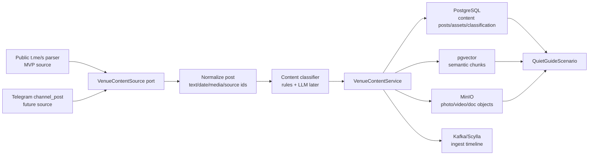

# AERIS Telegram Channel Ingest Plan

Дата: 2026-06-14

Цель: использовать официальный Telegram-канал AERIS как источник афиши, промо, новостей и атмосферного контента для `QuietGuideScenario`, пока у нас нет доступа добавить Astor Butler bot админом канала.

Статус 2026-06-15: MVP runtime реализован для public HTML source. Работают parser, rules classifier, MinIO media mirroring, PostgreSQL store, manual endpoint и read path в `QuietGuideScenario`. pgvector indexing, Kafka/Scylla events и admin-review кнопки остаются следующим слоем.

Канал MVP:

```text
https://t.me/aeris_gastrobar
```

## 1. Архитектурное решение

Делаем adapter-first подход:

```text
VenueContentSource
  ├─ PublicTelegramHtmlSource  сейчас
  └─ TelegramChannelPostSource позже, когда бот станет админом канала
```

Домен ниже источника не должен знать, откуда пришел пост: из публичного HTML, Telegram `channel_post`, ручного импорта или админки.



## 2. Что парсим сейчас

Публичная страница Telegram:

```text
https://t.me/s/aeris_gastrobar
```

Минимальный parser должен доставать:

- `sourceType = TELEGRAM_PUBLIC_HTML`;
- `channelUsername = aeris_gastrobar`;
- `sourceMessageId`;
- `sourceUrl`;
- raw text / html;
- publishedAt, если Telegram отдает дату;
- media URLs: photo/video/document links, если доступны;
- edit/version hash для idempotency.

Важно:

- public HTML parser считается best-effort;
- если Telegram меняет разметку, ломается только adapter;
- доменный слой и FSM не меняются.

## 3. Future switch на bot-admin

Когда Astor Butler bot добавят админом канала:

- включить `allowed_updates=["channel_post","edited_channel_post"]`;
- добавить `TelegramChannelPostSource`;
- сохранить тот же normalized DTO;
- выключить или оставить HTML parser как fallback.

Source compatibility contract:

```json
{
  "venueCode": "AERIS",
  "sourceType": "TELEGRAM_PUBLIC_HTML | TELEGRAM_CHANNEL_POST",
  "sourceChannel": "aeris_gastrobar",
  "sourceMessageId": "1234",
  "sourceUrl": "https://t.me/aeris_gastrobar/1234",
  "publishedAt": "2026-06-14T12:00:00Z",
  "text": "...",
  "media": [
    {
      "url": "https://...",
      "contentType": "image/jpeg",
      "telegramFileId": null
    }
  ]
}
```

## 4. Classification

Классификация постов:

| Type | Смысл | Примеры |
| --- | --- | --- |
| `AFISHA_EVENT` | событие/афиша с датой/временем | live music, DJ, гастроужин, вечеринка |
| `PROMO_OFFER` | акция/спецпредложение | скидка, сет, special offer, happy hour |
| `MENU_UPDATE` | новое меню/блюдо/напиток | новое блюдо, сезонное меню, cocktail update |
| `VENUE_NEWS` | новость заведения | режим работы, открытие, команда |
| `ATMOSPHERE_CONTENT` | фото/видео без конкретной даты | интерьер, настроение, backstage |
| `UNKNOWN_REVIEW` | не уверены | отправить админу на классификацию |

MVP classifier:

1. rules/keywords/date extraction;
2. confidence score;
3. если `confidence < threshold`, статус `NEEDS_REVIEW`;
4. позже LLM/pgvector classifier.

## 5. Data model

PostgreSQL:

```text
venue_content_posts
  id uuid pk
  venue_code text
  source_type text
  source_channel text
  source_message_id text
  source_url text
  source_hash text
  content_type text
  status text
  title text
  body text
  event_starts_at timestamptz null
  event_ends_at timestamptz null
  active_from timestamptz null
  active_until timestamptz null
  classification_confidence numeric
  raw_payload jsonb
  created_at timestamptz
  updated_at timestamptz

venue_content_assets
  id uuid pk
  post_id uuid fk
  asset_kind text
  source_url text
  bucket text
  object_key text
  content_type text
  width int null
  height int null
  duration_seconds int null
  created_at timestamptz
```

Indexes:

```text
unique(venue_code, source_type, source_channel, source_message_id)
index(venue_code, content_type, status, event_starts_at)
index(venue_code, active_until)
```

MinIO:

```text
content/aeris/channel/YYYY/MM/{sourceMessageId}/{assetName}
```

pgvector:

- one source per post;
- chunks for text, extracted title, event/promo facts;
- metadata includes `contentType`, `eventStartsAt`, `sourceUrl`, `assetObjectKeys`.

Kafka/Scylla:

- `CONTENT_POST_INGESTED`;
- `CONTENT_POST_UPDATED`;
- `CONTENT_POST_CLASSIFIED`;
- `CONTENT_ASSET_STORED`;
- `CONTENT_POST_EXPIRED`.

## 6. Retention

Правило пользователя: быстрый пул контента чистим раз в три месяца.

Decision:

- PostgreSQL post metadata: хранить 12 месяцев минимум;
- MinIO fast media pool: чистить через 90 дней, если пост не активен;
- active `AFISHA_EVENT`/`PROMO_OFFER` не удалять до `active_until + 14 days`;
- raw payload можно хранить 12 месяцев для аналитики;
- expired content не показывать гостю, но можно оставить в аналитике.

Job:

```text
VenueContentRetentionJob
  daily at night
  archive expired posts
  delete eligible MinIO assets
  write CONTENT_POST_EXPIRED event
```

## 7. QuietGuide integration

Новые запросы гостя:

- "что сегодня?";
- "афиша";
- "что на выходных?";
- "есть акции?";
- "что нового?";
- "какие мероприятия?";

Ответ:

1. найти active posts by `venue=AERIS`;
2. приоритет `AFISHA_EVENT` перед `PROMO_OFFER`;
3. если есть media, отправить 1-3 релевантных asset;
4. если ничего нет, ответить мягко:
   - "Сейчас не вижу свежей афиши в системе, могу показать меню, видео-тур или позвать менеджера."

## 8. Admin review

Если post classification unsure:

Admin card:

```text
Новый пост AERIS требует классификации

Source: https://t.me/aeris_gastrobar/1234
Guess: PROMO_OFFER, confidence 0.54

[Афиша] [Промо] [Меню] [Новости] [Игнор]
```

Результат ручного выбора:

- обновляет `content_type`;
- пишет event/timeline;
- сохраняет пример для future intent/classifier tuning.

## 9. Implementation steps

### Step 1 - Contract and persistence

- Done: enum/string constants for content types/statuses.
- Done: Liquibase changelog для `venue_content_posts` и `venue_content_assets`.
- Done: repository/service для upsert post + assets.

### Step 2 - Public HTML adapter

- Done: `VenueContentSource` port.
- Done: `PublicTelegramHtmlSource`.
- Done: parser изолирован в одном классе.
- Done: config:

```yaml
astor.content.telegram.public-channel.enabled: true
astor.content.telegram.public-channel.username: aeris_gastrobar
astor.content.telegram.public-channel.url: https://t.me/s/aeris_gastrobar
```

### Step 3 - Asset storage

- Done: скачать media URL в memory stream with timeout/size guard.
- Done: загрузить в MinIO prefix `content/aeris/channel/...`.
- Done: связать assets с post.

### Step 4 - Classifier

- Done: MVP rules classifier:
  - date/time words;
  - promo words;
  - menu words;
  - news/atmosphere fallback.
- Low confidence -> `NEEDS_REVIEW`.

### Step 5 - Scheduler/manual endpoint

- Done: manual endpoint `POST /api/content/ingest/aeris-channel`.
- Done: scheduled job scaffold with disabled-by-default toggle.
- Done: idempotency by `(venue_code, source_type, source_channel, source_message_id)` and `source_hash`.

### Step 6 - QuietGuide read path

- Done: `VenueContentQueryService`.
- Done: `QuietGuideScenario` uses active content for afisha/promo requests.
- Done: metadata includes content post ids and source URLs; asset object keys are persisted for delivery layer.

### Step 7 - Future bot-admin source

- Add `TelegramChannelPostSource`.
- Map `channel_post` to same normalized DTO.
- Keep public parser as fallback/manual recovery.

## 10. Risks

| Risk | Mitigation |
| --- | --- |
| Telegram public HTML changes | Keep parser isolated; add parser fixture tests; support manual import. |
| Media URLs expire/change | Store media in MinIO immediately after ingest. |
| Wrong classification | Confidence threshold + admin review buttons. |
| Channel access missing | Public parser works until bot-admin access exists. |
| Copyright/rights | Only official AERIS channel; store source URL and use for restaurant-owned assistant. |
| Spam/old events | Active window + 90-day media retention. |
