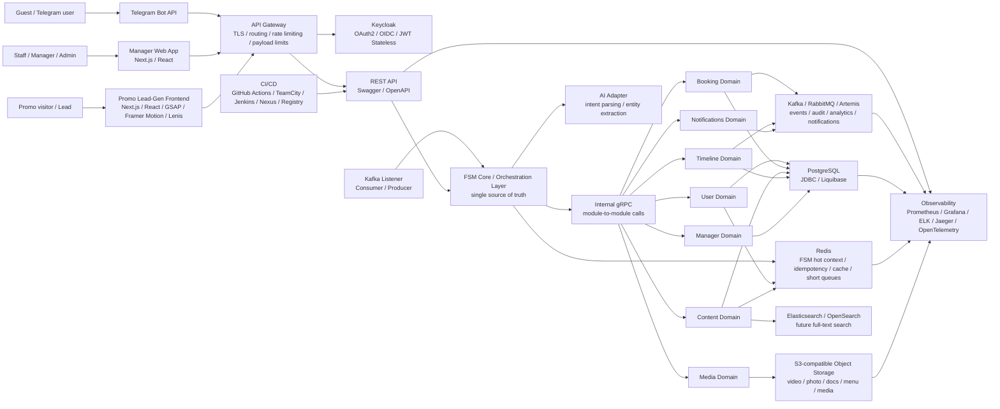
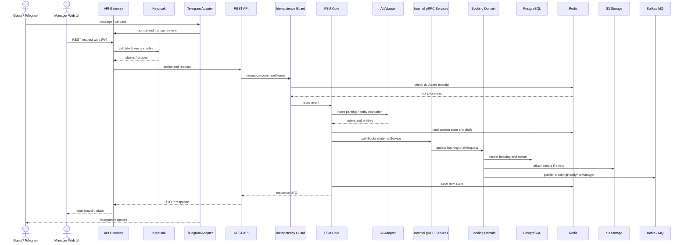

# Astor Butler Architecture

## Назначение

Astor Butler - soft-governance tool для HoReCa. Система объединяет Telegram UI, manager/staff/admin web app и публичную promo/lead-gen витрину. Telegram остается транспортом для гостя, web app - рабочим местом команды, promo frontend - витриной для production story, System Design/JavaGuru-материалов и сбора лидов.

Главный архитектурный принцип: FSM является single source of truth для сценариев взаимодействия. UI-слои не содержат бизнес-логики.

## High-Level Diagram

## Входные каналы

### Telegram

Telegram используется как первый guest-facing UI:

- сообщения;
- callbacks;
- контакты;
- safe exit из сценария;
- уведомления и переходы в бронирование.

Telegram adapter только нормализует входящие события в `InboundEvent` и отправляет ответы. Он не принимает бизнес-решений.

### Manager Web App

Manager/staff/admin web app нужен для операционной работы:

- dashboard менеджера;
- список и карточка заявок;
- пользователи и роли;
- поиск;
- таймлайны;
- posts/afisha management;
- media library;
- staff tasks;
- notifications center;
- admin settings.

Авторизация идет через Keycloak/OAuth2/OIDC. Frontend передает JWT в backend через `Authorization: Bearer`.

### Promo / Lead-Gen Frontend

Promo frontend - публичная витрина для презентации production story, System Design/JavaGuru-материалов и сбора лидов.

Стек:

- Next.js;
- React;
- GSAP;
- Framer Motion;
- Lenis smooth scroll.

Функции:

- immersive landing page;
- видео `mp4/webm`, muted autoplay, lazy loading, adaptive streaming target;
- CTA в Telegram, CRM, курс или форму заявки;
- сбор UTM/source/campaign;
- отправка lead events в backend.

WordPress/Headless CMS не является целевой backend-архитектурой. CMS-функции реализуются собственным `content/admin` модулем на общем backend stack.

## Backend

### Public Boundary

Наружу система предоставляет:

- REST API;
- Swagger/OpenAPI contracts;
- Kafka Listener / Consumer / Producer для event boundary;
- Prometheus metrics endpoint;
- readiness/liveness probes для Kubernetes/OpenShift.

### Internal Boundary

Внутреннее взаимодействие backend-модулей проектируется через gRPC:

- `UserInternalService`;
- `BookingInternalService`;
- `ContentInternalService`;
- `MediaInternalService`;
- `TimelineInternalService`;
- `ManagerInternalService`;
- `NotificationInternalService`.

REST API не должен напрямую размазывать бизнес-логику по контроллерам. Контроллеры принимают запрос, валидируют контракт и передают команду в application/FSM/orchestration layer.

## FSM Core

FSM Core отвечает за:

- текущее состояние пользователя;
- допустимые переходы;
- fallback и safe state;
- late/offline messages;
- idempotency-aware обработку событий;
- orchestration между AI Adapter и доменными модулями.

FSM не живет в Telegram, web app или promo frontend. Все UI-каналы являются транспортами.

## AI Adapter

AI Adapter - заменяемый модуль для первого понимания человеческого сообщения:

- intent parsing;
- entity extraction;
- normalization свободного текста;
- fallback к rule-based логике при timeout/error.

AI Adapter не является источником бизнес-правил. Он помогает понять, что пользователь хочет, после чего сценарий продолжает FSM.

## Domain Modules

- `User` - профиль, роли, идентичность, связки Telegram/web.
- `Booking` - заявки, мероприятия, статусы, менеджерская обработка.
- `Content` - посты, афиши, promo blocks, SEO metadata, draft/published/archived state.
- `Media` - metadata и связи с S3 objects.
- `Timeline` - действия пользователя, менеджера, FSM transitions, domain events.
- `Manager` - dashboard, tasks, escalation workflow.
- `Notifications` - Telegram/CRM/email/event notifications.

Доменные модули не содержат Telegram-логики и не должны напрямую зависеть от UI.

## Data Layer

### PostgreSQL

PostgreSQL - основная СУБД для:

- пользователей;
- ролей;
- заявок;
- статусов;
- таймлайнов;
- постов;
- лидов;
- SEO metadata;
- связей между сущностями.

Persistence strategy: JDBC without JPA/Hibernate. Причина: явный контроль SQL, транзакций, индексов и performance-critical запросов. Миграции схемы - Liquibase.

### Redis

Redis используется для:

- FSM hot context;
- idempotency guard;
- processed event IDs;
- краткоживущих booking drafts;
- краткосрочных очередей;
- кеша меню, справочников и публичного контента;
- feature flags/cache для landing blocks.

### S3-Compatible Object Storage

Object Storage используется для:

- фото;
- видео;
- меню;
- документов;
- приложений;
- медиа постов;
- презентаций и PDF;
- derivative assets для promo frontend.

### Kafka / RabbitMQ / Artemis

Event bus используется для:

- audit events;
- notification commands/events;
- analytics events;
- timeline enrichment;
- lead events;
- achievement events;
- интеграций с CRM и внешними системами.

Draft topics:

- `astor.booking.events`;
- `astor.user.events`;
- `astor.timeline.events`;
- `astor.media.events`;
- `astor.lead.events`;
- `astor.notification.commands`;
- `astor.notification.events`;
- `astor.audit.events`;
- `astor.analytics.events`;
- `astor.achievement.events`.

Финальный набор топиков и партиционирование уточняются после нагрузочного тестирования.

## Security

- API Gateway перед backend: TLS termination, routing, rate limiting, payload limits.
- Keycloak как OAuth2/OIDC provider.
- JWT Stateless authentication.
- Spring Security как OAuth2 Resource Server.
- Роли и permissions через JWT claims/scopes.
- Backend не хранит пользовательские web-сессии.
- UI скрывает недоступные действия, backend остается финальной точкой проверки прав.
- Admin actions пишутся в audit/timeline.
- Секреты не хранятся в git. `.env` остается только локально.

## Observability

Observability stack:

- Prometheus для метрик;
- Grafana для dashboard views;
- ELK для централизованных логов;
- Jaeger/OpenTelemetry для tracing.

Минимум 6 Grafana dashboard views:

- API;
- JVM;
- PostgreSQL;
- Redis;
- Kafka;
- business/FSM.

Отслеживаемые SLI:

- availability;
- error rate;
- P50/P95/P99 latency по REST;
- P50/P95/P99 latency по gRPC;
- Kafka consumer lag;
- Redis hit ratio;
- PostgreSQL query latency;
- S3 upload/download errors;
- lead conversion events;
- FSM transition failures.

Целевой availability SLO после production-выхода - 99.9% uptime в год. Конкретные latency thresholds фиксируются после нагрузочного тестирования.

## CI/CD And Quality Gates

CI/CD:

- GitHub Actions;
- TeamCity/Jenkins as optional enterprise CI;
- Nexus/Container Registry для артефактов и Docker images;
- Docker для контейнеризации;
- Docker Compose для локального запуска;
- Kubernetes/OpenShift для production-ready deployment.

Quality gates:

- JUnit;
- Mockito;
- Testcontainers;
- JaCoCo;
- Checkstyle;
- PMD or SpotBugs;
- OpenAPI contract checks;
- integration tests for PostgreSQL, Redis, API contracts and Kafka flows.

Цель - максимальное покрытие business-critical кода. Формальный процент coverage утверждается после выделения слоев, где покрытие действительно отражает качество, а не декоративную метрику.

## Sequence Diagram

