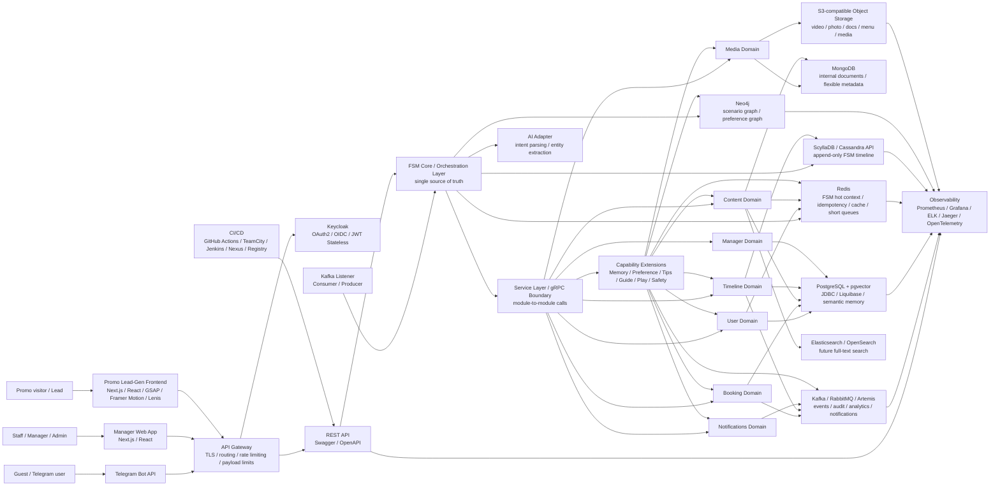
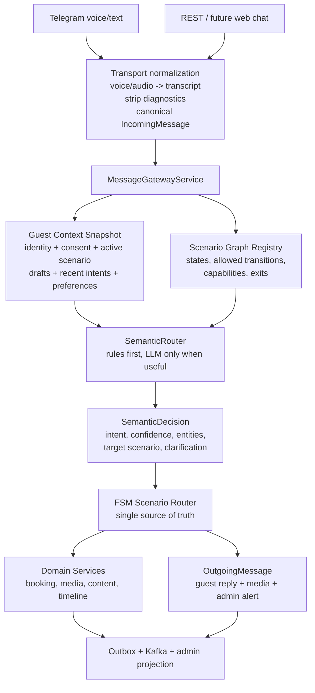

# Astor Butler Architecture

## Назначение

Astor Butler - soft-governance tool для HoReCa. Система объединяет Telegram UI, manager/staff/admin web app и публичную promo/lead-gen витрину. Telegram остается транспортом для гостя, web app - рабочим местом команды, promo frontend - витриной для production story, System Design/JavaGuru-материалов и сбора лидов.

Главный архитектурный принцип: FSM является single source of truth для сценариев взаимодействия. UI-слои не содержат бизнес-логики.

## High-Level Diagram



## Входные каналы

### Telegram

Telegram используется как первый guest-facing UI:

- сообщения;
- callbacks;
- контакты;
- safe exit из сценария;
- уведомления и переходы в бронирование.

Telegram adapter только нормализует входящие события в `InboundEvent` и отправляет ответы. Он не принимает бизнес-решений.

### Manager Web App

Manager/staff/admin web app нужен для операционной работы:

- dashboard менеджера;
- список и карточка заявок;
- пользователи и роли;
- поиск;
- таймлайны;
- posts/afisha management;
- media library;
- staff tasks;
- notifications center;
- admin settings.

Авторизация идет через Keycloak/OAuth2/OIDC. Frontend передает JWT в backend через `Authorization: Bearer`.

### Promo / Lead-Gen Frontend

Promo frontend - публичная витрина для презентации production story, System Design/JavaGuru-материалов и сбора лидов.

Стек:

- Next.js;
- React;
- GSAP;
- Framer Motion;
- Lenis smooth scroll.

Функции:

- immersive landing page;
- видео `mp4/webm`, muted autoplay, lazy loading, adaptive streaming target;
- CTA в Telegram, CRM, курс или форму заявки;
- сбор UTM/source/campaign;
- отправка lead events в backend.

WordPress/Headless CMS не является целевой backend-архитектурой. CMS-функции реализуются собственным `content/admin` модулем на общем backend stack.

## Backend

### API Gateway / Load Balancer

Локальный MVP уже содержит API Gateway как отдельный Nginx-контейнер:

- внешний порт: `8080`;
- внешний локальный вход: `http://localhost:8080`;
- локальный upstream: `host.docker.internal:8088`, то есть внутренний dev-порт Spring Boot из IDEA;
- Swagger через gateway: `http://localhost:8080/swagger-ui/index.html`;
- health gateway: `http://localhost:8080/gateway/health`;
- мягкий rate limit для `/api/**`, `/auth/**`, `/actuator/**`, Swagger/OpenAPI;
- прокидывание `X-Request-Id`, `X-Forwarded-*`, `X-Real-IP`.

Целевая конфигурация для ресторанного пилота на 100 гостей за вечер:

- `1` локальный backend instance для разработки;
- `2` backend instances для preprod/review;
- `3` backend instances для production MVP.

В production MVP роли инстансов разделяются:

- `1` Telegram ingress/adapter instance с `TELEGRAM_BOT_ENABLED=true`;
- `2` application/API instances с `TELEGRAM_BOT_ENABLED=false`;
- все REST/Web Chat запросы идут через API Gateway/Load Balancer;
- FSM state хранится в Redis, данные в PostgreSQL, события и аудит в Kafka.

Почему Telegram long polling только на одном instance: несколько long-polling процессов с одним bot token конфликтуют за доставку update. Горизонтальное масштабирование Telegram-входа возможно после перехода на webhook через API Gateway и строгой idempotency по `updateId`.

### Public Boundary

Наружу система предоставляет:

- REST API;
- Swagger/OpenAPI contracts;
- Kafka Listener / Consumer / Producer для event boundary;
- Prometheus metrics endpoint;
- readiness/liveness probes для Kubernetes/OpenShift.

### Service Layer / gRPC Boundary

Внутреннее взаимодействие backend-модулей проектируется через service layer. Для межмодульных и будущих межсервисных вызовов используется gRPC boundary:

- `UserService`;
- `BookingService`;
- `ContentService`;
- `MediaService`;
- `TimelineService`;
- `ManagerService`;
- `NotificationService`.

REST API не должен напрямую размазывать бизнес-логику по контроллерам. Контроллеры принимают запрос, валидируют контракт и передают команду в application/FSM/orchestration layer.

## FSM Core

FSM Core отвечает за:

- текущее состояние пользователя;
- допустимые переходы;
- fallback и safe state;
- late/offline messages;
- idempotency-aware обработку событий;
- orchestration между AI Adapter и доменными модулями.

FSM не живет в Telegram, web app или promo frontend. Все UI-каналы являются транспортами.

## AI Adapter

AI Adapter - заменяемый модуль для первого понимания человеческого сообщения:

- intent parsing;
- entity extraction;
- normalization свободного текста;
- fallback к rule-based логике при timeout/error.

AI Adapter не является источником бизнес-правил. Он помогает понять, что пользователь хочет, после чего сценарий продолжает FSM.

### Semantic Router and Scenario Graph Memory

Целевой слой между `MessageGatewayService` и конкретными сценариями - `SemanticRouter`.
Он нужен не для того, чтобы LLM "говорила вместо бота", а чтобы единообразно понимать текст, голос, будущий REST/web input и позицию гостя в графе сценариев.



Контракт:

- fast path сначала rule-based: `/start`, контакт, кнопки, явные слова "меню", "бронь", "отмена";
- LLM подключается для неоднозначного текста, голосовых транскриптов и извлечения сущностей;
- `SemanticDecision` не меняет БД и не подтверждает бизнес-действия;
- FSM проверяет допустимость перехода по текущему состоянию и графу возможностей;
- активный runtime-state остается один, но рядом хранится `Guest Context Snapshot`: последние intent, открытые drafts, preference facts, recent failures;
- если confidence низкий, сценарий задает один человеческий уточняющий вопрос, а не сразу падает в admin fallback.

### Semantic Data Stack

Astor Butler uses three different memory layers because they answer different questions:

| Layer | Technology | Question | Source of truth |
| --- | --- | --- | --- |
| Semantic memory | PostgreSQL + `pgvector` | "What does this guest probably mean, and which content should the LLM read?" | durable RAG sources/chunks/embeddings |
| Hot runtime state | Redis | "Where is the guest right now?" | short-lived operational state, recoverable |
| FSM timeline | ScyllaDB/Cassandra API | "How did the guest get here, what happened before, what may happen next?" | append-only transition history |
| Scenario graph | Neo4j | "Which states, scenarios, capabilities and transitions are connected?" | graph projection of FSM/spec, not OLTP facts |

Rules:

- LLM never writes business state directly.
- `SemanticRouter` may read pgvector/Neo4j/timeline context and produce `SemanticDecision`.
- FSM validates transitions and writes the current state to Redis.
- Every handled guest message is appended to Kafka and, when enabled, Scylla timeline.
- Neo4j starts with the static scenario graph; guest-specific preference graph is a later extension.
- PostgreSQL stays the transactional source for users, bookings, media catalog and guides.

## Domain Modules

- `Auth` - authorization language, permissions, JWT claims mapping, access decisions. Auth is separate from User.
- `User` - профиль, роли, идентичность, связки Telegram/web.
- `Booking` - заявки, мероприятия, статусы, менеджерская обработка.
- `Content` - посты, афиши, promo blocks, SEO metadata, draft/published/archived state.
- `Media` - metadata и связи с S3 objects.
- `Timeline` - действия пользователя, менеджера, FSM transitions, domain events.
- `Manager` - dashboard, tasks, escalation workflow.
- `Notifications` - Telegram/CRM/email/event notifications.

Доменные модули не содержат Telegram-логики и не должны напрямую зависеть от UI.

## Capability Extensions

Capability modules are product-level extension points above the core domains. MVP creates package boundaries and integration contracts, but does not implement full business logic for every capability in the first iteration.

| Pain axis | Capability module | MVP responsibility | Depends on |
| --- | --- | --- | --- |
| Identity | `Memory Engine` | recognize returning guests by phone, profile and preference history | User, Booking, Timeline |
| Personalization | `Preference Map` | prepare "as last time" suggestions | User, Booking, Content, Timeline |
| Gratitude | `Smart Tip` | digital tips and gratitude scenario tracking | User, Booking, Timeline, Notifications |
| Information support | `Quiet Guide` | menus, posters and useful info without spam | Content, Media, Redis |
| Social impact | `Hidden Heart` | anonymous donation extension point | User, Timeline, Notifications |
| Game experience | `Safe Play` | mini-scenarios with immediate exit | FSM, Timeline, Panic Exit |
| Time management | `Slot Keeper` | slot reminders and time-window coordination | Booking, Timeline, Notifications |
| Safety | `Panic Exit` | immediate scenario termination and safe state recovery | FSM, Redis, Timeline |

Reserved external blocks:

- `Direct Channel Hub` - direct API boundary for guest-to-PMS interaction.
- `Arena Reboot Engine` - hotel-to-stadium scenarios.
- `Consent Vault` - consent storage/export for GDPR, PDPA, PIPL and 152-FZ. It is reserved immediately in MVP because `/start`, contact capture and user profiling require policy acceptance and future export/revoke flows.
- `Impact Meter` - cultural KPI and reporting boundary.

Capability modules must communicate through application services/FSM and domain events. They do not bypass auth, idempotency guard or persistence constraints.

## Package Map

High-level diagram выше является context map. Для разработки используется package map:

### API boundary packages

- `api.auth` - OAuth2/OIDC, JWT, login/logout/current principal endpoints.
- `api.consent` - policy version, consent grant/revoke/export contracts.
- `api.user` - user profiles, roles, lookup.
- `api.fsm` - FSM events, normalized message gateway, state read model and safe reset.
- `api.booking` - booking requests, statuses, manager notes.
- `api.timeline` - user, booking, manager and system timelines.
- `api.content` - posts, afisha, promo blocks, SEO content.
- `api.media` - upload, media metadata, file links.
- `api.manager` - dashboard, tasks, escalation workflow.
- `api.notification` - notification read model and test commands.
- `api.integration` - Gmail, CRM, analytics and external integrations.
- `api.observability` - internal health/readiness/liveness/metrics boundary.

### Domain packages

- `domain.auth` - permissions, role mapping and access decisions.
- `domain.user` - user profile and user business data.
- `domain.booking` - first production domain after user/auth skeleton.
- `domain.content` - posts, afisha and promo content.
- `domain.media` - S3 metadata and file-to-entity links.
- `domain.timeline` - immutable events and user/manager history.
- `domain.manager` - dashboard and operational workflows.
- `domain.notification` - notification commands and delivery state.
- `domain.document` - internal documents, MongoDB metadata and parsing state.

### Service packages

- `service` - application service layer. Controllers stay thin and call services.
- `service.grpc` - future gRPC boundary implementations.

### Capability packages

- `capability.memory` - Memory Engine.
- `capability.preference` - Preference Map.
- `capability.smarttip` - Smart Tip.
- `capability.quietguide` - Quiet Guide.
- `capability.hiddenheart` - Hidden Heart.
- `capability.safeplay` - Safe Play.
- `capability.slotkeeper` - Slot Keeper.
- `capability.panicexit` - Panic Exit.
- `capability.directchannel` - Direct Channel Hub extension point.
- `capability.arenareboot` - Arena Reboot Engine extension point.
- `capability.consent` - Consent Vault extension point.
- `capability.impact` - Impact Meter extension point.

These packages are intentionally thin at MVP start. They give the team stable places for future scenario logic, contracts, metrics and domain-event handlers without polluting CRUD/API packages.

## Data Layer

### PostgreSQL

PostgreSQL - основная СУБД для:

- пользователей;
- ролей;
- заявок;
- статусов;
- таймлайнов;
- постов;
- лидов;
- SEO metadata;
- связей между сущностями.
- semantic/RAG source registry and chunks through `pgvector`.

Persistence strategy: JDBC without JPA/Hibernate. Причина: явный контроль SQL, транзакций, индексов и performance-critical запросов. Миграции схемы - Liquibase.

Identity model описан отдельно в [DATABASE_MODEL.md](DATABASE_MODEL.md). Базовое правило: `users` - внутренняя личность Astor Butler, а `telegram_profiles` - внешний Telegram-аккаунт. Новые домены (`Booking`, `Timeline`, `Notifications`, `Consent Vault`) должны ссылаться на `users.id`, а не на `telegram_user_id`.

Transition note: в коде еще есть legacy JPA-слой `UserRepository/UserProfileService` и совместимые колонки `users.telegram_id`, `users.first_name`, `users.phone`. Новая логика первого касания работает через identity boundary и нормализованные связи `user_id`.

PostgreSQL design rules:

- primary/master принимает write traffic;
- read replicas/slaves используются для read-heavy аналитики и dashboard-запросов;
- таблицы получают понятные имена в предметной области;
- связи `one-to-many`, `many-to-one` и `many-to-many` выражаются явными foreign keys и join tables;
- constraints защищают базу от невалидного состояния;
- индексы создаются по селективным полям и реальным query patterns;
- аналитические запросы не должны ломать OLTP-контур;
- схема мигрируется через Liquibase changesets.

#### pgvector Semantic Memory

`pgvector` is the first production-ready semantic layer for Astor Butler. It keeps retrieval close to existing PostgreSQL data and avoids adding a separate vector database before the RAG workflow is proven.

Tables:

- `semantic_sources` - durable source registry: menu PDFs, guides, FSM docs, future knowledge files.
- `semantic_chunks` - normalized chunks ready for retrieval.
- `semantic_embeddings` - vector embeddings for chunks.

First use cases:

- Quiet Guide menu search;
- guest/staff instruction retrieval;
- FSM/spec-aware semantic routing;
- future "why did the bot route this request here?" diagnostics.

Dedicated vector databases such as Qdrant, Weaviate, Milvus or Pinecone remain future options. The migration path is straightforward because scenario code must depend on a `SemanticMemoryRepository` port, not on raw SQL.

### MongoDB

MongoDB выделяется отдельно для внутренних документов и гибких document-like данных:

- загруженные внутренние документы;
- metadata документов;
- промежуточные распознавания/парсинг файлов;
- обезличенные примеры материалов;
- гибкие структуры, которые не должны раздувать PostgreSQL schema.

MongoDB не заменяет PostgreSQL как основную СУБД. Связь с бизнес-сущностями хранится через stable IDs и metadata references.

### Redis

Redis используется для:

- FSM hot context;
- idempotency guard;
- processed event IDs;
- краткоживущих booking drafts;
- краткосрочных очередей;
- кеша меню, справочников и публичного контента;
- feature flags/cache для landing blocks.

Текущая TTL-стратегия MVP:

- `astor:fsm:telegram:{chatId}:state` - FSM state, TTL `3` дня (`FSM_REDIS_TTL_SECONDS=259200`);
- `astor:idem:telegram:{eventId}` - idempotency guard, TTL `24` часа (`IDEMPOTENCY_REDIS_TTL_SECONDS=86400`);
- будущие booking drafts - `3` дня;
- будущие menu/reference caches - `6-12` часов;
- future rate limit keys - секунды/минуты.

Redis не является единственным источником правды. Важные факты пишутся в PostgreSQL и Kafka: user/profile/consent/messages, timeline/domain events and LLM responses. Если Redis потерян или ключ истек, backend должен восстановить safe state из PostgreSQL/timeline и продолжить сценарий без привязки к конкретному Java instance.

### ScyllaDB / Cassandra-Compatible Timeline

ScyllaDB is used locally as a Cassandra-compatible wide-column store for append-only FSM/user timelines.

Purpose:

- store every guest transition by guest/time;
- keep high-write history separate from Redis hot keys;
- support weekend analytics and future prediction features;
- make "where was this guest before fallback?" answerable without scanning Kafka manually.

Current table:

- keyspace: `astor_timeline`;
- table: `guest_fsm_timeline_by_guest`;
- partition: `guest_id`;
- clustering: `occurred_at DESC`, `event_id`.

Important boundary: Scylla/Cassandra does not replace PostgreSQL for relational facts, bookings, users or media. It is optimized for one primary query pattern: "show me this guest's timeline".

### Neo4j Scenario Graph

Neo4j stores the graph projection of Astor Butler's scenario model.

First graph:

- `(:FsmState)` nodes for every `BotState`;
- `(:Scenario)` nodes such as `FIRST_TOUCH`, `MAIN_MENU`, `MENU_ASSETS`, `QUIET_GUIDE`, `TABLE_BOOKING`;
- `(:Capability)` nodes such as `Quiet Guide`, `Slot Keeper`, `Hidden Heart`;
- `(:Scenario)-[:OWNS_STATE]->(:FsmState)`;
- `(:FsmState)-[:CAN_TRANSITION_TO]->(:FsmState)`.

Why this is useful:

- visual thinking for FSM design;
- scenario impact analysis before code changes;
- later preference graph: guest -> interests -> content -> reservation -> feedback;
- recommendations and explanations ("I suggested wine card because guest asked for Mediterranean dinner and wine").

Neo4j is a graph read/projection layer. It must not become the only source of operational truth.

### S3-Compatible Object Storage

Object Storage используется для:

- фото;
- видео;
- меню;
- документов;
- приложений;
- медиа постов;
- презентаций и PDF;
- derivative assets для promo frontend.

### Kafka / RabbitMQ / Artemis

Event bus используется для:

- audit events;
- notification commands/events;
- analytics events;
- timeline enrichment;
- lead events;
- achievement events;
- интеграций с CRM и внешними системами.

Draft topics:

- `astor.booking.events`;
- `astor.user.events`;
- `astor.timeline.events`;
- `astor.media.events`;
- `astor.lead.events`;
- `astor.notification.commands`;
- `astor.notification.events`;
- `astor.audit.events`;
- `astor.analytics.events`;
- `astor.achievement.events`.

Финальный набор топиков и партиционирование уточняются после нагрузочного тестирования.

## Security

- API Gateway перед backend: TLS termination, routing, rate limiting, payload limits.
- Keycloak как OAuth2/OIDC provider.
- JWT Stateless authentication.
- Spring Security как OAuth2 Resource Server.
- Роли и permissions через JWT claims/scopes.
- Backend не хранит пользовательские web-сессии.
- UI скрывает недоступные действия, backend остается финальной точкой проверки прав.
- Admin actions пишутся в audit/timeline.
- Секреты не хранятся в git. `.env` остается только локально.

## Observability

Observability stack:

- Prometheus для метрик;
- Grafana для dashboard views;
- ELK для централизованных логов;
- Jaeger/OpenTelemetry для tracing.

Минимум 6 Grafana dashboard views:

- API;
- JVM;
- PostgreSQL;
- Redis;
- Kafka;
- business/FSM.

Отслеживаемые SLI:

- availability;
- error rate;
- P50/P95/P99 latency по REST;
- P50/P95/P99 latency по gRPC;
- Kafka consumer lag;
- Redis hit ratio;
- PostgreSQL query latency;
- S3 upload/download errors;
- lead conversion events;
- FSM transition failures.

Целевой availability SLO после production-выхода - 99.9% uptime в год. Конкретные latency thresholds фиксируются после нагрузочного тестирования.

## CI/CD And Quality Gates

CI/CD:

- GitHub Actions;
- TeamCity/Jenkins as optional enterprise CI;
- Nexus/Container Registry для артефактов и Docker images;
- Docker для контейнеризации;
- Docker Compose для локального запуска;
- Kubernetes/OpenShift для production-ready deployment.

Quality gates:

- JUnit;
- Mockito;
- Testcontainers;
- JaCoCo;
- Checkstyle;
- PMD or SpotBugs;
- OpenAPI contract checks;
- integration tests for PostgreSQL, Redis, API contracts and Kafka flows.

Цель - максимальное покрытие business-critical кода. Формальный процент coverage утверждается после выделения слоев, где покрытие действительно отражает качество, а не декоративную метрику.

## Runtime Configuration And Local Environment

Runtime configuration:

- one `application.yaml` is the only Spring Boot YAML config for local development;
- `.env` is the only local source for credentials, ports and service endpoints;
- `.env` is ignored by git and stays only on the developer machine.

Config files:

- `application.yaml` - reads local values from environment variables;
- `.env` - local developer credentials and endpoints, not committed.

Local Docker Compose поднимает:

- PostgreSQL;
- Redis;
- MongoDB;
- Kafka-compatible broker for local tests;
- Redpanda Console for Kafka topics, partitions, messages and consumer groups;
- MinIO S3-compatible object storage;
- Prometheus;
- Grafana;
- опционально Ollama/local LLM через `--profile ai`.

The Spring Boot application is intentionally started locally from IDE or Maven, not inside Docker Compose. This keeps Swagger/API development fast and lets the backend connect to Dockerized dependencies through `localhost`.

Local dependency stack:

```bash
docker compose up -d
```

Local backend startup:

```bash
scripts/run_local_app.sh
```

After local backend startup:

- Swagger UI: `http://localhost:8080/swagger-ui/index.html`;
- OpenAPI JSON: `http://localhost:8080/v3/api-docs`;
- metrics: `http://localhost:8080/actuator/prometheus`.

Ollama is intentionally excluded from the default local infrastructure profile. Heavy local models can take tens of gigabytes and should not block PostgreSQL, Redis, MongoDB, Kafka, MinIO, Prometheus or Grafana startup.

Реальный `.env` не коммитится и остается единственным местом для локальных кредов.

## Sequence Diagram


## Current Implementation Status

Текущий код в `main` частично отстает от целевой архитектуры, но первый Telegram/FSM vertical slice уже выделен:

- Telegram `Update -> TelegramRouter -> MessageGatewayService` является первым видимым guest-facing путем.
- `MessageGatewayService` нормализует Telegram/web сообщения, управляет первичным `/start`, contact capture, AI response и fallback-to-admin.
- `POST /api/messages` exposes the same message gateway for future web chat and messenger adapters.
- `InboundEvent` и `IdempotencyGuard` уже есть.
- Duplicate text/contact/command events останавливаются в `TelegramRouter` до gateway route.
- `IdempotencyService` пока in-memory; целевое состояние - Redis-backed guard.
- Legacy `FSMRouter` и отдельные handlers остаются в коде как старый слой, который нужно постепенно слить с message gateway/state-machine contracts.
- AI Adapter как контракт пока не реализован полноценно: есть `AIInterpreter`, `OllamaClient` и старые Alisa-классы, но нет единого production adapter для intent/entity extraction.
- `Consent Vault API` добавлен как Swagger-visible stub for policy, grant, revoke and export flows.
- `pom.xml` пока содержит JPA/Hibernate/Actuator dependencies; целевое состояние - JDBC without JPA/Hibernate и Prometheus/observability stack.
- Keycloak/JWT Stateless пока не подключен в коде: `SecurityConfig` временно разрешает большую часть запросов.
- Booking domain в `main` еще не вынесен как первый production-домен; его нужно строить после User/service/data layer.
