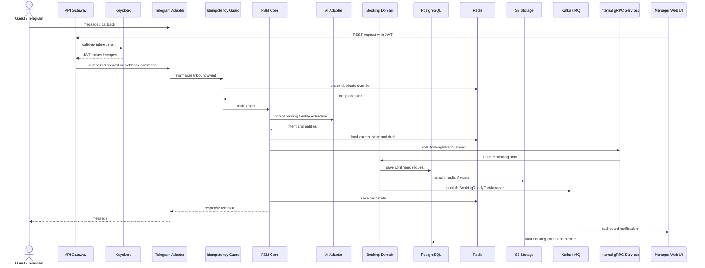
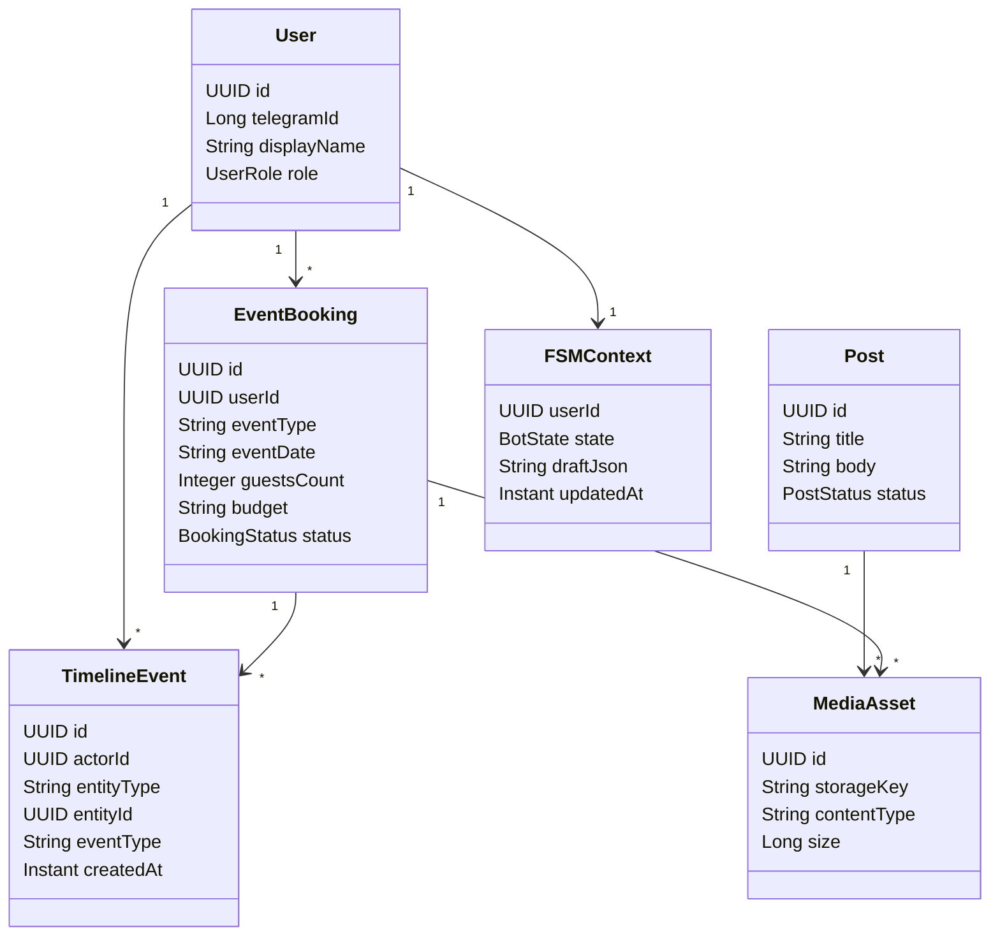

# Astor Butler: черновик ТЗ и материалов для диплома

## Где лежат найденные материалы

### Основная дипломная работа

- `/Users/michaelwelly/Downloads/Astor_Butler_Final_With_Header.docx` - версия с титульником ВШЭ, подходит как основа дипломной/исследовательской работы.
- `/Users/michaelwelly/Downloads/Astor_Butler_Triada_69_with_sources.docx` - более полная версия с расширенной триадой "гость - стафф - менеджер" и источниками.
- `/Users/michaelwelly/Downloads/Astor_Butler_Academic_Format.docx` - академически оформленная версия без титульного листа.
- `/Users/michaelwelly/Downloads/Titulnik_Astor_Butler_2025.docx` - отдельный титульник.
- `/Users/michaelwelly/Downloads/Astor_Butler_Triada_69_with_TOC.docx` и `/Users/michaelwelly/Downloads/Astor_Butler_Triada_69_ready_for_TOC.docx` - версии с/под оглавление.

### Презентации и короткие материалы

- `/Users/michaelwelly/Downloads/astor_butler_pitch_deck_may_2025_final.pdf`
- `/Users/michaelwelly/Downloads/astor_butler_pitch_deck_may_2025.pptx.pdf`
- `/Users/michaelwelly/Downloads/Astor_butler_one_pager(ru).docx`
- `/Users/michaelwelly/Downloads/Astor_butler_one_pager(ru).pdf`
- `/Users/michaelwelly/Downloads/astor_butler_speech.txt`
- `/Users/michaelwelly/Downloads/Astor_Butler_Conference_Paper.docx`
- `/Users/michaelwelly/Downloads/Astor Butler Conf.docx`

### Архитектура и проектная память

- `/Users/michaelwelly/IdeaProjects/Astor_Butler_MVP/docs/ARCHITECTURE.md`
- `/Users/michaelwelly/IdeaProjects/Astor_Butler_MVP/README.md`
- `/Users/michaelwelly/Obsidian/Astor_Butler_Knowledge/01_Project/Project_Context.md`
- `/Users/michaelwelly/Obsidian/Astor_Butler_Knowledge/01_Project/Work_Plan.md`
- `/Users/michaelwelly/Obsidian/Astor_Butler_Knowledge/04_Tech/Tech_Decisions.md`
- `/Users/michaelwelly/Obsidian/Astor_Butler_Knowledge/03_FSM/FSM_Index.md`

### Кодовые базы Astor Butler

- `/Users/michaelwelly/IdeaProjects/Astor_Butler_MVP` - актуальный MVP.
- `/Users/michaelwelly/IdeaProjects/Astor_Butler` - legacy-версия с модулями афиш, меню, слотов, чаевых, благотворительности, бронирований.
- `/Users/michaelwelly/IdeaProjects/CRMX/Astor_Butler_MVP` - копия MVP.
- `/Users/michaelwelly/IdeaProjects/CRMX/Astor_Butler_101`, `/Users/michaelwelly/IdeaProjects/CRMX/Astor_Butler_102`, `/Users/michaelwelly/IdeaProjects/CRMX/Astor_Butler_103` - промежуточные/учебные версии.

### Внешние материалы для ТЗ и system design

- System Design, занятие 1, часть 1: `https://docs.google.com/presentation/d/1iaMuH9JtA3KA35r7q7m6dubF6CyXqyEG/edit?usp=sharing&ouid=100492516528822270348&rtpof=true&sd=true`
- System Design, занятие 1, часть 2: `https://docs.google.com/presentation/d/1zlju_ggeHnIX-hi_rzUuQ_reXrkT8GP_/edit?usp=sharing&ouid=100492516528822270348&rtpof=true&sd=true`
- Notion/C3AG: `https://www.notion.so/C3AG-36ea7c019f19803e8fcce085b4db7f88?source=copy_link`
- `/Users/michaelwelly/Downloads/System_Design_Подготовка_к_сложном_у_интервью.pdf`
- `/Users/michaelwelly/Downloads/Микросервисы Кафка Кубер.pdf`
- `/Users/michaelwelly/Downloads/Доклад Open Api  и Swagger.pptx`
- `/Users/michaelwelly/Downloads/Доклад Open Api  и Swagger (pdf).pdf`
- `/Users/michaelwelly/Downloads/Тестовое задание.docx`

### Материалы HoReCa/меню/КП

- `/Users/michaelwelly/Downloads/MORGAN BAR MENU 24.11.25.pdf`
- `/Users/michaelwelly/Downloads/MORGAN KITCHEN MENU 24.11.25.pdf`
- `/Users/michaelwelly/Downloads/Morgan Info .rtf`
- `/Users/michaelwelly/Downloads/MENU AERIS.pdf`
- `/Users/michaelwelly/Downloads/AERIS DAILY MENU.pdf`
- `/Users/michaelwelly/Downloads/AERIS 10 MENU.pdf`
- `/Users/michaelwelly/Downloads/Коммерческое_предложение_AERIS_бар.docx`
- `/Users/michaelwelly/Downloads/КОММЕРЧЕСКОЕ ПРЕДЛОЖЕНИЕ.docx`
- `/Users/michaelwelly/Downloads/Пример Приложение.docx`
- `/Users/michaelwelly/Downloads/Приложение+Акт.ПоединенкоМихаил.docx`

## Назначение системы

Astor Butler - soft-governance tool для HoReCa, реализованный как цифровой AI/FSM-менеджер. Система помогает гостю, стаффу и менеджеру взаимодействовать без давления: собирает вводные, ведет управляемый сценарий, сохраняет контекст, маршрутизирует запросы и формирует структурированную заявку для менеджера.

Telegram используется как первый UI/transport, но бизнес-логика не привязана к Telegram. Источником истины является FSM-ядро, а доменные модули отвечают за пользователей, бронирования, меню, афиши, документы, посты, таймлайны и управленческие сценарии.

## Целевая архитектура

### Каналы и frontend

- Telegram Bot UI для MVP.
- Web interface для менеджера, стаффа и администратора.
- Веб-интерфейс должен поддерживать:
  - список пользователей;
  - поиск по пользователям, заявкам, постам и событиям;
  - таймлайны взаимодействий;
  - посты/афиши/новости;
  - карточку заявки;
  - менеджерское подтверждение и эскалацию;
  - загрузку фото, видео, меню и документов.

### Backend

- Java 21.
- Spring Boot.
- Spring Web / REST API.
- gRPC for internal module-to-module communication.
- Kafka Listener / Kafka Consumer / Kafka Producer for external async boundaries and domain events.
- JDBC without JPA/Hibernate ORM for predictable SQL control and lower persistence overhead.
- Spring Security as OAuth2 Resource Server.
- Keycloak for OAuth2/OIDC, JWT Stateless authentication, roles and access management.
- Spring Validation.
- Prometheus metrics endpoint and exporters.
- ELK stack for centralized logs and observability.
- FSM core как orchestration layer.
- Domain modules: user, booking, content, media, timeline, manager, notification.
- AI adapter как заменяемый модуль для intent parsing и entity extraction.

### Данные и хранилища

- PostgreSQL - основная СУБД для пользователей, ролей, заявок, статусов, таймлайнов, постов и связей.
- MongoDB - отдельное хранилище для внутренних документов, гибкой metadata, результатов парсинга файлов и обезличенных примеров материалов.
- Redis - hot context FSM, idempotency, краткоживущие черновики, краткосрочные очереди, кеш меню и справочников.
- S3-compatible Object Storage - фото, видео, меню, документы, приложения, медиа постов.
- Kafka/RabbitMQ/Artemis - асинхронные события для audit, notification, analytics, timeline enrichment, achievements и интеграций.
- Elasticsearch/OpenSearch как возможное расширение для полнотекстового поиска.

### Инфраструктура

- Docker для контейнеризации.
- Docker Compose для локального запуска.
- Один `application.yaml` для локального Spring Boot запуска.
- Реальные секреты и endpoint credentials хранятся только в локальном `.env`, который не попадает в git.
- Kubernetes/OpenShift для production-ready deployment.
- API Gateway перед backend для rate limiting, routing, TLS termination и защиты от перегрузки.
- Nexus/Container Registry для артефактов и Docker-образов.
- TeamCity/Jenkins/GitHub Actions для CI/CD.
- Swagger/OpenAPI для REST-контрактов.
- JsonSchema для контрактов событий и сложных payload.
- Jaeger/OpenTelemetry для distributed tracing.
- Prometheus/Grafana для метрик.
- ELK stack для логов.
- JaCoCo для контроля покрытия.
- Checkstyle/PMD/SpotBugs для style и static analysis gates.

## Стек для раздела "Технологии"

Проект реализуется на Java 21 и Spring Boot как модульный монолит с возможностью последующего выделения сервисов. Наружу система предоставляет REST API и Kafka event boundary, а внутреннее взаимодействие между backend-модулями проектируется через service layer и gRPC boundary. Для работы с данными используется PostgreSQL как основная реляционная СУБД, MongoDB как отдельное хранилище внутренних документов и гибкой metadata, Redis для быстрого хранения FSM-контекста, idempotency, краткосрочных очередей и кеша, а S3-совместимое объектное хранилище для медиафайлов и документов. Доступ к PostgreSQL реализуется через JDBC без JPA/Hibernate, чтобы явно контролировать SQL-запросы, транзакции и performance-critical участки. Миграции схемы управляются Liquibase. Внешние интерфейсы описываются через REST API и документируются с помощью Swagger/OpenAPI. Для асинхронных интеграций предусматриваются Kafka, RabbitMQ или Artemis, что позволяет разделить обработку пользовательского сценария, уведомления, аудит и аналитику.

Безопасность строится через Keycloak, OAuth2/OIDC и stateless JWT. Backend не хранит пользовательские сессии внутри приложения: роли, scopes и доступы приходят из токена и проверяются на уровне API Gateway и Spring Security. Система разворачивается в Docker-контейнерах и может быть перенесена в Kubernetes/OpenShift. CI/CD строится через Jenkins, TeamCity или GitHub Actions, артефакты хранятся в Nexus или Container Registry. Наблюдаемость обеспечивается через Prometheus, Grafana, ELK и Jaeger/OpenTelemetry. Качество кода подтверждается unit-, integration- и contract-тестами на JUnit, Mockito и Testcontainers, а также quality gates через JaCoCo, Checkstyle, PMD и SpotBugs.

## Frontend ТЗ

### Назначение frontend

Frontend Astor Butler - web interface для менеджера, стаффа и администратора, который дополняет Telegram UI. Telegram остается клиентским каналом для гостя, а web interface становится рабочим местом команды: просмотр заявок, поиск, таймлайны, посты, афиши, медиа и управленческие действия.

### Роли frontend

- `MANAGER` - видит заявки, таймлайны, карточки пользователей, статусы, эскалации и менеджерские задачи.
- `STAFF` - видит назначенные задачи, расписание, базовую информацию по заявке и статусы выполнения.
- `ADMIN` - управляет пользователями, ролями, контентом, настройками интеграций и справочниками.
- `GUEST` - в web MVP может иметь ограниченный личный кабинет, но основной guest flow остается в Telegram.

### Основные экраны

1. Login через Keycloak/OAuth2.
2. Dashboard менеджера.
3. Список заявок.
4. Карточка заявки.
5. Список пользователей.
6. Карточка пользователя.
7. Global search.
8. Timeline пользователя.
9. Timeline заявки.
10. Posts/Afisha manager.
11. Media library.
12. Notifications center.
13. Staff tasks.
14. Admin settings.
15. Observability overview для технической роли.

### Dashboard менеджера

Dashboard должен показывать:

- количество новых заявок;
- заявки в статусах `NEW`, `IN_PROGRESS`, `WAITING_FOR_CLIENT`, `READY_FOR_MANAGER`, `CONFIRMED`, `CANCELLED`;
- SLA/aging по заявкам;
- P50/P95/P99 latency по API;
- error rate;
- Kafka lag по ключевым топикам;
- Redis hit ratio для меню/справочников;
- состояние PostgreSQL, Redis, Kafka, S3;
- последние эскалации;
- задачи менеджера на сегодня.

### Заявки и бронирования

Frontend должен позволять:

- просматривать список заявок с фильтрами по статусу, дате, менеджеру и типу мероприятия;
- открывать карточку заявки;
- видеть данные, собранные FSM: дата, время, формат, гости, бюджет, меню, технические требования, контакты;
- менять статус заявки;
- добавлять заметки менеджера;
- видеть историю изменений;
- видеть связанные медиа и документы;
- отправлять заявку в подтверждение;
- эскалировать заявку;
- возвращаться к диалогу/таймлайну гостя.

### Пользователи

Frontend должен позволять:

- искать пользователей по имени, Telegram ID, телефону, email и роли;
- просматривать карточку пользователя;
- видеть историю взаимодействий;
- видеть связанные заявки, посты, медиа и таймлайны;
- менять роль пользователя при наличии прав `ADMIN`;
- блокировать или ограничивать пользователя при нарушении правил.

### Поиск

Global search должен искать по:

- пользователям;
- заявкам;
- таймлайнам;
- постам;
- афишам;
- медиа metadata;
- менеджерским заметкам;
- техническим событиям, если роль имеет доступ.

На первом этапе поиск может работать через PostgreSQL indexes. Elasticsearch/OpenSearch подключается как расширение при росте объема данных и требований к полнотекстовому поиску.

### Таймлайны

Frontend должен отображать:

- user timeline;
- booking timeline;
- manager action timeline;
- system events timeline;
- Kafka/domain events, привязанные к бизнес-сущности;
- изменения статусов;
- сообщения, callbacks и FSM-переходы;
- загрузки медиа;
- уведомления и ошибки отправки.

### Посты, афиши и контент

Frontend должен позволять:

- создавать посты и афиши;
- редактировать title, body, дату публикации и статус;
- прикреплять фото, видео, документы и меню;
- сохранять черновик;
- отправлять на публикацию;
- публиковать;
- архивировать;
- видеть историю изменений;
- переиспользовать медиа из media library.

### Media library

Media library должна поддерживать:

- загрузку фото, видео, PDF, DOCX и меню;
- хранение файлов в S3-compatible Object Storage;
- просмотр metadata;
- привязку файла к заявке, посту, пользователю или событию;
- проверку размера и типа файла;
- отображение статуса загрузки;
- безопасное удаление через soft delete.

### Frontend security

- Авторизация через Keycloak.
- Frontend получает access token и передает его в backend через `Authorization: Bearer`.
- Refresh flow настраивается через OAuth2/OIDC.
- Роли и permissions берутся из JWT claims.
- UI скрывает недоступные действия, но backend остается финальной точкой проверки прав.
- Все dangerous actions требуют confirmation modal.
- Для admin actions нужен audit event.

### Frontend observability

Frontend должен отправлять:

- client-side errors;
- API latency;
- failed requests;
- route load time;
- key user actions;
- frontend version/build metadata.

Метрики и логи frontend должны попадать в observability pipeline, чтобы техническая команда могла связывать проблемы UI с backend latency, Kafka lag и ошибками интеграций.

### Frontend API contract

- Все REST endpoints должны быть описаны в Swagger/OpenAPI.
- Frontend работает по generated API client или по типизированным DTO.
- Breaking changes API запрещены без версионирования.
- Сложные payload должны иметь JsonSchema или DTO validation contract.
- Для Kafka events frontend напрямую не подписывается в MVP; realtime обновления идут через backend API, polling или будущий WebSocket/SSE gateway.

### Frontend quality gates

- Unit tests для компонентов и utility logic.
- Integration tests для ключевых flows: login, search, booking status change, post publish, media upload.
- E2E smoke tests для manager dashboard и booking flow.
- Linting и formatter как обязательные checks.
- Проверка accessibility для ключевых экранов.
- Проверка responsive layout для desktop и tablet.

## Promo / Lead-Gen Frontend ТЗ

### Назначение

Отдельный публичный frontend-контур C3FLEX.com нужен для презентации production-истории Astor Butler/C3AG, рекламы System Design / JavaGuru-материалов и генерации лидов. Это immersive digital experience, который должен быстро объяснять ценность проекта, показывать архитектуру, подводить зрителя к курсу и собирать заявки после ссылки под видео.

Этот контур не заменяет manager web app. Он работает как публичная витрина и lead capture layer, а все лиды, события, видео и контент проходят через общий backend-контур Astor Butler.

### Frontend stack

- Next.js.
- React.
- GSAP для сложных scroll/scene animations.
- Framer Motion для UI transitions.
- Lenis smooth scroll.
- Adaptive layout for desktop/tablet/mobile.
- SEO-friendly routing and metadata.

### C3FLEX.com portfolio taxonomy

Верхний уровень каталога:

- Event Stories;
- Reels & Product Content;
- Commercials.

Папки из Яндекс.Диска внутри `ПОРТФОЛИО / VIDEO C3AG` используются как вложенные категории внутри этих трех веток. В локальном MVP frontend работает с тремя видео: по одному видео на каждую верхнюю категорию. Все 102 файла разрешены для публичного показа после курации, но полный перенос в S3/Object Storage выполняется только на production/cloud этапе.

### Backend для promo-контура

WordPress/Headless CMS из исходного ТЗ не принимается как целевая backend-архитектура проекта. Контентная часть должна опираться на тот же backend stack, который выбран для Astor Butler:

- Java 21 + Spring Boot.
- REST API наружу.
- gRPC для внутренних backend-вызовов.
- JDBC + PostgreSQL для контента, лидов, SEO metadata и связей.
- MongoDB для внутренних документов, гибких document metadata и результатов парсинга.
- Redis для кеша публичного контента, меню, справочников, landing blocks и feature flags.
- S3-compatible Object Storage для видео, изображений, презентаций, PDF и медиа.
- Kafka для lead events, analytics events, audit events и notification commands.
- Keycloak/JWT для admin-доступа к управлению контентом.
- Swagger/OpenAPI для frontend API contracts.

### Content management

CMS-функции реализуются внутри собственного admin/content module, без WordPress. Система должна позволять:

- добавлять и редактировать кейсы;
- менять тексты landing pages;
- загружать видео;
- управлять SEO title, description, OG image и canonical URL;
- управлять ссылками на курс, Notion, GitHub, Telegram и презентации;
- включать/выключать блоки лендинга через feature flags;
- публиковать draft/published/archived версии;
- видеть историю изменений;
- фиксировать audit events для admin actions.

### Видео

Frontend должен поддерживать:

- `mp4` и `webm`;
- autoplay only muted;
- lazy loading;
- adaptive streaming как production target;
- poster image;
- fallback image/video state;
- preload strategy по приоритету блока;
- хранение исходников и derivative assets в S3-compatible Object Storage;
- CDN-ready URL structure для будущего подключения CDN.

### Интеграции

- Telegram: lead handoff, notification to manager/admin, CTA to bot.
- CRM: отправка лидов и статусов обработки на следующем этапе; первая версия стартует с Telegram/email.
- Google Analytics.
- Яндекс Метрика.
- Vimeo.
- YouTube.
- GitHub links for repository credibility.
- Notion links for public specs/materials when allowed.

### Lead flow

1. Пользователь попадает на immersive landing page.
2. Frontend показывает production story, System Design blocks, architecture visuals и CTA.
3. Пользователь нажимает CTA: Telegram, форма заявки, ссылка на курс или видео.
4. Frontend отправляет lead event в REST API.
5. Backend валидирует payload и сохраняет lead в PostgreSQL.
6. Backend публикует Kafka event `astor.lead.events`.
7. Notification module отправляет событие в Telegram/CRM.
8. Timeline module фиксирует источник, UTM, страницу и CTA.
9. Analytics pipeline отправляет событие в GA/Яндекс Метрику.

### Promo functional requirements

1. Система должна отображать публичный landing page с production story.
2. Система должна показывать блоки System Design и архитектурные материалы.
3. Система должна поддерживать рекламный блок JavaGuru/System Design курса.
4. Система должна позволять оставить заявку через форму.
5. Система должна отправлять пользователя в Telegram по CTA.
6. Система должна поддерживать видео-блоки с lazy loading.
7. Система должна собирать UTM/source/campaign metadata.
8. Система должна сохранять лиды в PostgreSQL.
9. Система должна публиковать lead events в Kafka.
10. Система должна передавать события в Google Analytics и Яндекс Метрику.
11. Система должна позволять администратору менять тексты, кейсы, видео и SEO metadata.
12. Система должна иметь отдельный preview mode для draft-контента.

### Promo non-functional requirements

1. First viewport должен загружаться быстро и не зависеть от тяжелого видео.
2. Видео и медиа должны загружаться лениво.
3. Контент должен кешироваться через Redis.
4. Публичные API должны иметь rate limiting.
5. Формы должны иметь anti-spam validation.
6. SEO metadata должна быть доступна серверно.
7. Все lead actions должны логироваться и попадать в audit/timeline.
8. Ошибки frontend должны попадать в observability pipeline.
9. Страница должна быть готова к CDN.
10. Accessibility baseline обязателен для CTA, форм и навигации.

## Функциональные требования

1. Система должна регистрировать пользователя по Telegram ID или данным веб-интерфейса.
2. Система должна хранить профиль пользователя, роль и историю взаимодействий.
3. Система должна поддерживать роли `GUEST`, `STAFF`, `MANAGER`, `ADMIN`.
4. Система должна вести диалог через FSM-состояния.
5. Система должна сохранять текущее состояние пользователя вне Telegram.
6. Система должна позволять гостю создать заявку на мероприятие или бронирование.
7. Система должна собирать дату, время, формат мероприятия, количество гостей, бюджет, меню, технические требования и контактные данные.
8. Система должна формировать итоговую заявку для менеджера.
9. Система должна позволять менеджеру просматривать список заявок.
10. Система должна позволять менеджеру менять статус заявки.
11. Система должна поддерживать поиск по пользователям, заявкам, постам и таймлайнам.
12. Система должна отображать таймлайн действий пользователя и менеджера.
13. Система должна позволять создавать, редактировать и публиковать посты/афиши.
14. Система должна позволять прикреплять фото, видео, меню и документы к постам и заявкам.
15. Система должна хранить медиафайлы в S3-compatible storage.
16. Система должна публиковать доменные события для аудита, уведомлений и аналитики.
17. Система должна иметь 100% покрытие публичного REST API через Swagger/OpenAPI.
18. Система должна обеспечивать безопасный выход пользователя из любого сценария.
19. Система должна поддерживать внутреннее взаимодействие backend-модулей через gRPC.
20. Система должна принимать, обрабатывать и публиковать Kafka events через Kafka Listener, Consumer и Producer.
21. Система должна поддерживать Keycloak-based login для web interface.
22. Система должна поддерживать интеграцию с Gmail account как первый внешний productivity-аккаунт.

## Capability-модули MVP

Эти модули фиксируются сразу как точки расширения архитектуры. В MVP реализуются пакеты, контракты, события и связи с базовыми доменами; полная бизнес-логика добавляется итеративно после запуска core API и нагрузочного тестирования.

| Ось боли | Модуль | Что делает | Базовые связи |
| --- | --- | --- | --- |
| Идентичность | Memory Engine | узнает гостя по телефону, профилю и истории предпочтений | User, Booking, Timeline |
| Персонализация | Preference Map | предлагает сценарии "как в прошлый раз" | User, Booking, Content, Timeline |
| Благодарность | Smart Tip | цифровые чаевые и фиксация сценария благодарности | User, Booking, Timeline, Notifications |
| Инфо-поддержка | Quiet Guide | меню, афиши и справочная информация без спама | Content, Media, Redis |
| Социальный вклад | Hidden Heart | анонимные донейты и социальные сценарии | User, Timeline, Notifications |
| Игровой опыт | Safe Play | мини-сценарии с мгновенным выходом | FSM, Timeline, Panic Exit |
| Управление временем | Slot Keeper | контроль слотов и напоминания | Booking, Timeline, Notifications |
| Безопасность | Panic Exit | немедленное завершение сценария и перевод в safe state | FSM, Redis, Timeline |

Внешние блоки не обязательны для MVP, но архитектурно резервируются:

- Direct Channel Hub - прямое API "гость <-> PMS".
- Arena Reboot Engine - сценарии "отели <-> стадионы".
- Consent Vault - хранение и экспорт согласий для GDPR, PDPA, PIPL и 152-ФЗ.
- Impact Meter - культурные KPI и отчетность.

Capability-модули не ходят напрямую в UI и не обходят FSM. Внешние входы проходят через API Gateway, auth/idempotency guard и application service layer, после чего capability получает нормализованную команду или доменное событие.

## Нефункциональные требования

1. FSM является single source of truth для сценариев взаимодействия.
2. Telegram и web interface не должны содержать бизнес-логику.
3. Backend должен быть устойчив к повторной доставке сообщений и callback events.
4. Backend должен быть защищен от перегрузки и DDoS-рисков через API Gateway, rate limiter, request validation и ограничение payload size.
5. Все входящие события должны проходить idempotency guard.
6. Система должна восстанавливать пользовательский контекст после рестарта.
7. Система должна логировать ключевые доменные события.
8. REST API должен быть документирован через Swagger/OpenAPI.
9. Payload сложных событий должен валидироваться через JsonSchema или DTO validation.
10. Система должна поддерживать горизонтальное масштабирование backend-инстансов и вертикальное масштабирование ресурсов.
11. Система должна иметь tracing через Jaeger/OpenTelemetry.
12. Система должна собирать технические метрики через Prometheus.
13. Unit-тесты должны покрывать FSM-переходы и доменные сервисы.
14. Интеграционные тесты должны проверять persistence, Redis и API-контракты.
15. Секреты не должны храниться в git-репозитории.
16. Артефакты сборки `target/**` не должны попадать в git.
17. Целевой availability SLO - 99.9% uptime в год после выхода production-версии.
18. Latency должна отслеживаться по P50, P95 и P99 для публичных REST endpoints, gRPC calls и Kafka processing.
19. Целевые latency thresholds уточняются после нагрузочного тестирования; до тестов фиксируются как наблюдаемые SLI, а не как жесткие SLA.
20. Логи приложения должны попадать в ELK.
21. Grafana должна иметь минимум 6 dashboard views: API, JVM, PostgreSQL, Redis, Kafka, business/FSM.
22. JaCoCo должен контролировать покрытие unit-тестами; целевой ориентир - максимальное покрытие business-critical кода, а формальный процент утверждается после выделения слоев, где coverage имеет смысл.
23. Style gates должны включать formatter, Checkstyle, PMD или SpotBugs.
24. Интеграционные тесты должны строиться пирамидой: critical backend flows до production, расширенное покрытие на staging.
25. Данные и резервные копии production-среды должны размещаться в юрисдикции РФ, если это требуется регуляторикой проекта.
26. PostgreSQL должен проектироваться с явными constraints, foreign keys, join tables и индексами по реальным query patterns.
27. PostgreSQL primary/master принимает write traffic, read replicas/slaves используются для read-heavy запросов и аналитики.
28. MongoDB используется только для document-like данных и не заменяет PostgreSQL как основную СУБД.
29. Конфигурация локальной разработки должна использовать один `application.yaml`; реальные секреты должны храниться только в локальном `.env` и не попадать в git.
30. Локальное окружение должно подниматься через Docker Compose: PostgreSQL, Redis, MongoDB, Kafka, MinIO, Prometheus, Grafana и опционально Ollama; backend запускается локально из IDE или Maven.

## Список API

### Auth/User API

- `POST /api/auth/login` - начать OAuth2/OIDC login flow через Keycloak.
- `POST /api/auth/logout` - завершить пользовательскую сессию на клиенте и инвалидировать refresh flow при необходимости.
- `GET /api/auth/me` - получить текущего пользователя из JWT claims.
- `POST /api/users` - создать или обновить пользователя.
- `GET /api/users/{id}` - получить карточку пользователя.
- `GET /api/users?query=&role=&page=&size=` - поиск пользователей.
- `PATCH /api/users/{id}/role` - изменить роль пользователя.

### FSM API

- `POST /api/fsm/events` - принять нормализованное событие.
- `GET /api/fsm/users/{userId}/state` - получить текущее состояние пользователя.
- `POST /api/fsm/users/{userId}/reset` - сбросить сценарий в безопасное состояние.

### Booking API

- `POST /api/bookings` - создать заявку.
- `GET /api/bookings/{id}` - получить заявку.
- `GET /api/bookings?status=&query=&from=&to=` - найти заявки.
- `PATCH /api/bookings/{id}/status` - изменить статус заявки.
- `POST /api/bookings/{id}/manager-notes` - добавить заметку менеджера.

### Timeline API

- `GET /api/timelines/users/{userId}` - таймлайн пользователя.
- `GET /api/timelines/bookings/{bookingId}` - таймлайн заявки.
- `POST /api/timelines/events` - добавить событие таймлайна.

### Posts/Content API

- `POST /api/posts` - создать пост/афишу.
- `GET /api/posts` - список постов.
- `GET /api/posts/{id}` - карточка поста.
- `PATCH /api/posts/{id}` - обновить пост.
- `POST /api/posts/{id}/publish` - опубликовать пост.

### Media API

- `POST /api/media/upload` - загрузить фото, видео или документ.
- `GET /api/media/{id}` - получить metadata файла.
- `DELETE /api/media/{id}` - удалить файл или пометить как удаленный.

### Manager API

- `GET /api/manager/dashboard` - сводка для менеджера.
- `GET /api/manager/tasks` - задачи менеджера.
- `POST /api/manager/tasks/{id}/complete` - завершить задачу.

### Notifications API

- `GET /api/notifications` - список уведомлений пользователя.
- `POST /api/notifications/test` - отправить тестовое уведомление.
- `PATCH /api/notifications/{id}/read` - пометить уведомление как прочитанное.

### Integrations API

- `GET /api/integrations` - список подключенных интеграций.
- `POST /api/integrations/gmail/connect` - начать подключение Gmail account.
- `DELETE /api/integrations/gmail` - отключить Gmail account.

### Observability API

- `GET /internal/metrics` - Prometheus metrics endpoint.
- `GET /internal/health/readiness` - readiness probe for Kubernetes/OpenShift.
- `GET /internal/health/liveness` - liveness probe for Kubernetes/OpenShift.

### API Implementation Plan

1. Поднять test-окружение через Docker Compose.
2. Запустить backend локально через `scripts/run_local_app.sh`.
3. Проверить Swagger UI и `/v3/api-docs`.
4. Реализовать основные API из списка выше.
5. Покрыть API contract tests и smoke tests.
6. Прогнать базовый нагрузочный сценарий.
7. По результатам нагрузки уточнить Kafka topics, индексы PostgreSQL, Redis cache strategy и границы доменных модулей.
8. После нагрузочного теста дописать системные блоки, которые обсуждались в архитектурной части.

### API Contract Rules

- Swagger/OpenAPI является источником правды для frontend generated clients.
- Все public API должны иметь DTO/schema модели для request и response payload.
- Все CRUD-oriented ресурсы должны иметь `POST`, `GET`, `PUT`, `PATCH`, `DELETE`, если операция применима к ресурсу.
- Все API используют единый error contract `ApiErrorResponse`.
- Стандартная матрица ответов фиксируется заранее: `200`, `201`, `202`, `204`, `304`, `400`, `401`, `403`, `404`, `409`, `422`, `429`, `500`, `502`, `503`.
- `2xx` описывает успешное выполнение или принятие команды.
- `3xx` резервируется для cache-aware reads и OAuth/browser flows.
- `4xx` описывает ошибки клиента, авторизации, прав, idempotency conflicts, validation и rate limits.
- `5xx` описывает backend или dependency failures.
- Контроллеры не содержат бизнес-логику. Они валидируют контракт и пробрасывают команду в service/FSM/domain layer.
- Kafka и gRPC не являются frontend API, но их команды и события должны иметь JsonSchema/DTO contracts.

### Internal gRPC Services

- `UserInternalService` - lookup пользователя, ролей и basic profile.
- `BookingInternalService` - создание и обновление booking draft/request.
- `TimelineInternalService` - запись timeline events.
- `MediaInternalService` - привязка media metadata к сущностям.
- `NotificationInternalService` - постановка notification command во внутренний контур.

### Kafka Topics Draft

Финальный список топиков уточняется после нагрузочного тестирования. Базовый draft:

- `astor.booking.events`
- `astor.user.events`
- `astor.timeline.events`
- `astor.media.events`
- `astor.notification.commands`
- `astor.notification.events`
- `astor.audit.events`
- `astor.analytics.events`
- `astor.achievement.events`

## Диаграмма последовательности API

## UML / доменная схема для диплома

## Git hygiene перед push/PR

Нельзя коммитить:

- `.env`
- `target/**`
- `.codex*/**`
- `.idea/dataSources.xml`, если нет отдельного решения
- локальные аудио/транскрипты Codex

Перед push нужно отдельно проверить локальный коммит и историю на наличие секретов.
