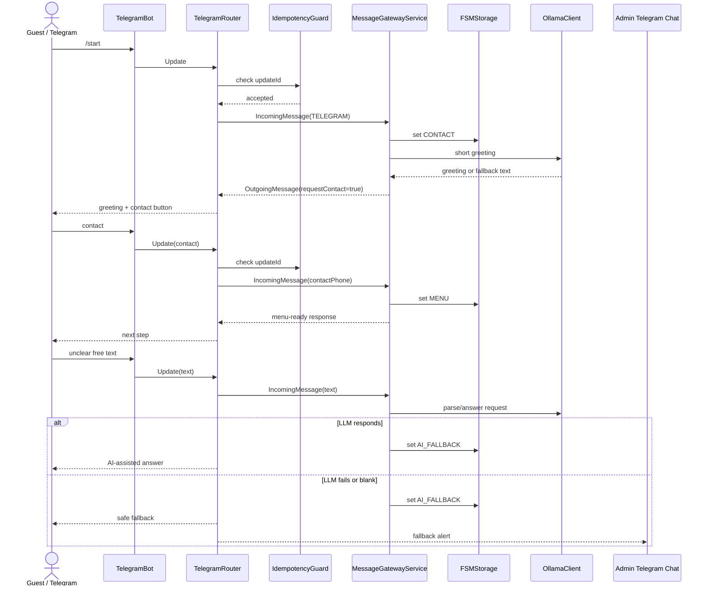

# FSM Scenarios

## Purpose

Telegram is the first Astor Butler UI, but it is not the owner of business logic. The same normalized message flow must work for Telegram, future frontend chat and other messengers.

Current MVP slice:

- guest sends `/start` in Telegram;
- backend moves the user into `CONTACT`;
- backend asks for contact and links privacy policy;
- contact capture moves the user into `MENU`;
- free text is routed through AI-assisted response;
- unclear/failed AI response falls back to admin alert when `TELEGRAM_ADMIN_CHAT_ID` is configured.

## Message Gateway

`MessageGatewayService` is the current application boundary for UI messages. Telegram long polling calls it internally. REST exposes the same contract as `POST /api/messages` for future web chat and smoke tests.



## States

| State | Meaning | Current behavior | Next build step |
| --- | --- | --- | --- |
| `UNKNOWN` | Redis has no user state yet | default state before `/start` | connect to User/Memory Engine |
| `CONTACT` | backend needs phone/contact and consent evidence | asks user to share contact | persist contact and consent |
| `MENU` | safe basic menu state | confirms contact and offers next action | connect Booking/Quiet Guide |
| `AI_FALLBACK` | free-text or unclear request path | AI-assisted reply or admin fallback | replace with structured intent/entity adapter |

Future states:

- `IDENTITY_CHECK` - Memory Engine recognizes guest by phone/profile/history.
- `BOOKING_DRAFT` - Slot Keeper collects date, time, guests, budget and requirements.
- `SLOT_SELECTION` - booking slots and reminders.
- `MANAGER_ESCALATION` - manager review or manual response required.
- `SAFE_IDLE` - Panic Exit state after reset or scenario exit.

## API Links

- `POST /api/messages` - normalized message gateway for web chat and future messengers.
- `POST /api/fsm/events` - lower-level normalized event boundary.
- `GET /api/fsm/users/{userId}/state` - state read model.
- `POST /api/fsm/users/{userId}/reset` - safe reset.
- `POST /api/consents` - consent grant placeholder for contact/policy flow.
- `GET /api/consents/policy/current` - current policy version.

## Local Check

1. Start infrastructure:

```bash
docker compose up -d
```

2. Start Spring Boot locally:

```bash
scripts/run_local_app.sh
```

3. Open Swagger:

```text
http://localhost:8088/swagger-ui/index.html
```

4. For Telegram bot check, `.env` must contain:

```bash
TELEGRAM_BOT_ENABLED=true
TELEGRAM_BOT_TOKEN=...
TELEGRAM_BOT_USERNAME=...
TELEGRAM_ADMIN_CHAT_ID=...
```

5. Send `/start` to the bot and verify:

- bot answers with greeting;
- bot requests contact;
- contact moves state to `MENU`;
- unclear text returns fallback and sends admin alert if admin chat id is set.
