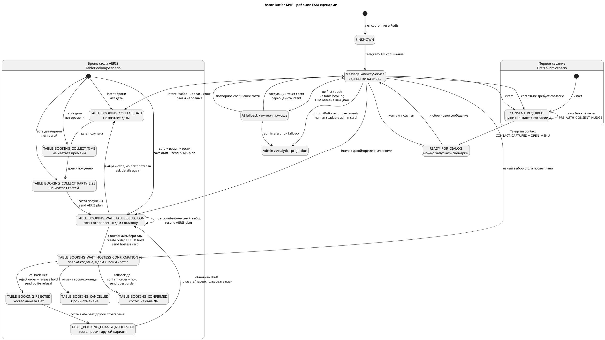

# Рабочие FSM-сценарии Astor Butler MVP

Этот документ описывает фактическую рабочую FSM-модель, которая сейчас есть в коде. Telegram остается транспортом и UI, а источником истины по состояниям является backend FSM.

UML-диаграмма в формате PlantUML лежит рядом:

```text
docs/FSM_WORKING_SCENARIOS_UML.puml
```

Ее можно открыть в IntelliJ IDEA через PlantUML plugin или вставить в любой PlantUML renderer.

## Главная идея

Все входящие сообщения идут через `MessageGatewayService`. Это единая точка входа для Telegram, будущего web-чата и smoke-тестов через `POST /api/messages`.

Порядок маршрутизации:

1. Сохраняем входящее сообщение и профиль Telegram в PostgreSQL.
2. Если сообщение пришло из admin/analytics чата, не пускаем его в гостевой FSM.
3. Проверяем сценарий первого касания `FirstTouchScenario`.
4. Проверяем сценарий брони стола `TableBookingScenario`.
5. Обрабатываем voice/empty/menu.
6. Если ничего не подошло, идем в AI fallback и, при необходимости, шлем alert админу.
7. Публикуем событие в outbox/Kafka `astor.user.events`; admin chat получает человекочитаемую проекцию.

## UML



## Перевод состояний на русский

| Состояние | По-русски | Что делает система |
| --- | --- | --- |
| `UNKNOWN` | Состояния еще нет | Redis не знает гостя; backend создает начальное состояние. |
| `CONSENT_REQUIRED` | Нужен контакт и согласие | Просим нажать кнопку контакта; без этого не ведем бронирование. |
| `READY_FOR_DIALOG` | Можно вести диалог | Гость прошел первый контакт, можно запускать сценарии. |
| `AI_FALLBACK` | Непонятный текст или LLM-проблема | Отвечаем безопасно, при необходимости шлем alert админу. |
| `TABLE_BOOKING_COLLECT_DATE` | Нужна дата | Спрашиваем дату брони. |
| `TABLE_BOOKING_COLLECT_TIME` | Нужно время | Спрашиваем время брони. |
| `TABLE_BOOKING_COLLECT_PARTY_SIZE` | Нужно количество гостей | Спрашиваем, на сколько гостей бронировать. |
| `TABLE_BOOKING_WAIT_TABLE_SELECTION` | Ждем выбор стола | PDF плана уже отправлен, ждем номер стола, зону или "выбери сам". |
| `TABLE_BOOKING_WAIT_HOSTESS_CONFIRMATION` | Ждем хостес | Заявка и hold созданы, в чат хостес ушла карточка с кнопками `Да`/`Нет`. |
| `TABLE_BOOKING_CONFIRMED` | Бронь подтверждена | Хостес нажала `Да`, hold стал подтвержденным, гостю отправляется красивый ордер. |
| `TABLE_BOOKING_REJECTED` | Бронь отклонена | Хостес нажала `Нет`, hold освобожден, гостю отправляется вежливый отказ и предложение выбрать другой вариант. |
| `TABLE_BOOKING_CHANGE_REQUESTED` | Гость хочет изменить бронь | Пересобираем draft и снова идем к выбору/подтверждению. |
| `TABLE_BOOKING_CANCELLED` | Бронь отменена | Освобождаем активные holds и закрываем сценарий. |

Устаревшие алиасы `GREETING`, `CONTACT`, `MENU` еще есть в enum для совместимости Redis-данных. В runtime они канонизируются так:

| Старое состояние | Новое состояние |
| --- | --- |
| `GREETING` | `CONSENT_REQUIRED` |
| `CONTACT` | `CONSENT_REQUIRED` |
| `MENU` | `READY_FOR_DIALOG` |

## Первый контакт

Рабочий путь:

```text
Гость: /start
Astor: просит согласие и Telegram contact
Гость: делится контактом
Astor: сохраняет consent/profile/contact, переводит гостя в READY_FOR_DIALOG
```

Если гость пишет текст до контакта, система не продолжает бронирование. Она коротко возвращает его к кнопке согласия и контакта.

## Бронь стола

Happy path:

```text
Гость: Хочу забронировать столик завтра на 20:00 на двоих
Astor: сохраняет draft, отправляет AERIS PLAN.pdf, просит выбрать стол/зону
Гость: 17
Astor: создает table_reservation_order и HELD hold
Astor -> чат хостес: карточка заявки с кнопками Да/Нет
Хостес: нажимает Да
Astor: подтверждает order/hold и отправляет гостю красивый ордер
```

Важное поведение:

- план зала отправляется до выбора стола;
- повторная фраза про бронь в состоянии выбора стола снова отправляет план, а не считается номером стола;
- выбор стола считается явным только для ответов вроде `17`, `стол 17`, `vip`, `бар`, `выбери сам`;
- хостес подтверждает только кнопками, свободный текст в чате хостес не подтверждает бронь;
- Redis хранит только runtime draft, а долговечная заявка и holds лежат в PostgreSQL.

## Хранилища

| Слой | Что хранит |
| --- | --- |
| Redis | Текущее FSM-состояние `astor:fsm:telegram:{chatId}:state` и временный table booking draft `astor:booking:table:draft:telegram:{chatId}`. |
| PostgreSQL | Telegram profile/messages/consents, `table_reservation_orders`, `table_reservation_holds`, `venue_tables`. |
| Kafka/outbox | События `astor.user.events` для admin/analytics projection. |
| Telegram | Только UI: сообщения гостя, PDF плана, кнопки контакта и кнопки хостес. |

## Проверка руками

1. Запустить инфраструктуру:

```bash
docker compose up -d
```

2. Запустить Spring Boot из IDEA или через:

```bash
scripts/run_local_app.sh
```

3. Проверить `.env`:

```bash
TELEGRAM_BOT_ENABLED=true
TELEGRAM_BOT_TOKEN=...
TELEGRAM_BOT_USERNAME=...
TELEGRAM_ADMIN_CHAT_ID=...
TELEGRAM_ANALYTICS_CHAT_ID=...
TELEGRAM_HOSTESS_CHAT_ID=-1004291419562
TELEGRAM_BOOKING_PLAN_PDF_PATH=classpath:booking/aeris-plan.pdf
KAFKA_BOOTSTRAP_SERVERS=localhost:9092
KAFKA_USER_EVENTS_TOPIC=astor.user.events
```

4. Написать гостем:

```text
Хочу забронировать столик завтра на 20:00 на двоих
```

Ожидаем:

- гостю приходит `AERIS PLAN.pdf`;
- FSM становится `TABLE_BOOKING_WAIT_TABLE_SELECTION`;
- в admin/analytics chat приходит человекочитаемый Kafka event.

5. Ответить гостем:

```text
17
```

Ожидаем:

- создается order в `table_reservation_orders`;
- создается hold в `table_reservation_holds`;
- чат хостес получает карточку с кнопками `Да`/`Нет`;
- гость получает сообщение, что заявка отправлена хостес.

6. Нажать `Да` в чате хостес.

Ожидаем:

- order получает статус `CONFIRMED`;
- hold получает статус `CONFIRMED`;
- гостю отправляется подтвержденный ордер.
