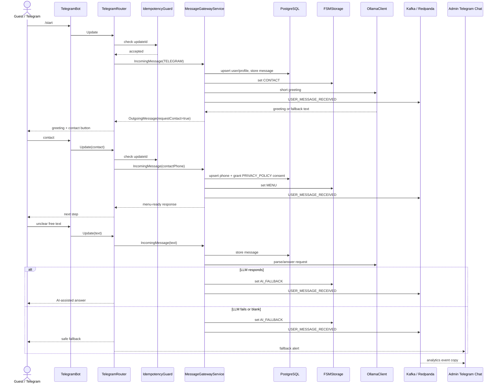

# FSM Scenarios

## Purpose

Telegram is the first Astor Butler UI, but it is not the owner of business logic. The same normalized message flow must work for Telegram, future frontend chat and other messengers.

Current MVP slice:

- guest sends `/start` in Telegram;
- backend moves the user into `CONTACT`;
- backend asks for contact and links privacy policy;
- contact capture moves the user into `MENU`;
- backend stores Telegram profile, incoming message and privacy-policy consent evidence in PostgreSQL;
- backend publishes each accepted user message into Kafka topic `astor.user.events`;
- analytics consumer forwards Kafka events into a separate admin Telegram chat when configured;
- free text is routed through AI-assisted response;
- unclear/failed AI response falls back to admin alert when `TELEGRAM_ADMIN_CHAT_ID` is configured.

## Message Gateway

`MessageGatewayService` is the current application boundary for UI messages. Telegram long polling calls it internally. REST exposes the same contract as `POST /api/messages` for future web chat and smoke tests.

Telegram UI preview shell:

- first private Telegram touch sends a persistent Butler preview with avatar and short product copy;
- preview message id is stored in `telegram_profiles.preview_message_id`;
- transient bot replies can be deleted from Telegram UI, but all incoming messages remain stored in PostgreSQL/Kafka;
- previous guest message and previous bot reply are deleted from private Telegram UI on the next accepted guest message when `TELEGRAM_UI_DELETE_USER_MESSAGES_ENABLED=true`;
- the target guest screen model is `persistent preview + current request/response`, while PostgreSQL/Kafka keep the full audit trail;
- legal/contact/booking confirmation messages are not cleaned up.

Voice messages:

- Telegram transport stores `mediaKind`, `telegramFileId`, duration and MIME type in message payload;
- Telegram transport downloads voice/audio files to local STT work dir when voice download is enabled;
- downloaded binary is uploaded to MinIO/S3 under `transient/telegram-voice/...`;
- object lifecycle expires voice binaries after `3` days (`S3_VOICE_TTL_DAYS`);
- transcript and message metadata remain in PostgreSQL/Kafka after the binary expires;
- admin Telegram chat receives the transcript, transcription status and S3 object key in the Kafka event summary;
- `SpeechToTextService` is an adapter boundary: current implementation can call an external command configured by `ASTOR_STT_COMMAND`;
- successful transcript replaces empty text before `MessageGatewayService`, so FSM sees it as a normal user message;
- if STT is disabled or unavailable, MVP acknowledges voice messages without fallback-to-admin.



## States

| State | Meaning | Current behavior | Next build step |
| --- | --- | --- | --- |
| `UNKNOWN` | Redis has no user state yet | default state before `/start` | connect to User/Memory Engine |
| `CONTACT` | backend needs phone/contact and consent evidence | asks user to share contact | persist contact and consent |
| `MENU` | safe basic menu state | confirms contact and offers next action | connect Booking/Quiet Guide |
| `AI_FALLBACK` | free-text or unclear request path | AI-assisted reply or admin fallback | replace with structured intent/entity adapter |

Redis FSM keys use `astor:fsm:telegram:{chatId}:state` and live for 3 days in MVP. This lets a guest return after a pause during the same restaurant/event cycle without losing the scenario. Redis is a hot state layer; durable facts still go to PostgreSQL and Kafka.

Future states:

- `IDENTITY_CHECK` - Memory Engine recognizes guest by phone/profile/history.
- `BOOKING_DRAFT` - Slot Keeper collects date, time, guests, budget and requirements.
- `SLOT_SELECTION` - booking slots and reminders.
- `MANAGER_ESCALATION` - manager review or manual response required.
- `SAFE_IDLE` - Panic Exit state after reset or scenario exit.

## API Links

- `POST /api/messages` - normalized message gateway for web chat and future messengers.
- `POST /api/fsm/events` - lower-level normalized event boundary.
- `GET /api/fsm/users/{userId}/state` - state read model.
- `POST /api/fsm/users/{userId}/reset` - safe reset.
- `POST /api/consents` - consent grant boundary for contact/policy flow.
- `GET /api/consents/policy/current` - current policy version.

## Local Check

1. Start infrastructure:

```bash
docker compose up -d
```

2. Start Spring Boot locally:

```bash
scripts/run_local_app.sh
```

3. Open Swagger:

```text
http://localhost:8080/swagger-ui/index.html
```

4. For Telegram bot check, `.env` must contain:

```bash
TELEGRAM_BOT_ENABLED=true
TELEGRAM_BOT_TOKEN=...
TELEGRAM_BOT_USERNAME=...
TELEGRAM_ADMIN_CHAT_ID=...
TELEGRAM_ANALYTICS_CHAT_ID=...
KAFKA_BOOTSTRAP_SERVERS=localhost:9092
KAFKA_USER_EVENTS_TOPIC=astor.user.events
```

5. Send `/start` to the bot and verify:

- bot answers with greeting;
- bot requests contact;
- contact moves state to `MENU`;
- PostgreSQL contains rows in `users`, `telegram_profiles`, `telegram_messages`, and `user_consents`;
- Kafka topic `astor.user.events` receives one event per accepted Telegram message;
- analytics admin chat receives event copies when `TELEGRAM_ANALYTICS_CHAT_ID` points to a valid chat/supergroup;
- unclear text returns fallback and sends admin alert if admin chat id is set.

If Telegram reports `group chat was upgraded to a supergroup chat`, read the logged `migrate_to_chat_id` value and put it into `TELEGRAM_ADMIN_CHAT_ID` or `TELEGRAM_ANALYTICS_CHAT_ID`. The backend retries once with the migrated id, but the `.env` value must still be updated for the next restart.
