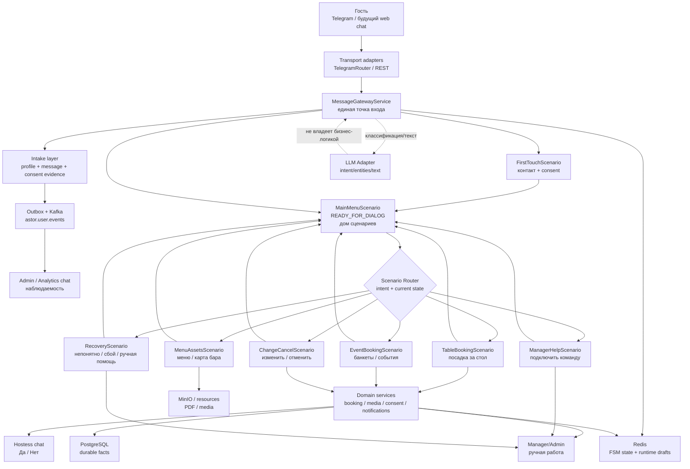
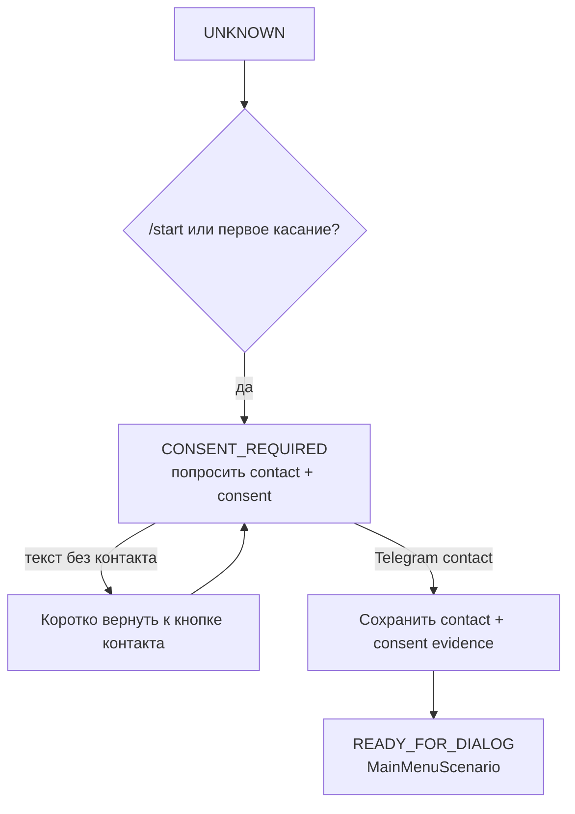
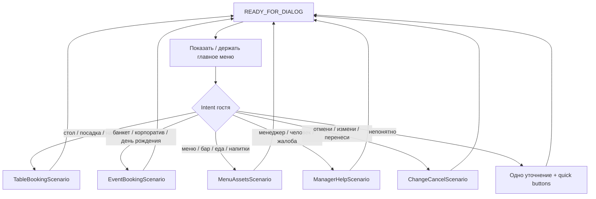
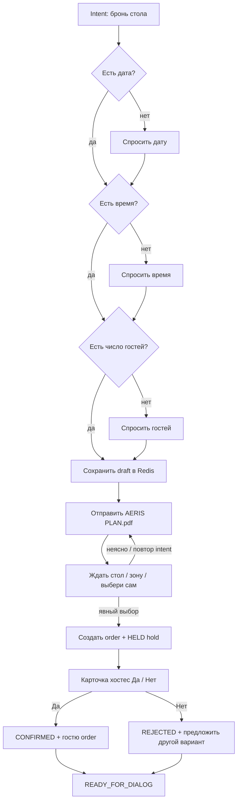
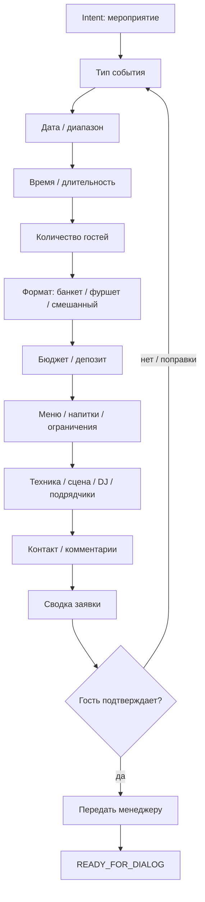
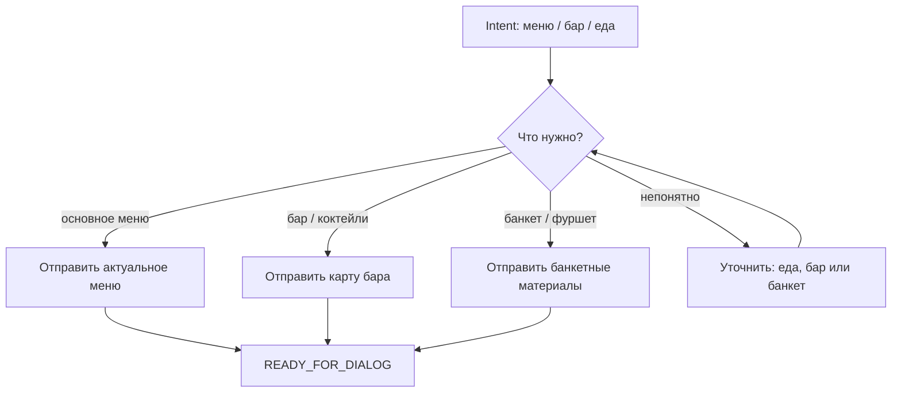
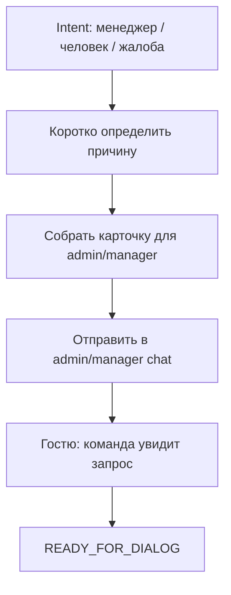
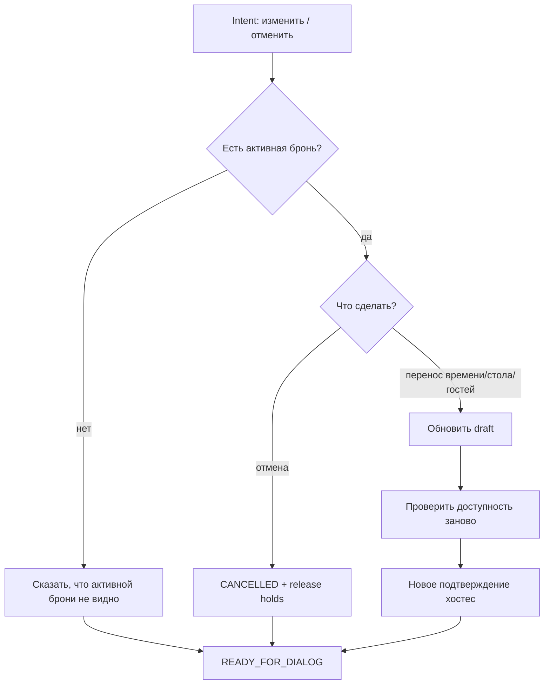
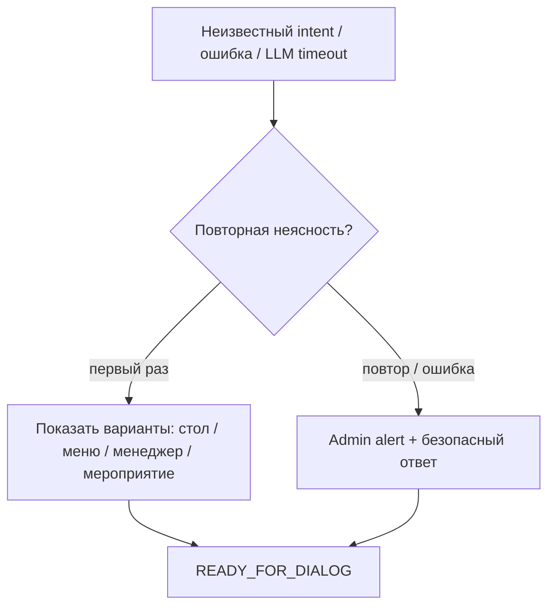

# FSM Infrastructure Blueprint

Документ описывает целевую инфраструктуру FSM-сценариев Astor Butler MVP перед изменениями в коде.

Цель: иметь одну понятную карту системы, по которой человек, LLM и тесты одинаково понимают, что делать с гостем на каждом шаге.

HTML-viewer с крупными диаграммами:

```text
docs/FSM_SCENARIOS_VIEWER.html
```

PlantUML-версия текущей карты:

```text
docs/FSM_WORKING_SCENARIOS_UML.puml
```

## Принципы

1. Telegram - только транспорт и UI.
2. `MessageGatewayService` - единая точка входа.
3. FSM - single source of truth по состояниям и переходам.
4. `READY_FOR_DIALOG` - не пустой чат, а дом сценариев, продуктово это `MainMenuScenario`.
5. Каждый завершенный сценарий возвращает гостя в `READY_FOR_DIALOG`.
6. Admin/analytics chat - наблюдаемость и аудит, а не гостевой сценарий.
7. LLM помогает распознать intent, извлечь сущности и сформулировать текст, но не подтверждает бронь, не создает holds и не меняет бизнес-статусы сам.
8. `AI_FALLBACK` - последняя страховка, а не обычный путь диалога.

## Общая Карта



## Реестр Сценариев

| Сценарий | Статус | Вход | Выход | Возврат |
| --- | --- | --- | --- | --- |
| `FirstTouchScenario` | работает | `/start`, нет состояния, `CONSENT_REQUIRED` | контакт + consent | `READY_FOR_DIALOG` |
| `MainMenuScenario` | целевой следующий слой | гость уже в системе | выбор сценария | остается `READY_FOR_DIALOG` |
| `TableBookingScenario` | частично работает | "хочу столик", "забронировать стол", "на двоих" | заявка хостес, подтверждение/отказ | `READY_FOR_DIALOG` |
| `EventBookingScenario` | целевой | банкет, день рождения, корпоратив, свадьба, выкуп зала | structured event request для менеджера | `READY_FOR_DIALOG` |
| `MenuAssetsScenario` | целевой | "меню", "карта бара", "а что есть по еде" | отправка релевантных файлов/разделов меню | `READY_FOR_DIALOG` |
| `ManagerHelpScenario` | целевой | "позови менеджера", "хочу человека", жалоба | карточка менеджеру/admin | `READY_FOR_DIALOG` или ожидание ответа |
| `ChangeCancelScenario` | целевой | "изменить бронь", "отмена", "не придем" | изменение/отмена active order | `READY_FOR_DIALOG` |
| `RecoveryScenario` | целевой safety-net | неизвестный intent, конфликт, LLM/интеграция недоступна | короткое уточнение или admin alert | `READY_FOR_DIALOG` |

## Состояния

| State | Русское имя | Роль |
| --- | --- | --- |
| `UNKNOWN` | Нет состояния | Redis не знает гостя. |
| `CONSENT_REQUIRED` | Нужен контакт и согласие | Не продолжаем бизнес-сценарии до контакта. |
| `READY_FOR_DIALOG` | Главное меню / дом сценариев | Базовая точка после первого касания и после завершения сценариев. |
| `AI_FALLBACK` | Последняя страховка | Временное состояние для неизвестного/сломавшегося пути. |
| `TABLE_BOOKING_COLLECT_DATE` | Нужна дата | Сбор даты посадки. |
| `TABLE_BOOKING_COLLECT_TIME` | Нужно время | Сбор времени посадки. |
| `TABLE_BOOKING_COLLECT_PARTY_SIZE` | Нужно число гостей | Сбор party size. |
| `TABLE_BOOKING_WAIT_TABLE_SELECTION` | Ждем стол | План отправлен, ждем стол/зону/автовыбор. |
| `TABLE_BOOKING_WAIT_HOSTESS_CONFIRMATION` | Ждем хостес | Заявка и hold созданы, хостес решает кнопками. |
| `TABLE_BOOKING_CONFIRMED` | Подтверждено | Гостю отправлен order, возврат домой. |
| `TABLE_BOOKING_REJECTED` | Отклонено | Предложить другой вариант, затем домой или change. |
| `TABLE_BOOKING_CHANGE_REQUESTED` | Изменение | Пересобрать draft и пройти подтверждение заново. |
| `TABLE_BOOKING_CANCELLED` | Отмена | Освободить holds, вернуться домой. |

Старые Redis aliases:

| Старое | Каноническое |
| --- | --- |
| `GREETING` | `CONSENT_REQUIRED` |
| `CONTACT` | `CONSENT_REQUIRED` |
| `MENU` | `READY_FOR_DIALOG` |

## Правила Разговора

Astor должен говорить как спокойный цифровой дворецкий AERIS:

- коротко;
- уверенно;
- не обещать то, что не подтверждено доменным слоем;
- спрашивать один недостающий параметр за раз;
- не спорить с гостем;
- не раскрывать технические детали;
- подтверждать понимание только после структурирования данных;
- для неопределенности использовать уточнение, а не длинную лекцию.

### Базовые тексты

Первое касание:

```text
Нажимая кнопку "Согласиться и поделиться контактом", вы соглашаетесь с политикой обработки персональных данных.
```

Главное меню после контакта:

```text
Спасибо, я на связи. Что сделаем?

• Забронировать стол
• Посмотреть меню
• Позвать менеджера
• Организовать мероприятие
• Изменить или отменить бронь
```

Непонятный intent в Main Menu:

```text
Я пока не уверен, какой сценарий нужен. Выберите, пожалуйста: стол, меню, менеджер или мероприятие.
```

Fallback при технической проблеме:

```text
Я не смог уверенно продолжить сценарий. Передам это администратору, а вы можете написать проще: стол, меню, менеджер или мероприятие.
```

## FirstTouchScenario



Правила:

- не запускать бронь до контакта;
- не собирать дату/стол/меню до consent;
- контакт дает право перейти в `READY_FOR_DIALOG`.

## MainMenuScenario



Правила:

- `READY_FOR_DIALOG` не должен сразу уходить в `AI_FALLBACK`;
- первым делом пробуем явные сценарии;
- если intent слабый, показываем варианты;
- fallback только после повторной неясности или технического сбоя.

## TableBookingScenario



Правила:

- перед выбором стола всегда отправлять план;
- `20:00` не считается номером стола;
- "17", "стол 17", "vip", "бар", "выбери сам" считаются выбором;
- хостес подтверждает только кнопками;
- после `Да`/`Нет` гость получает человекочитаемый результат.

## EventBookingScenario

Целевой сценарий для мероприятий: день рождения, банкет, корпоратив, свадьба, презентация, выкуп зала.



Правила:

- не смешивать с обычной посадкой за стол;
- если запрос больше регулярной посадки, route в `EVENT_BOOKING`;
- итог - structured request для менеджера, не автоматическое подтверждение.

## MenuAssetsScenario

Целевой сценарий для меню, карты бара, банкетных документов и медиа.



Правила:

- не отправлять все файлы сразу;
- выбирать релевантный asset;
- после отправки предложить бронь стола или менеджера.

## ManagerHelpScenario

Целевой сценарий для ручного подключения команды.



Правила:

- не скрывать ручную передачу;
- приложить chatId, имя, username, последнее сообщение, состояние FSM;
- не запускать этот сценарий из admin chat как гостевой.

## ChangeCancelScenario

Целевой сценарий для изменения или отмены существующей заявки.



Правила:

- изменение после hold требует нового подтверждения;
- отмена освобождает holds;
- гостю всегда сообщается итог.

## RecoveryScenario



Правила:

- сначала уточнять;
- затем эскалировать;
- не оставлять гостя в техническом тупике;
- логировать причину и correlation id.

## LLM Contract

LLM может:

- классифицировать intent;
- извлекать дату, время, гостей, стол, зону, тип события;
- переформулировать ответ в тоне Astor;
- предложить одно уточнение.

LLM не может:

- подтверждать бронь;
- создавать order/hold;
- обещать свободный стол;
- менять статус заявки;
- подтверждать от имени хостес;
- игнорировать FSM state.

Минимальный формат результата intent adapter в будущем:

```json
{
  "intent": "TABLE_BOOKING",
  "confidence": 0.91,
  "entities": {
    "date": "tomorrow",
    "time": "20:00",
    "partySize": 2,
    "tablePreference": null
  },
  "needsClarification": false,
  "clarificationQuestion": null
}
```

## Предкодовый Тест-План

Перед изменением кода проверяем сценарии на бумаге и потом покрываем тестами.

### First Touch

| Given | When | Then |
| --- | --- | --- |
| `UNKNOWN` | `/start` | `CONSENT_REQUIRED`, кнопка контакта |
| `CONSENT_REQUIRED` | текст без контакта | остается `CONSENT_REQUIRED`, короткий nudge |
| `CONSENT_REQUIRED` | contact | consent saved, `READY_FOR_DIALOG` |

### Main Menu

| Given | When | Then |
| --- | --- | --- |
| `READY_FOR_DIALOG` | "хочу столик завтра" | route `TABLE_BOOKING` |
| `READY_FOR_DIALOG` | "скинь меню" | route `MENU_ASSETS` |
| `READY_FOR_DIALOG` | "позови менеджера" | route `MANAGER_HELP` |
| `READY_FOR_DIALOG` | "день рождения на 30 человек" | route `EVENT_BOOKING` |
| `READY_FOR_DIALOG` | непонятный текст | показать варианты, не сразу admin alert |

### Table Booking

| Given | When | Then |
| --- | --- | --- |
| `READY_FOR_DIALOG` | "столик завтра в 20:00 на двоих" | send plan, wait table |
| `TABLE_BOOKING_WAIT_TABLE_SELECTION` | "17" | create order/hold, send hostess card |
| `TABLE_BOOKING_WAIT_TABLE_SELECTION` | повтор booking intent | resend plan, не создавать order |
| `TABLE_BOOKING_WAIT_HOSTESS_CONFIRMATION` | hostess `Да` | confirm order/hold, guest order, return ready |
| `TABLE_BOOKING_WAIT_HOSTESS_CONFIRMATION` | hostess `Нет` | reject/release, polite guest refusal |

### Observability

| Given | When | Then |
| --- | --- | --- |
| любое guest сообщение | accepted | outbox/Kafka event |
| admin chat message | incoming | stored + projection, guest FSM skipped |
| fallback | technical/unknown | admin alert with state/correlation |

## Кодовые Шаги После Утверждения Карты

1. Добавить `MainMenuScenario`.
2. Вынести intent routing из `MessageGatewayService` в явный scenario router.
3. Обновить `MessageGatewayService`: first touch -> active scenario -> main menu -> recovery.
4. Добавить тесты Main Menu routing.
5. Добавить будущие enum states только там, где нужен runtime state, не плодить состояния для простых одношаговых ответов.
6. Обновить LLM prompt contract под сценарный router.
7. Прогнать ручной сценарий в Telegram.
