# FSM Infrastructure Blueprint

Документ описывает целевую инфраструктуру FSM-сценариев Astor Butler MVP перед изменениями в коде.

Цель: иметь одну понятную карту системы, по которой человек, LLM и тесты одинаково понимают, что делать с гостем на каждом шаге.

HTML-viewer с крупными диаграммами:

```text
docs/FSM_SCENARIOS_VIEWER.html
```

Статус 2026-06-15: `docs/FSM_SCENARIOS_VIEWER.html` утвержден как актуальный визуальный source of truth для сценариев, нумерации, service-chat boundary и предкодового тест-плана. Этот Markdown остается текстовым companion-документом и должен подтягиваться к viewer, а не спорить с ним.

Историческая PlantUML-карта перенесена в `docs/archive/2026-06-29-docs-cleanup/FSM_WORKING_SCENARIOS_UML.puml` и больше не является source of truth.

Implementation contract перед глубоким кодингом:

```text
docs/fsm/FSM_IMPLEMENTATION_PLAN.md
```

Quiet Guide channel ingest plan:

```text
docs/content/AERIS_CHANNEL_INGEST.md
```

## Принципы

1. Telegram - только транспорт и UI.
2. `MessageGatewayService` - единая точка входа.
3. FSM - single source of truth по состояниям и переходам.
4. `READY_FOR_DIALOG` - не пустой чат, а дом сценариев, продуктово это `MainMenuScenario`.
5. Каждый завершенный сценарий возвращает гостя в `READY_FOR_DIALOG`.
6. Admin/analytics/system chats - наблюдаемость, аудит и ручной контроль, а не гостевой сценарий. Текущий `TELEGRAM_SYSTEM_CHAT_ID=-5403153261`.
7. LLM помогает распознать intent, извлечь сущности и сформулировать текст, но не подтверждает бронь, не создает holds и не меняет бизнес-статусы сам.
8. `AI_FALLBACK` - последняя страховка, а не обычный путь диалога.
9. 8 дипломных осей боли - продуктовый слой над FSM, а не отдельные хаотичные команды.
10. Legacy-сценарии `auction`, `charity`, `tip`, `merch`, `poster`, `feedback` используются как продуктовая память, но переписываются под новый FSM и capability boundaries.
11. `/start` - команда безопасного перезапуска гостевого диалога: сбросить активный runtime-сценарий, снова показать/pin preview и вернуть гостя либо в `CONSENT_REQUIRED`, либо в `READY_FOR_DIALOG`.
12. Preview AERIS - постоянный верхний UI-якорь гостя. Runtime-удаление сообщений Telegram временно отключено полностью: диалог не чистим через `DeleteMessage`, пока не будет отдельная Redis/session UX-политика.
13. Голосовой вход нормализуется на уровне `Transport adapters`: Telegram voice/audio сначала превращается в текст/metadata, затем дальше идет тот же FSM путь, что и обычное текстовое сообщение.
14. RAG для меню - инфраструктурный слой над menu assets: файлы остаются source of truth, LLM получает извлеченный индекс/чанки и не выдумывает позиции, цены или наличие.
15. `Model Gateway` - единый сменный слой для LLM, VLM, STT, будущего TTS и embeddings. Локальные модели и cloud API должны подключаться через capability contracts, а не через прямую зависимость сценария от конкретного provider.
16. Vision/VLM помогает распознавать план зала и фото гостя, но не принимает booking decisions. Результат vision - только candidates/slots/confidence, которые затем проверяет FSM.

## Общая Карта

```mermaid
flowchart TD
    Guest["Гость<br/>Telegram / будущий web chat"]
    Transport["Transport adapters<br/>TelegramRouter / REST<br/>voice -> transcript"]
    Gateway["MessageGatewayService<br/>единая точка входа"]

    Intake["Intake layer<br/>profile + message + consent evidence"]
    EventTrail["Outbox + Kafka<br/>astor.user.events"]
    Admin["Admin / Analytics chat<br/>наблюдаемость"]

    FirstTouch["FirstTouchScenario<br/>контакт + consent"]
    MainMenu["MainMenuScenario<br/>READY_FOR_DIALOG<br/>дом сценариев"]
    Router{"Scenario Router<br/>intent + current state"}

    TableBooking["TableBookingScenario<br/>посадка за стол"]
    EventBooking["EventBookingScenario<br/>банкеты / события"]
    MenuAssets["MenuAssetsScenario<br/>меню / карта бара / RAG"]
    Preference["PreferenceScenario<br/>память предпочтений гостя"]
    ManagerHelp["ManagerHelpScenario<br/>подключить команду"]
    Concierge["ConciergeScenario<br/>сервисная просьба команде"]
    ChangeCancel["ChangeCancelScenario<br/>изменить / отменить"]
    SmartTip["SmartTipScenario<br/>чаевые / благодарность"]
    HiddenHeart["HiddenHeartScenario<br/>донейты / социальный вклад"]
    ArtAuction["ArtAuctionScenario<br/>картины / аукцион на событии"]
    QuietGuide["QuietGuideScenario<br/>справки / афиши / видео-тур / концепция"]
    SafePlay["SafePlayScenario<br/>мини-сценарии"]
    Impact["ImpactMeterScenario<br/>культурный вклад / KPI"]
    Recovery["RecoveryScenario<br/>непонятно / сбой / ручная помощь"]

    Domain["Domain services<br/>booking / media / consent / notifications"]
    Redis["Redis<br/>FSM state + runtime drafts"]
    Postgres["PostgreSQL<br/>durable facts"]
    Resources["Media catalog + MinIO<br/>PDF / media / video"]
    Rag["Menu RAG index<br/>chunks / metadata / embeddings later"]
    Hostess["Hostess chat<br/>Да / Нет"]
    Manager["Manager/Admin<br/>ручная работа"]
    LLM["LLM Adapter<br/>intent/entities/text"]
    ModelGateway["Model Gateway<br/>LLM / VLM / STT / embeddings"]

    Guest --> Transport --> Gateway --> Intake
    Intake --> EventTrail --> Admin
    Gateway --> FirstTouch --> MainMenu
    Gateway --> MainMenu
    MainMenu --> Router

    Router --> ModelGateway
    ModelGateway --> Router
    Router --> TableBooking
    Router --> EventBooking
    Router --> MenuAssets
    Router --> Preference
    Router --> ManagerHelp
    Router --> Concierge
    Router --> ChangeCancel
    Router --> SmartTip
    Router --> HiddenHeart
    Router --> ArtAuction
    Router --> QuietGuide
    Router --> SafePlay
    Router --> Impact
    Router --> Recovery

    TableBooking --> Domain --> Hostess
    EventBooking --> Domain --> Manager
    MenuAssets --> Resources
    MenuAssets --> Rag
    Preference --> Domain
    ManagerHelp --> Manager
    Concierge --> Domain
    Concierge --> Manager
    ChangeCancel --> Domain
    SmartTip --> Domain
    HiddenHeart --> Domain
    ArtAuction --> Domain
    QuietGuide --> Domain
    QuietGuide --> Resources
    SafePlay --> Domain
    Impact --> Domain
    Recovery --> Manager

    Gateway --> Redis
    Domain --> Postgres
    Domain --> Redis
    Gateway -. "язык / уши / глаза / embeddings" .-> ModelGateway
    ModelGateway -. "candidates / slots / text, без business write" .-> Gateway

    TableBooking --> MainMenu
    EventBooking --> MainMenu
    MenuAssets --> MainMenu
    Preference --> MainMenu
    ManagerHelp --> MainMenu
    Concierge --> MainMenu
    ChangeCancel --> MainMenu
    SmartTip --> MainMenu
    HiddenHeart --> MainMenu
    ArtAuction --> MainMenu
    QuietGuide --> MainMenu
    SafePlay --> MainMenu
    Impact --> MainMenu
    Recovery --> MainMenu
```

## Model Gateway / органы восприятия

`Model Gateway` - целевой сменный AI-provider слой. Он нужен, чтобы сценарии не зависели напрямую от Ollama, Qwen, OpenAI, STT-команды или VLM-контейнера. Текущий text-generation provider: Spring AI `OllamaChatModel` внутри `SpringAiOllamaModelGateway`; raw Ollama оставлен как fallback. Embeddings идут через `ModelGateway.generateEmbedding(...)`, а vision через `ModelGateway.analyzeImage(...)`.

| Capability | Локальный MVP | Production fallback | Роль в системе |
| --- | --- | --- | --- |
| Язык / LLM | Qwen/Ollama text model: `FRONTLINE=qwen2.5:1.5b`, `QUALITY=qwen2.5:3b` | OpenAI или совместимый API | Живые ответы, summary, entity extraction, помощь в неоднозначных intent. |
| Глаза / VLM | `qwen2.5vl:3b` через Ollama `/api/chat` images; позже OCR/OpenCV для deterministic parts | OpenAI vision или managed VLM | План зала, фото гостя, отметки на изображении, documents understanding. |
| Уши / STT | faster-whisper | managed STT | Telegram voice/audio -> transcript. |
| Голос / TTS | выключено в MVP | future TTS provider | Accessibility/voice replies later. |
| Embeddings | pgvector + approved corpus | cloud embeddings при необходимости | Похожие фразы, RAG по меню, инструкции, сценарные подсказки. |

Правило: Model Gateway возвращает только `candidates`, `slots`, `confidence`, `summary` или `text`. FSM и domain services решают, можно ли двигать state, создавать order, hold, payment, bid или cancellation.

### Vision для плана зала

Vision/VLM подключается к бронированию в два этапа:

1. Offline annotation: `AERIS PLAN.pdf` превращается в структурированную карту `tableCode`, `zone`, `capacity`, `polygon/box`, `tags`. Результат вручную проверяется и сохраняется в PostgreSQL.
2. Runtime photo understanding: если гость прислал фото/скрин плана с кружком или галочкой, VLM/OCR/OpenCV возвращает top candidates и confidence. FSM заполняет `tableCode` только при высокой уверенности, иначе задает уточнение.

VLM не обещает гостю свободный стол. Доступность, hold и подтверждение остаются в `TableReservationService` и staff chat.

## Дипломный Product Layer

Центральная категория исследования: **потребность быть распознанным без давления**.

FSM переводит эту идею в управляемые сценарии: гость не должен угадывать команду, спорить с ботом или проваливаться в ручную помощь. Система сначала распознает, какая ось боли активна, затем переводит гостя в явный сценарий.

| Ось боли | Capability | FSM-сценарий | Смысл для гостя |
| --- | --- | --- | --- |
| Идентичность | `Memory Engine` | `FirstTouchScenario`, `MainMenuScenario` | Меня узнают и помнят контекст. |
| Персонализация | `Preference Map` | `PreferenceScenario` | Можно предложить "как в прошлый раз". |
| Благодарность | `Smart Tip` | `SmartTipScenario` | Я могу красиво поблагодарить команду. |
| Инфо-поддержка | `Quiet Guide` | `MenuAssetsScenario`, `QuietGuideScenario` | Я получаю меню, афиши и справки без спама. |
| Социальный вклад | `Hidden Heart` | `HiddenHeartScenario`, `ArtAuctionScenario` | Я могу участвовать в донате/благотворительности незаметно и достойно. |
| Игровой опыт | `Safe Play` | `SafePlayScenario`, `ArtAuctionScenario` | Я могу участвовать в интерактиве, но всегда выйти. |
| Управление временем | `Slot Keeper` | `TableBookingScenario`, `EventBookingScenario`, `ChangeCancelScenario` | Мое время и слот не теряются. |
| Безопасность | `Panic Exit` | `RecoveryScenario`, `SafeExit` внутри каждого сценария | Я могу остановить сценарий и вернуться домой. |

Внешние extension points:

| Extension point | Где проявляется в FSM |
| --- | --- |
| `Direct Channel Hub` | будущая прямая связка guest <-> PMS/SBIS без обхода FSM |
| `Arena Reboot Engine` | будущие массовые сценарии "отели <-> стадионы" |
| `Consent Vault` | первое касание, отзыв согласия, экспорт данных |
| `Impact Meter` | отчеты о донатах, культурных KPI, аукционах и социальном вкладе |

## Legacy Product Sources

Legacy не копируется как кодовая архитектура, но сохраняется как карта продуктовых идей.

| Legacy area | Новый слой | FSM-сценарий |
| --- | --- | --- |
| `auction/*` | `capability.hiddenheart` + `capability.impact` + `domain.event` | `ArtAuctionScenario` |
| `charity/*` | `capability.hiddenheart` | `HiddenHeartScenario` |
| `tip/*` | `capability.smarttip` | `SmartTipScenario` |
| `merch/*` | `domain.order` + future commerce boundary | `MerchScenario` |
| `poster/*` | `domain.content` + `capability.quietguide` | `QuietGuideScenario` |
| `feedback/*` | `domain.timeline` + future feedback capability | `ManagerHelpScenario` / future `FeedbackScenario` |

## Реестр Сценариев

| Сценарий | Статус | Вход | Выход | Возврат |
| --- | --- | --- | --- | --- |
| `FirstTouchScenario` | работает | `/start`, нет состояния, `CONSENT_REQUIRED` | контакт + consent | `READY_FOR_DIALOG` |
| `MainMenuScenario` | MVP работает | гость уже в системе, `/menu`, "главное меню", safe exit | явное меню или остановка активного сценария | `READY_FOR_DIALOG` |
| `TableBookingScenario` | частично работает | "хочу столик", "забронировать стол", "на двоих" | заявка хостес, подтверждение/отказ | `READY_FOR_DIALOG` после внешнего подтверждения |
| `EventBookingScenario` | MVP слой работает | банкет, день рождения, корпоратив, свадьба, выкуп зала | structured event request для менеджера | `READY_FOR_DIALOG` |
| `MenuAssetsScenario` | MVP работает | "меню", "карта бара", "вино", "коктейли", "что есть по еде" text/voice | отправка 1-4 актуальных PDF меню + RAG metadata | `READY_FOR_DIALOG` |
| `PreferenceScenario` | MVP работает | "запомни", "я не ем острое", "люблю тихий стол", "предпочтения" | durable guest preference для будущей персонализации | `READY_FOR_DIALOG` |
| `MerchScenario` | MVP слой работает | "мерч", "сабражная цепь", "купить цепь" | merch draft -> подтверждение гостя -> admin/team handoff без обещания оплаты/наличия | `READY_FOR_DIALOG` |
| `QuietGuideScenario` | MVP работает | "афиша", "что сегодня", "покажи ресторан", "что за концепция" | активные посты AERIS Channel, видео-тур, концепция AERIS | `READY_FOR_DIALOG` |
| `SmartTipScenario` | MVP слой работает | "оставить чаевые", "поблагодарить официанта" | сумма + подтверждение + future SBP boundary | `READY_FOR_DIALOG` |
| `HiddenHeartScenario` | MVP слой работает | "донат", "благотворительность", "поддержать проект" | donation draft + confirmation + future SBP boundary | `READY_FOR_DIALOG` |
| `ArtAuctionScenario` | MVP слой работает | "картина", "аукцион", "ставка", event activation | bid draft + explicit confirmation + manager validation | `READY_FOR_DIALOG` |
| `ImpactMeterScenario` | MVP read-only работает | "сколько собрали", "итоги", "impact" | агрегированный культурный KPI без приватных платежных данных | `READY_FOR_DIALOG` |
| `FeedbackScenario` | MVP слой работает | "отзыв", "обратная связь", содержательная жалоба/похвала | карточка в admin chat | `READY_FOR_DIALOG` |
| `SafePlayScenario` | MVP слой работает | сабражный ритуал, игровой ритуал, опасный how-to | team/admin handoff + safety guard; покупка сабражной цепи роутится в `MerchScenario` | `READY_FOR_DIALOG` |
| `ManagerHelpScenario` | MVP слой работает | "позови менеджера", "хочу человека", жалоба | карточка менеджеру/admin | `READY_FOR_DIALOG` |
| `ConciergeScenario` | MVP работает | "передай команде", "подготовьте свечу", "принесите плед", "нужна помощь на месте" | сервисная заявка команде с admin card, без автоподтверждения | `READY_FOR_DIALOG` |
| `ChangeCancelScenario` | MVP слой работает | "изменить бронь", "отмена", "не придем" | сбор reference + admin handoff, без auto release holds | `READY_FOR_DIALOG` |
| `RecoveryScenario` | MVP работает | неизвестный intent, конфликт, LLM/интеграция недоступна | короткое уточнение или admin alert | `READY_FOR_DIALOG` |

## Anti-Fallback Strategy

Главная задача следующего слоя FSM - сделать `AI_FALLBACK` редким техническим событием, а не обычным путем разговора. Для этого вход гостя проходит через несколько мягких фильтров до ручной помощи.

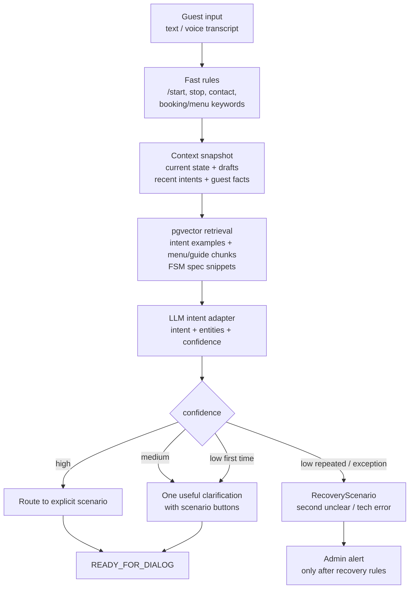

Правила:

- `READY_FOR_DIALOG` не отправляет гостя в `AI_FALLBACK` с первого непонятного текста;
- если есть хотя бы один близкий сценарий, Astor задает одно уточнение;
- `RecoveryScenario` включается после повторной неясности, конфликта state/draft или технического сбоя;
- admin alert должен содержать state/correlation, но гостю нельзя показывать technical dump;
- каждое распознавание intent пишет событие в timeline/Kafka, чтобы потом улучшать сценарии.

## Semantic Context / pgvector

`pgvector` - это не отдельная "память LLM", а общий semantic retrieval layer для всех локальных LLM-инстансов и будущих моделей. Он помогает до генерации ответа найти похожие смыслы, документы и примеры.

Что кладем в semantic memory:

| Source | Для чего нужен |
| --- | --- |
| `FSM_SCENARIOS.md` chunks | Подсказать LLM допустимые сценарии, states и запреты. |
| `guest-guide.html` / `staff-guide.html` | Отвечать на вопросы "что умеет бот", "куда писать менеджеру". |
| Menu/Bar/Wine/Elements extracted chunks | Отвечать по меню без выдумывания блюд/цен и приложить PDF source. |
| Approved AERIS concept copy | Рассказывать про шефа, 21 страну Средиземноморья и философию кухни. |
| Intent examples | Понимать фразы гостей: "посмотреть зал", "накинуть официанту", "стол на завтра". |
| Negative/fallback examples | Видеть, какие фразы раньше ломались, и переводить их в сценарии. |

Как это работает в будущем коде:

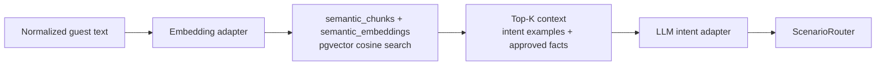

Границы:

- pgvector не принимает бизнес-решения;
- pgvector не подтверждает бронь, ставку или платеж;
- pgvector отвечает на вопрос "на что это похоже и какой контекст достать?";
- FSM отвечает на вопрос "можно ли сейчас сделать этот переход?";
- domain service отвечает на вопрос "что реально создано/подтверждено?".

## Guest Input Understanding

`GuestInputUnderstandingService` - общий слой перед `ScenarioRouter`, который переводит живой ввод гостя в машинный формат. Через него должен проходить ручной ввод из всех гостевых сценариев: текст, STT transcript и кнопки главного меню. Исключения: служебные чаты, manager/staff callbacks, contact payload и другие уже структурированные Telegram events.

Статус 2026-06-17:

- repo-owned corpus: `src/main/resources/understanding/guest-input-golden-corpus.jsonl`;
- runtime tables: `intent_examples`, `intent_example_embeddings`, `intent_understanding_misses`;
- pgvector migration: `db/changelog/2026-06-17-intent-understanding-pgvector.sql`;
- optional startup ingest: `ASTOR_INTENT_EXAMPLES_INGEST_ON_STARTUP=true`;
- embeddings provider: `ASTOR_SEMANTIC_EMBEDDINGS_PROVIDER=none|model-gateway|spring-ai|ollama`;
- default AERIS runtime provider: `model-gateway`, so embeddings go through the same `ModelGateway` boundary as text generation;
- `ModelGatewayEmbeddingProvider` calls `ModelGateway.generateEmbedding(...)`; the active Spring AI implementation uses local Ollama `nomic-embed-text` and raw Ollama only as fallback;
- VLM capability: `ModelGateway.analyzeImage(...)` accepts image base64 + prompt and defaults to `LLM_OLLAMA_VISION_MODEL=qwen2.5vl:3b`; it returns candidates/text for FSM review, not direct orders;
- legacy diagnostics remain available: `SpringAiEmbeddingProvider` with a direct Spring AI `EmbeddingModel` bean (`spring-ai`) and `OllamaEmbeddingProvider` with direct `/api/embed` (`ollama`);
- Runtime NLU: state-aware rules + `NatashaRussianNluAdapter` for Russian morphology/noisy STT. `DucklingRussianNluAdapter` remains an archived experimental adapter behind `ASTOR_NLU_DUCKLING_ENABLED=false`, not part of Docker Compose runtime or the default AERIS booking path.

Контракт слоя:

| Поле | Смысл |
| --- | --- |
| `rawText` | Оригинальный текст гостя или STT transcript. |
| `normalizedText` | Машинно удобная версия: кнопки -> canonical prompt, "в 8 вечера" -> `20:00`, "на 2х" -> "на 2 гостей". |
| `primaryIntent` | Главная гипотеза: `TABLE_BOOKING`, `PROVIDE_TIME`, `MENU_ASSETS`, `SAFE_PLAY`, etc. |
| `confidence` | Уверенность в гипотезе. Низкая уверенность не должна сразу вести в fallback. |
| `slots` | Извлеченные сущности: `date`, `time`, `partySize`, `tableNumber`, `amount`, `yes/no`. |
| `candidates` | Альтернативные intents для composite/recovery. |
| `needsClarification` | Нужно ли задать короткое уточнение вместо эскалации. |

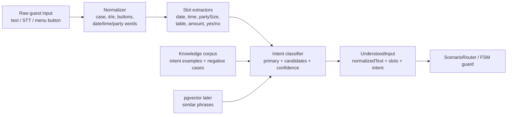

Почему это отдельный слой:

- сценарии не должны копить бесконечные `if` для "на двоих", "на 2х", "будем вдвоем";
- один и тот же ответ гостя должен одинаково пониматься в Telegram, REST и будущих transport adapters;
- все найденные ошибки ручного теста добавляются в `guest-input-golden-corpus.jsonl`, а не чинятся только в одном сценарии;
- repo-owned corpus остается источником воспроизводимости, а Postgres/pgvector становится runtime-копией для масштабирования;
- FSM остается single source of truth: understanding предлагает гипотезу, но не подтверждает бронь, платеж, ставку или отмену.

Первый рабочий corpus:

| Ввод | State | Ожидаемый результат |
| --- | --- | --- |
| `На завтра` | `TABLE_BOOKING_COLLECT_DATE` | `PROVIDE_DATE`, `slot.date=завтра` |
| `В 8 вечера` | `TABLE_BOOKING_COLLECT_TIME` | `PROVIDE_TIME`, `slot.time=20:00` |
| `На 2х` / `На двоих` | `TABLE_BOOKING_COLLECT_PARTY_SIZE` | `PROVIDE_PARTY_SIZE`, `slot.partySize=2` |
| `Тихий стол в винной комнате` | `TABLE_BOOKING_WAIT_TABLE_SELECTION` | `PROVIDE_TABLE_SELECTION`, `slot.seatingPreference` |
| `Покажи меню и винную карту` | `READY_FOR_DIALOG` | `MENU_ASSETS` + candidates for composite expansion |

Цикл наполнения базы понимания:

1. Берем конкретный сценарий и state, например `TABLE_BOOKING_COLLECT_TIME`.
2. Генерируем живые варианты ответа гостя: "в 8 вечера", "к восьми", "20 часов", "примерно в 20".
3. Добавляем их в `guest-input-golden-corpus.jsonl` с ожидаемым intent/slot.
4. Гоняем `GuestInputUnderstandingServiceTest`; если красный - правим normalizer/parser или corpus.
5. После зеленого corpus можно переносить approved examples в runtime tables `intent_examples` / `intent_example_embeddings` / pgvector.
6. Любой ручной Telegram-fallback становится новым negative/golden example, а не разовой правкой "на глаз".

## Composite Intent Plan

Если в одном сообщении есть несколько намерений, Astor не должен терять вторую часть запроса. Он строит небольшой план: что можно сделать вместе, что нужно выполнить по очереди, а что требует явного подтверждения.

Примеры:

| Запрос гостя | План |
| --- | --- |
| "пришли винную карту и видео-тур" | `PARALLEL_CONTENT`: отправить PDF + video/document. |
| "забронируй стол завтра на 20:00 и пришли меню" | `SEQUENTIAL`: сначала бронь/план зала, меню отложить как pending intent. |
| "отмени бронь и создай новую" | `SEQUENTIAL_WITH_CONFIRMATION`: сначала найти активную бронь и спросить подтверждение отмены. |
| "ставлю 20000 и донат 5000" | нельзя выполнять автоматически: оба действия требуют явного confirmation/payment boundary. |

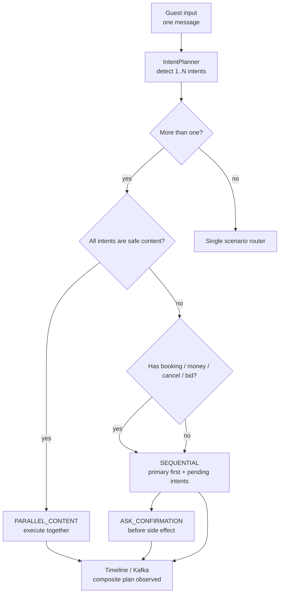

Правила совместимости:

- **Вместе**: меню + видео-тур, меню + концепция, меню + афиша.
- **По очереди**: бронь + меню, бронь + видео-тур, мероприятие + меню, менеджер + справка.
- **Только после подтверждения**: отмена брони, ставка, чаевые, донат, любые платежные действия.
- Если гость уже в активном сценарии, текущий scenario state имеет приоритет, а новые намерения становятся `pendingIntents`.
- Composite plan всегда пишет `compositePlan`, `primaryIntent` и/или `completedIntents` в metadata/timeline, чтобы потом видеть, где теряются смыслы.

## Scenario Intake Matrix

Это практическая таблица для снижения fallback: какие фразы считать входом в сценарий, какие сущности собирать и какие состояния нужны.

| Сценарий | Примеры фраз | Entities | Runtime states |
| --- | --- | --- | --- |
| `TableBookingScenario` | "стол на завтра", "нас двое в 20", "посади у окна" | table/zone preference, optional seatingPreference, date, time, partySize | `TABLE_BOOKING_WAIT_TABLE_SELECTION`, `TABLE_BOOKING_COLLECT_DATE`, `TABLE_BOOKING_COLLECT_TIME`, `TABLE_BOOKING_COLLECT_PARTY_SIZE`, then `READY_FOR_DIALOG` after order creation |
| `MenuAssetsScenario` | "скинь меню", "что по вину", "барная карта", "коктейли" | menuCategories, dietary hints, source assets | `MENU_ASSETS_CLARIFY`, `MENU_ASSETS_DELIVERED` |
| `PreferenceScenario` | "запомни, я не ем острое", "люблю тихий стол", "предпочтения" | preference text, category, confidence, source state | `PREFERENCE_COLLECT_TEXT`, `PREFERENCE_SAVED` |
| `QuietGuideScenario` | "покажи зал", "что за концепция", "афиша", "как у вас внутри" | contentKind, date range, media asset | `QUIET_GUIDE_CLARIFY`, `QUIET_GUIDE_DELIVERED` |
| `EventBookingScenario` | "день рождения на 25", "корпоратив", "выкупить зал" | eventType, date, time, guests, budget, format, tech needs | `EVENT_BOOKING_COLLECT_TYPE`, `EVENT_BOOKING_COLLECT_DATE`, `EVENT_BOOKING_COLLECT_GUESTS`, `EVENT_BOOKING_COLLECT_BUDGET`, `EVENT_BOOKING_CONFIRMATION` |
| `ManagerHelpScenario` | "позови человека", "жалоба", "нужно с менеджером" | reason, urgency, guest contact | `MANAGER_HELP_COLLECT_REASON`, `MANAGER_HELP_SENT` |
| `ConciergeScenario` | "передай команде", "подготовьте свечу к десерту", "принесите плед", "нужна помощь" | request text, request type, guest snapshot, admin chat | `CONCIERGE_COLLECT_REQUEST`, `CONCIERGE_SENT` |
| `ChangeCancelScenario` | "отменить бронь", "перенеси на 21", "нас будет четверо" | order reference, new date/time/partySize, reason | `CHANGE_CANCEL_FIND_ORDER`, `CHANGE_CANCEL_CONFIRMATION`, `CHANGE_CANCEL_DONE` |
| `SmartTipScenario` | "оставить чаевые", "поблагодарить официанта", "накинуть бару" | amount, target, note | `TIP_COLLECT_AMOUNT`, `TIP_CONFIRMATION` |
| `HiddenHeartScenario` | "донат", "поддержать проект", "анонимно 5000" | amount, cause, anonymous flag | `DONATION_COLLECT_AMOUNT`, `DONATION_CONFIRMATION` |
| `ArtAuctionScenario` | "ставлю 20000", "что за картина", "участвовать в аукционе" | lotId/title, bid amount, active event | `AUCTION_RUNNING`, `AUCTION_WAIT_BID` |
| `ImpactMeterScenario` | "сколько собрали", "итоги", "impact" | report scope, date range | no long-lived state until reports become interactive |
| `RecoveryScenario` | repeated unclear input, LLM/STT/RAG errors | failure kind, previous intent, retry count | `AI_FALLBACK` only after clarify/retry path |

Правило проектирования states:

- если сценарий одношаговый и не хранит draft, не плодим enum state;
- если гость должен ответить на следующий вопрос, нужен явный runtime state;
- если есть деньги, бронь, ставка, отмена или менеджерская карточка, нужен draft/order в durable storage;
- если state появился в этой таблице, но еще не реализован в `BotState`, он считается **target state** для следующего кодового шага.

## Состояния

| State | Русское имя | Роль |
| --- | --- | --- |
| `UNKNOWN` | Нет состояния | Redis не знает гостя. |
| `CONSENT_REQUIRED` | Нужен контакт и согласие | Не продолжаем бизнес-сценарии до контакта. |
| `READY_FOR_DIALOG` | Главное меню / дом сценариев | Базовая точка после первого касания и после завершения сценариев. |
| `AI_FALLBACK` | Последняя страховка | Временное состояние для неизвестного/сломавшегося пути. |
| `MENU_ASSETS_CLARIFY` | Уточнить меню | Нужно понять: кухня, бар, коктейли/elements, вино или все меню. |
| `MENU_ASSETS_DELIVERED` | Меню отправлено | Файлы отправлены, RAG/admin event записан, возврат домой. |
| `QUIET_GUIDE_CLARIFY` | Уточнить справку | Нужно понять: афиша, видео-тур, концепция, правила или менеджер. |
| `QUIET_GUIDE_DELIVERED` | Справка отправлена | Контент/видео/концепция отправлены, возврат домой. |
| `TABLE_BOOKING_COLLECT_DATE` | Нужна дата | Сбор даты посадки. Батлер показывает reply-кнопки на 21 день от сегодняшнего дня заведения и принимает текст: "сегодня", "завтра", "на пятницу", `03.07`. |
| `TABLE_BOOKING_COLLECT_TIME` | Нужно время | Сбор времени посадки. Батлер показывает reply-кнопки времени с шагом 1 час и принимает текст: `20:00`, "в 8 вечера", "к восьми". |
| `TABLE_BOOKING_COLLECT_PARTY_SIZE` | Нужно число гостей | Сбор party size. |
| `TABLE_BOOKING_COLLECT_SEATING_PREFERENCE` | Legacy-пожелания по посадке | Совместимый старый state: если runtime попал сюда, текст сохраняется как пожелание и заявка создается. Новый happy path собирает "у окна", "винная комната", "тихий стол" на шаге выбора стола/зоны и не задает финальный вопрос. |
| `TABLE_BOOKING_WAIT_TABLE_SELECTION` | Ждем стол | План отправлен, ждем стол/зону/автовыбор. |
| `TABLE_BOOKING_WAIT_HOSTESS_CONFIRMATION` | Ждем хостес | Заявка и hold созданы, хостес решает кнопками. |
| `TABLE_BOOKING_CONFIRMED` | Подтверждено | Гостю отправлен order, возврат домой. |
| `TABLE_BOOKING_REJECTED` | Отклонено | Предложить другой вариант, затем домой или change. |
| `TABLE_BOOKING_CHANGE_REQUESTED` | Изменение | Пересобрать draft и пройти подтверждение заново. |
| `TABLE_BOOKING_CANCELLED` | Отмена | Освободить holds, вернуться домой. |
| `TIP_COLLECT_AMOUNT` | Сумма чаевых | Smart Tip собирает сумму. |
| `TIP_CONFIRMATION` | Подтверждение чаевых | Гость подтверждает благодарность до payment boundary. |
| `DONATION_COLLECT_AMOUNT` | Сумма доната | Hidden Heart собирает сумму. |
| `DONATION_CONFIRMATION` | Подтверждение доната | Гость подтверждает социальный вклад. |
| `AUCTION_RUNNING` | Аукцион идет | Принимаются ставки по правилам event/auction. |
| `AUCTION_WAIT_BID` | Ждем ставку | Гость вводит сумму или нажимает кнопку. |
| `SAFE_EXIT` | Безопасный выход | Любой сценарий может вернуться домой без давления. |

Старые Redis aliases:

| Старое | Каноническое |
| --- | --- |
| `GREETING` | `CONSENT_REQUIRED` |
| `CONTACT` | `CONSENT_REQUIRED` |
| `MENU` | `READY_FOR_DIALOG` |

## Правила Разговора

Astor должен говорить как спокойный цифровой дворецкий AERIS:

- коротко;
- уверенно;
- не обещать то, что не подтверждено доменным слоем;
- спрашивать один недостающий параметр за раз;
- не спорить с гостем;
- не раскрывать технические детали;
- подтверждать понимание только после структурирования данных;
- для неопределенности использовать уточнение, а не длинную лекцию.

### Базовые тексты

Первое касание:

```text
Нажимая кнопку "Согласиться и поделиться контактом", вы соглашаетесь с политикой обработки персональных данных.
```

Главное меню после контакта:

```text
Спасибо, я на связи. Что сделаем?

• Забронировать стол
• Посмотреть меню
• Позвать менеджера
• Организовать мероприятие
• Изменить или отменить бронь
• Афиша и события
• Чаевые / благодарность
• Благотворительность / аукцион
```

Непонятный intent в Main Menu:

```text
Я пока не уверен, какой сценарий нужен. Выберите, пожалуйста: стол, меню, менеджер или мероприятие.
```

Fallback при технической проблеме:

```text
Я не смог уверенно продолжить сценарий. Передам это администратору, а вы можете написать проще: стол, меню, менеджер или мероприятие.
```

## FirstTouchScenario

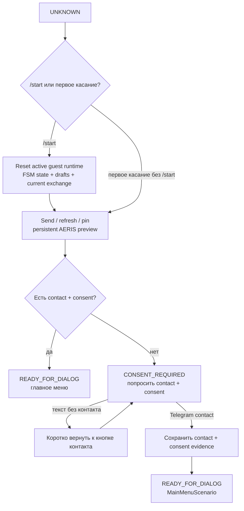

Правила:

- `/start` всегда сбрасывает активный гостевой runtime-сценарий в безопасное начало;
- durable facts не удаляются: profile/messages/consents/orders остаются в PostgreSQL/Kafka;
- preview AERIS должен быть виден гостю после `/start`; если Telegram позволяет, его нужно pin/update, иначе отправить заново и сохранить новый `preview_message_id`;
- если contact/consent уже есть, `/start` не просит контакт повторно, а ставит `READY_FOR_DIALOG`;
- не запускать бронь до контакта;
- не собирать дату/стол/меню до consent;
- контакт дает право перейти в `READY_FOR_DIALOG`.

## MainMenuScenario

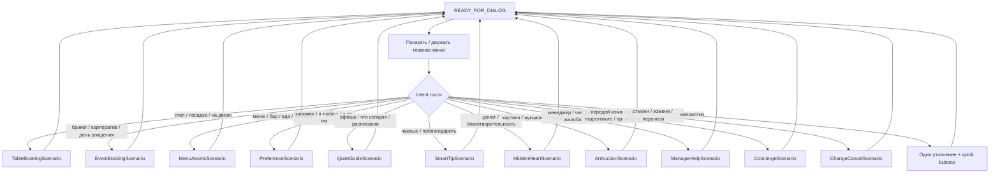

Правила:

- `READY_FOR_DIALOG` не должен сразу уходить в `AI_FALLBACK`;
- первым делом пробуем явные сценарии;
- если intent слабый, показываем варианты;
- fallback только после повторной неясности или технического сбоя.

## TableBookingScenario

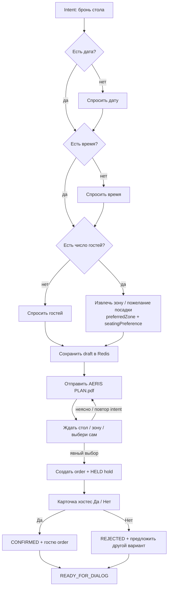

Правила:

- перед выбором стола всегда отправлять план;
- `20:00` не считается номером стола;
- "17", "стол 17", "vip", "бар", "винная комната", "выбери сам" считаются выбором;
- "тихий стол", "у окна", "винная комната", "VIP", "у бара" сохраняются как `preferredZone` / `seatingPreference`, чтобы не терять пожелание в order и карточке хостес;
- хостес подтверждает только кнопками;
- после `Да`/`Нет` гость получает человекочитаемый результат.

## EventBookingScenario

Целевой сценарий для мероприятий: день рождения, банкет, корпоратив, свадьба, презентация, выкуп зала.

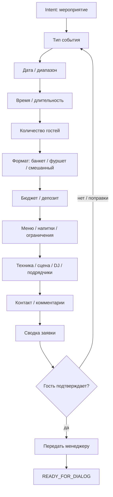

Правила:

- не смешивать с обычной посадкой за стол;
- если запрос больше регулярной посадки, route в `EVENT_BOOKING`;
- итог - structured request для менеджера, не автоматическое подтверждение.

## MenuAssetsScenario

Целевой сценарий в домене **Инфо-поддержка / Quiet Guide**: гость текстом или голосом просит меню, карту бара, вино, коктейли или "что у вас есть". Astor должен спокойно понять запрос, при необходимости задать одно уточнение, отправить актуальные PDF-файлы и вернуться в открытый диалог.

Актуальные PDF-файлы не живут в `src/main/resources`: git хранит код, docs и manifest/metadata, PostgreSQL `media_assets` хранит активный runtime index, MinIO/S3 хранит бинарники. Desktop/Yandex Disk остаются только исходным местом для ingest.

| Asset | Runtime asset code | Object key | Когда отправлять |
| --- | --- | --- | --- |
| Кухня / основное меню | `AERIS_MENU_KITCHEN` | `content/aeris/menu/kitchen/MENU_AERIS_A4_2026_DIGITAL.pdf` | "меню", "еда", "кухня", "что поесть" |
| Бар | `AERIS_MENU_BAR` | `content/aeris/menu/bar/BAR_CARD.pdf` | "бар", "напитки", "крепкое", "барная карта" |
| Коктейли / Elements | `AERIS_MENU_ELEMENTS` | `content/aeris/menu/elements/ELEMENTS_CARD.pdf` | "коктейли", "elements", "авторские коктейли" |
| Вино | `AERIS_MENU_WINE` | `content/aeris/menu/wine/WINE_MENU_2026_FINAL.pdf` | "вино", "винная карта", "шампанское" |

RAG-направление:

- PDF assets загружаются через `scripts/ingest_aeris_runtime_assets.sh`;
- текст/структура меню извлекается в menu knowledge index;
- в MVP index может быть JSON/Markdown chunks в docs/manifest или Mongo metadata;
- позже embeddings/vector store подключаются к LLM adapter;
- если локально запущено несколько LLM-инстансов, RAG не хранится внутри них: все инстансы получают одинаковый контекст через общий retrieval service / shared index;
- LLM отвечает по RAG только справочно и всегда может приложить исходный PDF.

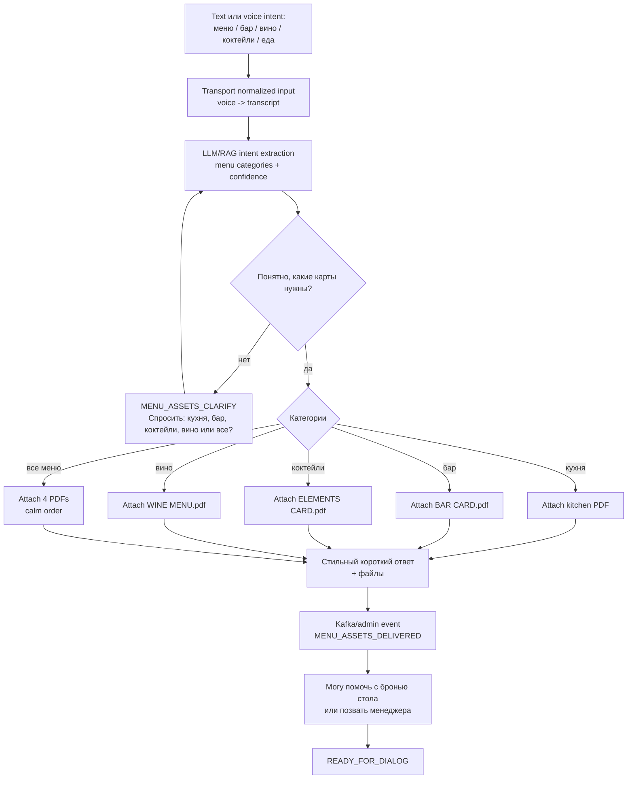

Правила:

- если гость явно просит "все меню", можно отправить все 4 PDF;
- если запрос узкий, отправлять только релевантные PDF;
- если голосовая команда успешно расшифрована, она идет тем же путем, что текст;
- если STT не смог разобрать голосовое первый раз, попросить гостя перезаписать коротко и ближе к микрофону;
- если STT не смог разобрать голосовое второй раз подряд, попросить перейти на текст, чтобы не потерять запрос;
- LLM не выдумывает позиции/цены: если отвечает по блюдам, ответ должен ссылаться на RAG/menu source;
- после отправки файлов предложить следующий шаг без давления: бронь стола, менеджер или открытый вопрос;
- каждый шаг логируется как guest event и пока проецируется в admin chat.

## PreferenceScenario

Сценарий персонализации: гость явно просит запомнить предпочтение или сообщает устойчивую особенность, которую можно использовать в следующих сценариях. Это не скрытый profiling: Astor сохраняет только то, что гость сам сказал, и использует это как мягкую подсказку для меню, посадки, событий и сервиса.

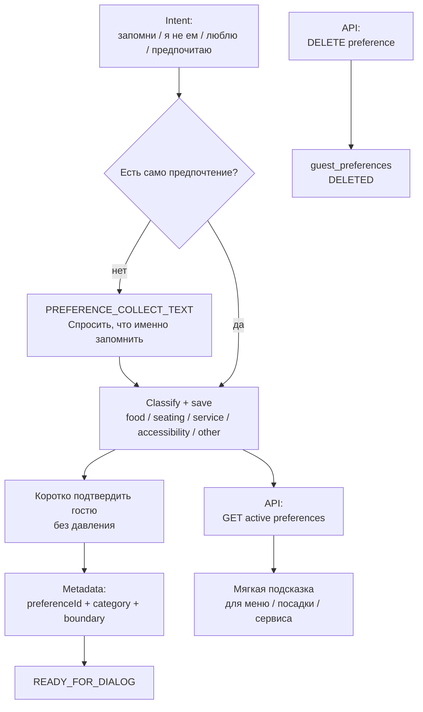

Правила:

- сохраняем только guest-provided facts, без догадок и скрытых выводов;
- preference - это подсказка, а не жесткое правило: при сомнении лучше уточнить;
- категория нужна для будущего routing: еда, посадка, сервис, accessibility, события, другое;
- Preference Map должен помогать уменьшать fallback: "как обычно", "как в прошлый раз", "без острого" должны иметь опору;
- active-list API возвращает только `ACTIVE` записи, чтобы сценарии не использовали удаленные предпочтения;
- удаление предпочтения - soft delete (`DELETED`), чтобы сохранить аудит и не ломать историю событий;
- каждое сохранение пишет durable запись в PostgreSQL и metadata события, но не раскрывает чувствительные детали в публичные чаты.

## QuietGuideScenario

Сценарий инфо-поддержки: афиши, расписание, правила, справки, доступные события, видео-тур по интерьеру и рассказ о концепции AERIS. Это не маркетинговая рассылка, а ответ на запрос гостя.

Для текущего этапа в Quiet Guide входят две важные ветки:

1. **Видео-тур интерьера** - гость просит "покажи ресторан", "как у вас внутри", "можно посмотреть зал". В MVP видео не кладем в git/jar из-за размера, а храним как media object в MinIO: `content/aeris/interior/INTERIOR.mp4`. В проекте остается manifest/metadata и fallback-текст.
2. **Концепция кухни** - гость спрашивает "что за место", "какая концепция", "что готовит шеф", "почему AERIS". Astor отвечает коротко и красиво, с опорой на approved copy.

Approved concept copy для RAG/контента:

```text
ГАСТРОНОМИЧЕСКАЯ ЭКСПЕДИЦИЯ ГЕОРГИЯ МАТВЕЕВА В AERIS

Кухня 21 страны Средиземноморья в прочтении победителя "Адской кухни".

Новую главу в истории AERIS открывает Георгий Матвеев - шеф-повар с "золотым" почерком, триумфатор пятого сезона шоу "Адская кухня" и обладатель Гран-при международных кулинарных чемпионатов.

Концепция Георгия для нашего ресторана - это масштабное исследование Средиземноморского бассейна. В меню воплощена история 21 страны: от утонченной классики Франции и Италии до колоритных и пряных традиций Ливана. Это 80 авторских позиций, в которых исторически сложившиеся вкусы соединяются с современной эстетикой яркого гастробара.

"Моя философия в AERIS - это торжество продукта и чистота вкуса", - подчеркивает шеф. Основной акцент сделан на премиальном мясе, свежей рыбе и обилии зелени. Уникальный характер блюдам придают авторские неклассические соусы, которые превращают каждый ужин в глубокое гастрономическое путешествие.
```

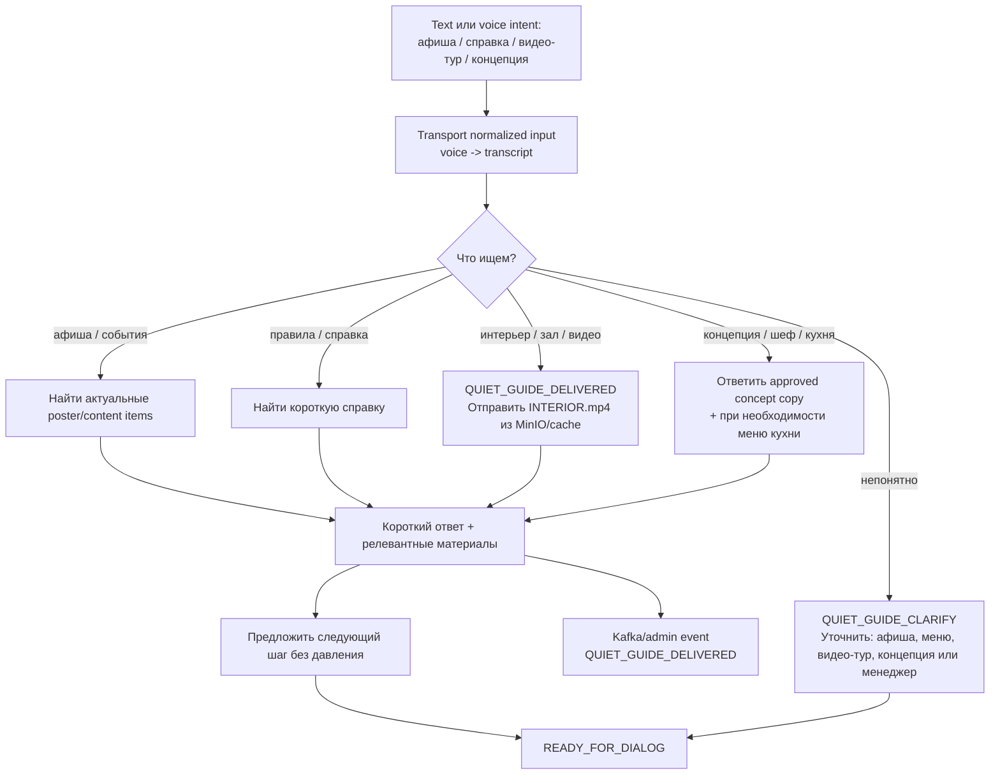

Правила:

- не пушить афишу без запроса;
- максимум один релевантный набор материалов за раз;
- видео-тур хранить в MinIO/cache, не в git и не внутри jar;
- если MinIO/video недоступны, дать короткое извинение, концепт-текст и отправить admin event;
- концепцию говорить approved copy, не выдумывать биографию шефа или факты о меню;
- голосовая команда идет по тому же пути после transcription;
- если гость хочет попасть на событие, route в `EventBookingScenario` или `TableBookingScenario`.

## SmartTipScenario

Сценарий благодарности из Legacy `tip/*`: гость хочет оставить чаевые или красиво поблагодарить команду.

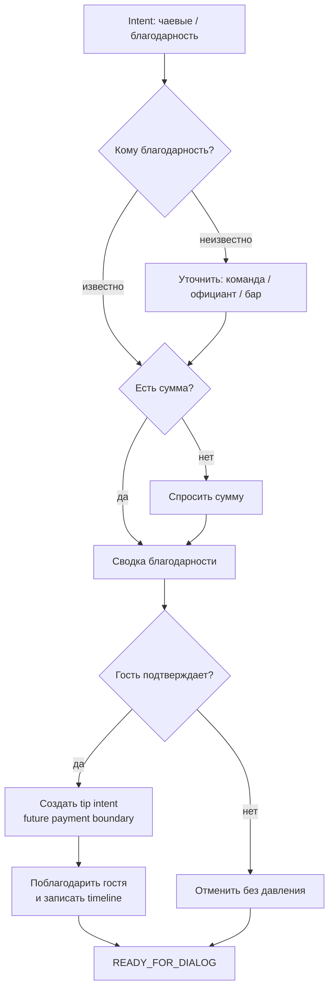

Правила:

- без payment integration сценарий создает только намерение/заявку, не проводит оплату;
- гость всегда видит сумму и адресата до подтверждения;
- чаевые не смешиваются с бронью, но могут быть предложены после завершенного события.

## HiddenHeartScenario

Сценарий социального вклада из Legacy `charity/*`: анонимный донат, поддержка проекта, благотворительность.

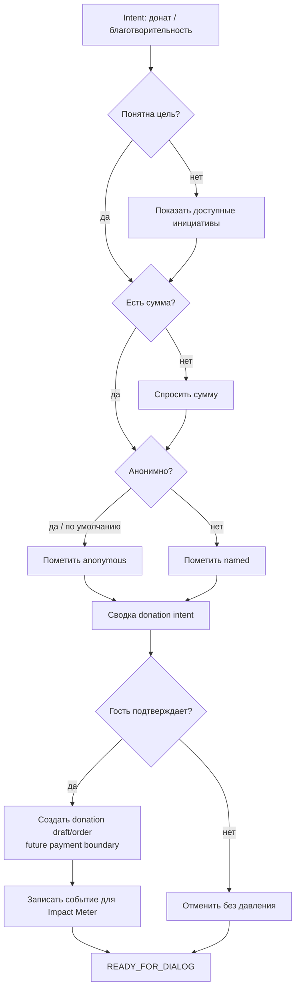

Правила:

- по умолчанию донат анонимный;
- не использовать давление, рейтинги вины или публичное сравнение гостей;
- `Impact Meter` получает агрегированные факты, а не лишние персональные данные.

## ArtAuctionScenario

Legacy `auction/*` становится event-сценарием для благотворительной продажи картин / аукциона на мероприятии. Это стык `Hidden Heart`, `Safe Play`, `Impact Meter` и `EventBooking`.

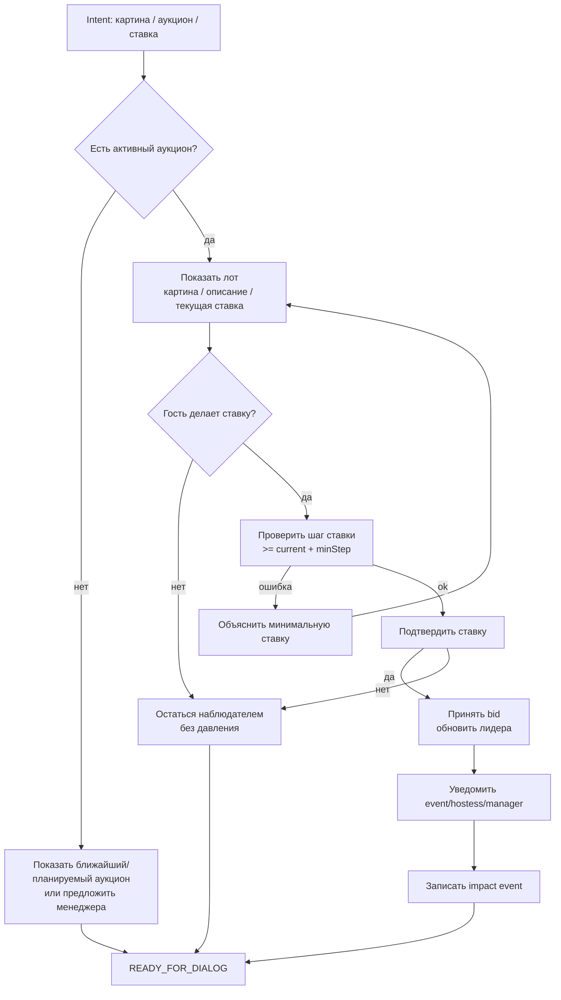

Правила:

- аукцион не запускается случайной фразой гостя, нужен активный event/lot;
- ставка требует явного подтверждения;
- гость может выйти командой safe exit на любом шаге;
- победитель/финал подтверждаются менеджером или event owner, не LLM.

## ImpactMeterScenario

Extension point для культурных KPI: сколько собрано, какие инициативы поддержаны, какие события дали вклад.

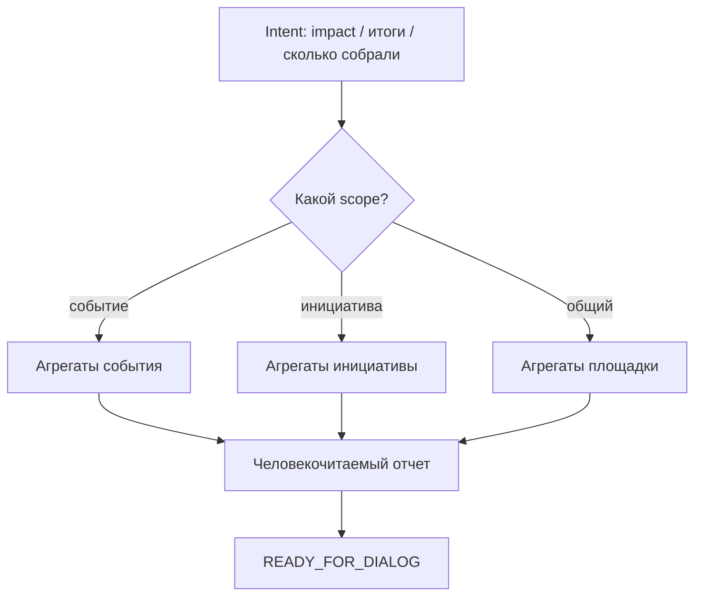

Правила:

- показывать агрегаты, а не персональные платежные данные;
- использовать данные из donation/auction/tip/timeline events;
- в MVP можно оставить как boundary и тестовый отчет.

## ManagerHelpScenario

Целевой сценарий для ручного подключения команды.

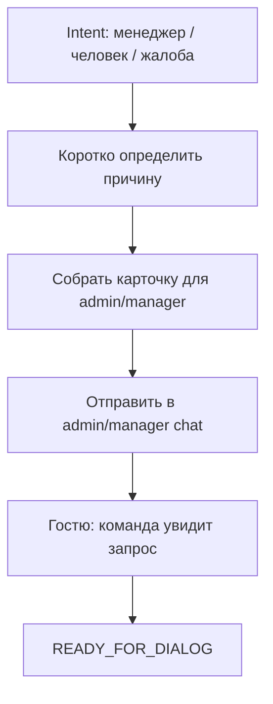

Правила:

- не скрывать ручную передачу;
- приложить chatId, имя, username, последнее сообщение, состояние FSM;
- не запускать этот сценарий из admin chat как гостевой.

## ConciergeScenario

Сценарий сервисной просьбы: гость не просит менеджера и не оставляет отзыв, а хочет передать команде конкретное действие. Например: подготовить свечу, принести плед, предупредить хостес, помочь с комфортом на месте. Astor создает сервисную заявку и отправляет карточку в админ/командный контур.

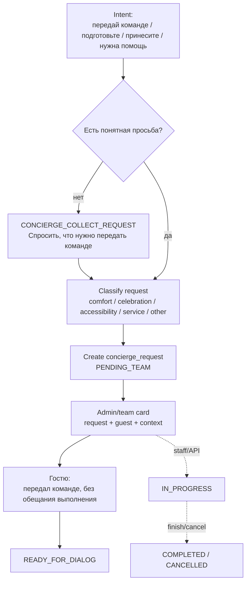

Правила:

- Concierge не заменяет менеджера: если нужна ручная беседа или жалоба, route в `ManagerHelpScenario` или `FeedbackScenario`;
- не обещаем выполнение до подтверждения команды;
- карточка команде должна быть человекочитаемой: кто гость, что просит, контекст, correlation id;
- request type нужен для аналитики сервиса: comfort, celebration, accessibility, service, technical, other;
- у заявки есть управляемый lifecycle через API: `PENDING_TEAM -> IN_PROGRESS -> COMPLETED/CANCELLED`;
- финальные статусы `COMPLETED` и `CANCELLED` не переоткрываются автоматически;
- сценарий возвращает гостя в главное меню сразу после передачи заявки.

## ChangeCancelScenario

Целевой сценарий для изменения или отмены существующей заявки.

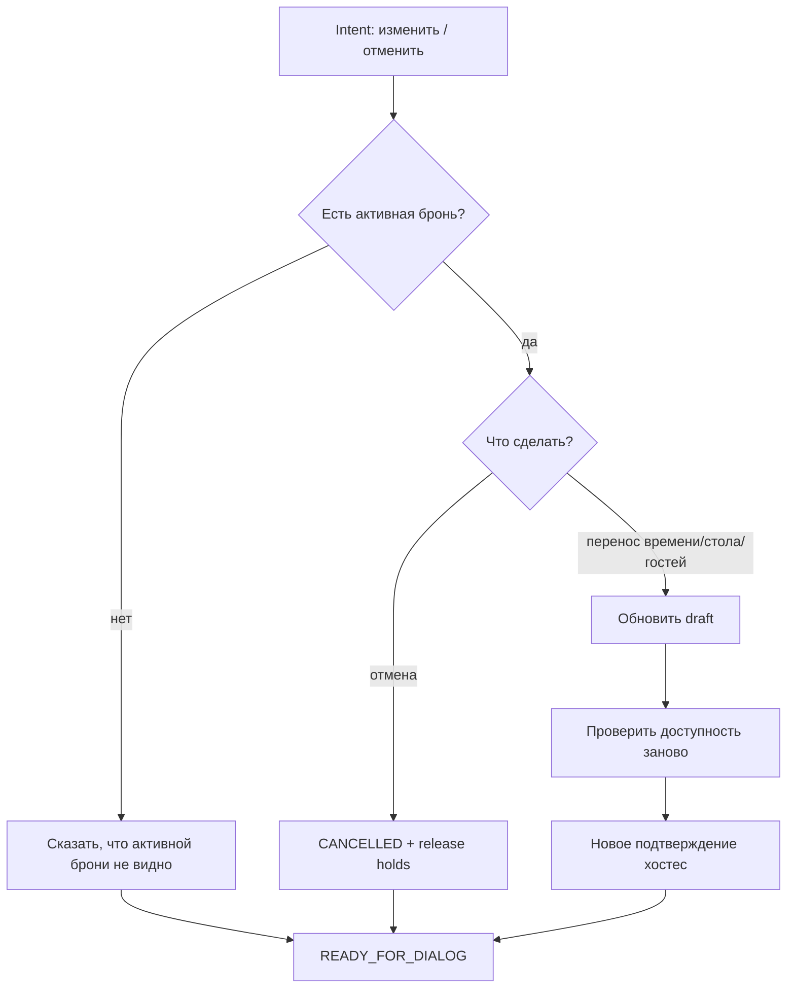

Правила:

- изменение после hold требует нового подтверждения;
- отмена освобождает holds;
- гостю всегда сообщается итог.

## RecoveryScenario

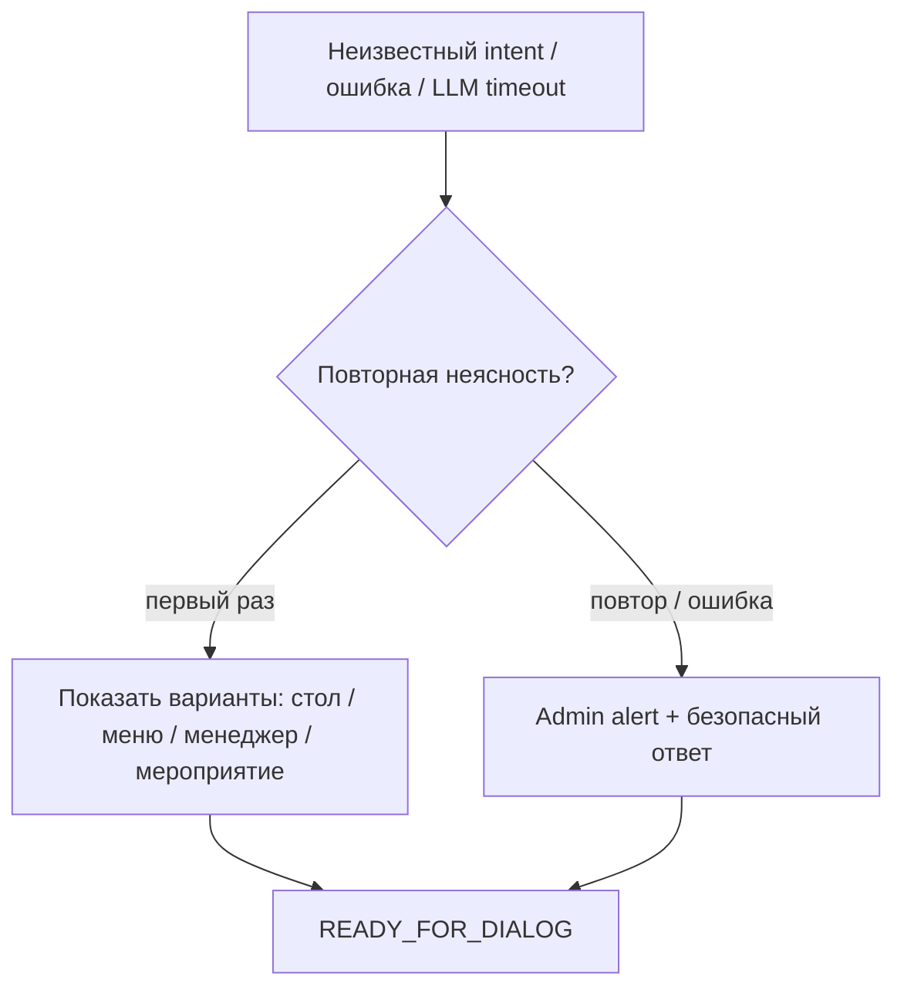

Правила:

- сначала уточнять;
- затем эскалировать;
- не оставлять гостя в техническом тупике;
- логировать причину и correlation id.

## LLM Contract

### Semantic FSM Loop

LLM в Astor Butler не должна быть "болталкой после FSM". Правильная петля такая: транспорт очищает вход, semantic layer понимает смысл, FSM проверяет граф переходов, сценарий приносит гостю пользу и возвращает контекст в наблюдаемость.

```mermaid
flowchart LR
    In["Guest input<br/>text или voice"]
    Normalize["Normalize<br/>voice -> transcript<br/>stderr/warnings removed"]
    Snapshot["Guest Context Snapshot<br/>current FSM state<br/>active drafts<br/>recent intents<br/>known facts"]
    Semantic["SemanticRouter<br/>rules + LLM intent/entities"]
    Decision{"confidence >= threshold?"}
    Clarify["One good clarification<br/>без technical dump"]
    Route["Scenario Router<br/>allowed by graph"]
    Scenario["FSM Scenario<br/>booking/menu/quiet guide/etc."]
    Value["Guest value<br/>file, booking step,<br/>answer, manager handoff"]
    Memory["Timeline + outbox + Kafka<br/>analytics/admin chat"]
    Home["READY_FOR_DIALOG<br/>MainMenuScenario"]

    In --> Normalize --> Snapshot --> Semantic --> Decision
    Decision -- "нет" --> Clarify --> Memory
    Decision -- "да" --> Route --> Scenario --> Value --> Memory
    Scenario --> Home
```

Минимальная память рядом с FSM:

- `currentState` - один активный state для runtime-логики;
- `activeScenario` - человекочитаемый сценарий, если state общий вроде `READY_FOR_DIALOG`;
- `openDrafts` - бронь, аукцион, донат, чаевые, feedback, event request;
- `recentIntents` - последние распознанные смыслы и confidence;
- `recentFailures` - STT/LLM/RAG/integration failures для умного recovery;
- `guestFacts` - устойчивые предпочтения, только если они получены явно или выведены безопасно.

LLM может:

- классифицировать intent;
- извлекать дату, время, гостей, стол, зону, тип события, сумму, адресата благодарности, цель доната, номер/название лота;
- переформулировать ответ в тоне Astor;
- предложить одно уточнение.

LLM не может:

- подтверждать бронь;
- создавать order/hold;
- обещать свободный стол;
- менять статус заявки;
- подтверждать от имени хостес;
- принимать ставки без явного подтверждения гостя;
- раскрывать приватные данные донатов и платежей;
- игнорировать FSM state.

Минимальный формат результата intent adapter в будущем:

```json
{
  "intent": "TABLE_BOOKING",
  "confidence": 0.91,
  "entities": {
    "date": "tomorrow",
    "time": "20:00",
    "partySize": 2,
    "tablePreference": null
  },
  "needsClarification": false,
  "clarificationQuestion": null
}
```

## Предкодовый Тест-План

Перед изменением кода проверяем сценарии на бумаге и потом покрываем тестами.

### First Touch

| Given | When | Then |
| --- | --- | --- |
| `UNKNOWN` | `/start` | persistent preview sent/pinned, `CONSENT_REQUIRED`, кнопка контакта |
| known contact + consent | `/start` | active runtime scenario reset, preview sent/pinned, `READY_FOR_DIALOG` |
| active booking/menu/guide scenario | `/start` | scenario draft cleared, durable facts kept, preview sent/pinned, safe start |
| `CONSENT_REQUIRED` | текст без контакта | остается `CONSENT_REQUIRED`, короткий nudge |
| `CONSENT_REQUIRED` | contact | consent saved, `READY_FOR_DIALOG` |

### Main Menu

| Given | When | Then |
| --- | --- | --- |
| `READY_FOR_DIALOG` | "хочу столик завтра" | route `TABLE_BOOKING` |
| `READY_FOR_DIALOG` | "скинь меню" | route `MENU_ASSETS` |
| `READY_FOR_DIALOG` | "позови менеджера" | route `MANAGER_HELP` |
| `READY_FOR_DIALOG` | "день рождения на 30 человек" | route `EVENT_BOOKING` |
| `READY_FOR_DIALOG` | "что сегодня по афише" | route `QUIET_GUIDE` |
| `READY_FOR_DIALOG` | "хочу оставить чаевые" | route `SMART_TIP` |
| `READY_FOR_DIALOG` | "хочу поддержать благотворительный проект" | route `HIDDEN_HEART` |
| `READY_FOR_DIALOG` | "хочу поставить на картину" | route `ART_AUCTION`, если есть активный аукцион |
| `READY_FOR_DIALOG` | непонятный текст | показать варианты, не сразу admin alert |

### Table Booking

| Given | When | Then |
| --- | --- | --- |
| `READY_FOR_DIALOG` | "столик завтра в 20:00 на двоих" | send plan first, capture date/time/party, wait table/zone; optional seating preference is captured from table/zone phrase |
| `READY_FOR_DIALOG` | "хочу забронировать столик" | send plan first, wait table/zone |
| `TABLE_BOOKING_WAIT_TABLE_SELECTION` | "17" / "винная комната" / "у окна" | capture table/zone/preference, ask only missing date/time/party in FSM order |
| `TABLE_BOOKING_COLLECT_PARTY_SIZE` | "на троих" | capture party size, create order/hold, send hostess card, return guest to main menu |
| `TABLE_BOOKING_COLLECT_SEATING_PREFERENCE` | "нет" / "тихий стол" | legacy-compatible: resolve preference slot, create order/hold, send hostess card |
| `TABLE_BOOKING_WAIT_TABLE_SELECTION` | повтор booking intent | resend plan, не создавать order |
| `TABLE_BOOKING_WAIT_HOSTESS_CONFIRMATION` | hostess `Да` | confirm order/hold, guest order, return ready |
| `TABLE_BOOKING_WAIT_HOSTESS_CONFIRMATION` | hostess `Нет` | reject/release, polite guest refusal |

### Menu Assets / Quiet Guide

| Given | When | Then |
| --- | --- | --- |
| `READY_FOR_DIALOG` | "скинь все меню" | route `MENU_ASSETS`, отправить 4 PDF: кухня, бар, elements, вино |
| `READY_FOR_DIALOG` | "что у вас по вину?" | route `MENU_ASSETS`, отправить только wine PDF + короткий ответ |
| `READY_FOR_DIALOG` | voice: "покажи коктейли" | transport транскрибирует, route `MENU_ASSETS`, отправить elements/bar по классификации |
| `MENU_ASSETS_CLARIFY` | "бар и вино" | отправить BAR + WINE, `MENU_ASSETS_DELIVERED`, затем `READY_FOR_DIALOG` |
| `READY_FOR_DIALOG` | "покажи ресторан внутри" | route `QUIET_GUIDE`, отправить `INTERIOR.mp4` из MinIO/cache |
| `READY_FOR_DIALOG` | "какая у вас концепция?" | route `QUIET_GUIDE`, ответ approved concept copy, предложить меню/бронь |
| `QUIET_GUIDE` video unavailable | media storage error | короткий fallback гостю + admin event, без technical dump |
| any menu/guide step | accepted | outbox/Kafka event + admin chat projection |

### Diploma Capability Scenarios

| Given | When | Then |
| --- | --- | --- |
| `READY_FOR_DIALOG` | "хочу оставить чаевые 1000" | route `SMART_TIP`, show confirmation before payment boundary |
| `READY_FOR_DIALOG` | "донат 5000 анонимно" | route `HIDDEN_HEART`, anonymous donation draft |
| `READY_FOR_DIALOG` | "какие итоги благотворительности?" | route `IMPACT_METER`, aggregated report only |
| `READY_FOR_DIALOG` | "ставлю 20000 за картину" + active auction | route `ART_AUCTION`, validate min step, ask explicit confirmation |
| `AUCTION_WAIT_BID` | bid below min step | explain min step, keep auction state |
| any active scenario | "стоп", "назад", "отмена" | `SAFE_EXIT`, return `READY_FOR_DIALOG` |

### Observability

| Given | When | Then |
| --- | --- | --- |
| любое guest сообщение | accepted | outbox/Kafka event |
| admin chat message | incoming | stored + projection, guest FSM skipped |
| fallback | technical/unknown | admin alert with state/correlation |

## Кодовые Шаги После Утверждения Карты

1. Добавить `MainMenuScenario`.
2. Вынести intent routing из `MessageGatewayService` в явный scenario router.
3. Вынести voice/audio normalization на уровень transport/intake adapter: Telegram voice -> transcript -> canonical incoming message.
4. Обновить `MessageGatewayService`: first touch -> active scenario -> main menu -> recovery.
5. Реализовать `/start` как safe restart: clear runtime drafts, keep durable facts, send/pin preview, route by consent.
6. Загрузить PDF menu assets и план зала через `scripts/ingest_aeris_runtime_assets.sh`, в git хранить только code/docs/manifest.
7. Загрузить `INTERIOR.mp4` в MinIO prefix `content/aeris/interior/`, в git хранить только manifest/metadata.
8. Добавить shared RAG/index service для меню, не привязанный к конкретному LLM instance.
9. Добавить тесты Main Menu routing, MenuAssets, QuietGuide, `/start` preview reset и voice-normalized path.
10. Добавить будущие enum states только там, где нужен runtime state, не плодить состояния для простых одношаговых ответов.
11. Обновить LLM prompt contract под сценарный router и RAG menu guardrails.
12. Собрать контейнер приложения, прокинуть ресурсы/MinIO env и прогнать ручной сценарий в Telegram.
