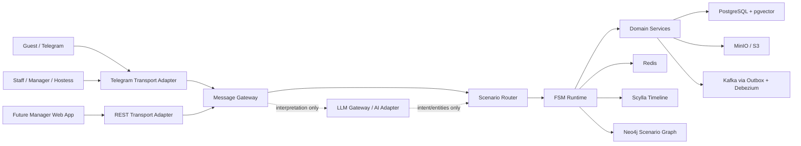
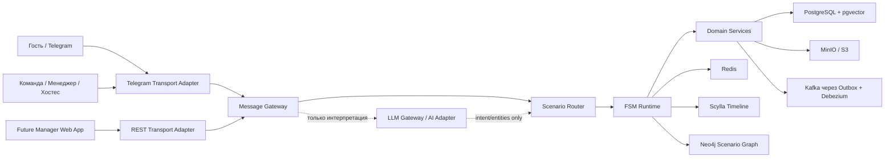

# Astor Butler Knowledge Base Refresh

Date: 2026-06-15

Scope: audit and replacement content for the Notion knowledge base:
https://auspicious-kryptops-863.notion.site/Astor-Butler-Knowledge-Base-380a7c019f1980d78b68d8bc659c609b

Status: ready for publication. Direct Notion write is blocked in this Codex session because Notion search/fetch/update tools are not exposed by the connected tool runtime.

## Knowledge Base Audit Report

### Sources Used

Priority order applied:

1. Runtime code in `src/main/java` and Liquibase migrations in `src/main/resources/db/changelog`.
2. `docs/FSM_SCENARIOS_VIEWER.html`.
3. `docs/ARCHITECTURE.md`.
4. `Obsidian/Astor_Butler_Knowledge/01_Project/Current_Status.md`.
5. `Obsidian/Astor_Butler_Knowledge/01_Project/Backlog.md`.
6. Other Markdown documents in `docs/` and the Obsidian vault.

### Updated Content Prepared

- `01 Product Overview (EN)`.
- `01 Обзор продукта (RU)`.
- `02 System Architecture (EN)`.
- `02 Архитектура системы (RU)`.
- `03 Domain Model (EN)`.
- `03 Модель домена (RU)`.
- `04 FSM Catalog (EN)`.
- `04 Каталог FSM (RU)`.
- `05 Event Catalog (EN)`.
- `05 Каталог событий (RU)`.

### Main Changes

- Astor Butler is described as a soft-governance system for HoReCa, not as an ordinary Telegram bot.
- Telegram is defined as a transport adapter and first guest UI. FSM remains the source of business authority.
- `MessageGatewayService` and `ScenarioRouter` are documented as the current intake and scenario-routing path.
- AI/LLM is documented as an interpretation layer only: AI is outside business authority.
- Runtime storage boundaries are clarified: Redis for hot state and drafts; PostgreSQL for durable facts; MinIO for binary media; Kafka via PostgreSQL outbox and Debezium; Scylla/Neo4j/pgvector as timeline, graph and semantic-memory layers.
- FSM catalog is aligned with the current Viewer and code: 16 MVP Java `FsmScenario` components exist, with `MerchScenario` and `SafePlayScenario` present in addition to the requested list.
- Event catalog is split into implemented events and target taxonomy. The real Kafka outbox currently publishes `USER_MESSAGE_RECEIVED` and `LLM_RESPONSE_GENERATED`; booking/media/admin/analytics events are target catalog entries unless tied to current local actions.

### Still Outdated Or Missing

- `Current_Status.md` and `Backlog.md` contain 2026-06-08 status that is older than 2026-06-15 code and handoff notes.
- The public Notion state was not fetched because Notion tools were unavailable.
- `PreferenceScenario` and `ConciergeScenario` are future scenarios in the requested structure; no Java `FsmScenario` implementations exist yet.
- `Conversation`, `Scenario`, `ScenarioDraft`, `EventRequest`, `TipIntent`, `DonationIntent`, and `AuctionBid` exist as concepts, but the code uses different concrete names: `telegram_messages`, `FsmScenario`, Redis drafts, `EventBookingOrder`, `TipOrder`, `DonationOrder`, and `ArtAuctionBid`.
- Kafka topic documentation still lists only `USER_MESSAGE_RECEIVED` and `LLM_RESPONSE_GENERATED` as current event types; the full business event taxonomy is not fully implemented.

### Sections 06-17 Audit Plan

| Section | Status | Recommendation |
| --- | --- | --- |
| 06 API Contract | Requires update | Reconcile Swagger-visible controller stubs with real implemented endpoints. Mark stubs explicitly. |
| 07 Data Storage | Requires update | Merge PostgreSQL, Redis, MinIO, Kafka outbox, pgvector, Scylla, Neo4j and Mongo/metadata decisions into one storage matrix. |
| 08 Integrations | Requires update | Separate current integrations from future adapters: Telegram, Debezium, MinIO, Ollama/STT, SBIS, Keycloak, Yandex Cloud. |
| 09 AI and Semantic Layer | Recommended create/update | Document SemanticRouter target, LLM Gateway, pgvector retrieval, menu RAG, and the non-authority rule. |
| 10 Media Pipeline | Requires update | Align with `media_assets`, MinIO object keys, AERIS content ingest, and Telegram `SendDocument` fidelity rule. |
| 11 Admin and Staff Operations | Recommended create | Cover hostess chat, admin analytics chat, system chat, manual handoff, startup notifications, and service-chat guard. |
| 12 Observability and Analytics | Requires update | Describe outbox/Kafka, admin projection, retry/backpressure, Prometheus/Grafana target, and timeline writes. |
| 13 Security and Privacy | Requires update | Cover Consent Vault, service chat isolation, PII boundaries, payment/privacy boundaries, and planned Keycloak/JWT. |
| 14 Deployment and Infrastructure | Requires update | Document Docker Compose, local gateway, target multi-instance layout, Yandex Cloud target, and Telegram long-polling constraint. |
| 15 QA and Testing | Requires update | Include focused scenario tests, k6 deterministic baseline, container smoke tests, and graphify update workflow. |
| 16 Product Backlog | Requires update | Split implemented MVP, next vertical slices, future capability work, and blocked business inputs from Yana. |
| 17 Glossary | Recommended create | Normalize terms: transport, gateway, scenario router, FSM runtime, durable fact, hot state, handoff, capability, AI adapter. |

## 01 Product Overview (EN)

### What Is Astor Butler

Astor Butler is a soft-governance system for hospitality operations. It coordinates guest communication, service routing, reservations, content delivery, staff handoff and operational evidence through controlled FSM scenarios.

Telegram is the first guest-facing interface, but it is not the product architecture. Telegram is a transport adapter and UI surface. The authoritative interaction model is the FSM runtime.

### Mission

The mission of Astor Butler is to reduce operational ambiguity in restaurant and event-venue communication while preserving human hospitality. The system should recognize guest intent, collect structured context, keep service state consistent, and hand over to staff when human judgment is required.

### Soft Governance

Soft governance means that the system guides behavior without coercion. It offers explicit paths, safe exits, confirmations, and escalation boundaries. It does not force a guest into a rigid command language and does not let generative AI invent operational decisions.

### Butler vs Concierge

A concierge primarily answers requests. A butler maintains continuity, remembers operational context, protects service boundaries, and ensures that an action is routed to the correct owner. Astor Butler therefore focuses on state, consent, evidence, and safe handoff rather than open-ended chat.

### Primary Actors

- Guest: a Telegram user or future web-chat user interacting with AERIS.
- Hostess: staff member who confirms or rejects table reservations.
- Manager: staff member who receives event, feedback, change/cancel, merch and escalation cards.
- Admin/Analytics Operator: observer of runtime events and system health.
- System Chat: service control channel that is audited but does not start guest FSM.
- AI Adapter: interpretation component for intent and entity extraction, not a business actor.

### AERIS as First Use Case

AERIS is the first venue-specific use case. The current MVP includes AERIS menu assets, floor plan, interior tour, concept copy, public channel ingest, table reservation flow, Quiet Guide responses and staff handoff rules.

### Platform Principles

- FSM is the single source of truth for guest interaction state.
- Transport adapters normalize input and send output, but do not own business decisions.
- AI is outside business authority.
- Durable facts are stored in PostgreSQL.
- Hot runtime state and drafts are stored in Redis.
- Media binaries are stored in MinIO/S3-compatible storage and referenced through PostgreSQL catalog records.
- Kafka is fed through the PostgreSQL outbox path, not direct ad hoc publication.
- Service chats are control-plane channels and do not trigger guest scenarios.

### Hospitality Capability Model

- Memory Engine: identity, consent and context continuity.
- Preference Map: future personalization and repeat-guest preferences.
- Smart Tip: controlled gratitude and payment-intent boundary.
- Quiet Guide: menu, guide, poster, venue and concept support.
- Hidden Heart: anonymous donation and cultural contribution intent.
- Safe Play: safe hospitality rituals with explicit team confirmation.
- Slot Keeper: table and event reservation coordination.
- Panic Exit: safe return to `READY_FOR_DIALOG` and human escalation.

### Current MVP Scope

The current MVP contains:

- Telegram intake and message gateway.
- Consent/contact first-touch flow.
- Redis FSM state and scenario drafts.
- Scenario Router with explicit `FsmScenario` components.
- Table booking with floor-plan delivery and hostess confirmation.
- Menu assets and Quiet Guide content delivery.
- Event booking, manager help, change/cancel, feedback, Smart Tip, Hidden Heart, Art Auction, Impact Meter, Merch and Safe Play MVP scenario layers.
- PostgreSQL tables for users, telegram profiles, consents, messages, bookings, media assets, content posts, tips, donations, auctions, feedback, merch and payments.
- Outbox-to-Kafka event trail with admin Telegram projection.
- Local Docker infrastructure: PostgreSQL, Redis, Kafka/Redpanda, Debezium, MinIO, MongoDB, LLM gateway and app/gateway containers.

### Long-Term Vision

Astor Butler should become a hospitality coordination platform where multiple guest channels, staff applications, content sources, payment providers and venue systems are governed by one scenario graph. The long-term direction includes manager web UI, Keycloak/JWT security, SBIS/PMS adapters, stronger LLM gateway, pgvector semantic retrieval, Scylla timeline, Neo4j scenario graph and production deployment in Yandex Cloud.

## 01 Обзор продукта (RU)

### Что такое Astor Butler

Astor Butler - это система soft governance для HoReCa. Она координирует общение с гостем, маршрутизацию сервисных запросов, бронирования, выдачу контента, передачу команде и операционные доказательства через управляемые FSM-сценарии.

Telegram является первым гостевым интерфейсом, но не архитектурой продукта. Telegram - это transport adapter и UI-поверхность. Авторитетная модель взаимодействия находится в FSM runtime.

### Миссия

Миссия Astor Butler - снизить операционную неопределенность в коммуникации ресторана или event-площадки с гостем, сохраняя человеческое гостеприимство. Система должна распознавать намерение, собирать структурированный контекст, держать состояние сервиса согласованным и передавать запрос человеку там, где требуется человеческое решение.

### Soft Governance

Soft governance означает мягкое управление поведением без принуждения. Система предлагает явные маршруты, безопасные выходы, подтверждения и правила эскалации. Она не заставляет гостя угадывать команды и не позволяет генеративному AI принимать операционные решения.

### Butler vs Concierge

Concierge в основном отвечает на запросы. Butler поддерживает непрерывность контекста, защищает сервисные границы и следит, чтобы действие попало к правильному владельцу. Поэтому Astor Butler фокусируется на состоянии, согласии, доказательности и безопасной передаче, а не на открытом чате.

### Основные акторы

- Гость: Telegram-пользователь или будущий пользователь web chat.
- Хостес: сотрудник, подтверждающий или отклоняющий бронирование стола.
- Менеджер: сотрудник, получающий карточки мероприятий, отзывов, изменений, мерча и эскалаций.
- Admin/Analytics оператор: наблюдает runtime-события и здоровье системы.
- System chat: служебный канал, который аудируется, но не запускает гостевую FSM.
- AI Adapter: компонент интерпретации intent/entities, не бизнес-актор.

### AERIS как первый use case

AERIS - первый venue-specific сценарий. MVP уже включает меню AERIS, план зала, интерьерный тур, approved concept copy, ingest публичного канала, бронирование столов, Quiet Guide и правила handoff команде.

### Принципы платформы

- FSM является single source of truth для состояния общения.
- Transport adapters нормализуют вход и отправляют выход, но не принимают бизнес-решения.
- AI находится вне бизнес-полномочий.
- Durable facts хранятся в PostgreSQL.
- Hot runtime state и drafts хранятся в Redis.
- Медиа-файлы хранятся в MinIO/S3-compatible storage и описываются PostgreSQL-каталогом.
- Kafka получает события через PostgreSQL outbox, а не через случайные прямые публикации.
- Service chats являются control-plane каналами и не запускают гостевые сценарии.

### Hospitality Capability Model

- Memory Engine: identity, consent и контекстная непрерывность.
- Preference Map: будущая персонализация и предпочтения постоянного гостя.
- Smart Tip: управляемая благодарность и payment-intent boundary.
- Quiet Guide: меню, справки, афиша, видео-тур и концепция.
- Hidden Heart: анонимный donation и культурный вклад.
- Safe Play: безопасные hospitality-ритуалы с подтверждением команды.
- Slot Keeper: координация столов и event-бронирований.
- Panic Exit: безопасный возврат в `READY_FOR_DIALOG` и эскалация человеку.

### Текущий MVP Scope

Текущий MVP включает:

- Telegram intake и message gateway.
- First-touch flow с contact/consent.
- Redis FSM state и scenario drafts.
- Scenario Router с явными `FsmScenario` компонентами.
- Бронирование стола с отправкой плана зала и подтверждением хостес.
- Выдачу меню и Quiet Guide content.
- MVP-слои для Event Booking, Manager Help, Change/Cancel, Feedback, Smart Tip, Hidden Heart, Art Auction, Impact Meter, Merch и Safe Play.
- PostgreSQL-таблицы для users, telegram profiles, consents, messages, bookings, media assets, content posts, tips, donations, auctions, feedback, merch и payments.
- Outbox-to-Kafka event trail с Telegram admin projection.
- Локальную Docker-инфраструктуру: PostgreSQL, Redis, Kafka/Redpanda, Debezium, MinIO, MongoDB, LLM gateway и app/gateway контейнеры.

### Долгосрочное видение

Astor Butler должен стать платформой координации гостеприимства, где разные guest channels, staff applications, content sources, payment providers и venue systems управляются единым scenario graph. Долгосрочное направление: manager web UI, Keycloak/JWT, SBIS/PMS adapters, сильный LLM gateway, pgvector semantic retrieval, Scylla timeline, Neo4j scenario graph и production-deployment в Yandex Cloud.

## 02 System Architecture (EN)

### Architecture Principle

The system is a Java 21 + Spring Boot monolith with explicit module boundaries. UI and transport layers are not allowed to contain business logic. The FSM runtime and domain services decide what can happen next.

AI is outside business authority.

### High-Level Architecture

### Transport Adapters

Transport adapters receive external input and normalize it into canonical application messages. Current adapters include Telegram bot updates and REST simulation endpoints. Voice/audio is normalized before the business FSM; stderr and STT diagnostics are never appended to guest text.

### Message Gateway

`MessageGatewayService` is the runtime entry point after transport normalization. It records intake, applies service-chat guard, handles voice transcription retries, loads current FSM state, invokes `ScenarioRouter`, writes outbox events and appends timeline events.

### Scenario Router

`ScenarioRouter` selects an explicit `FsmScenario`, handles composite intent plans, defers safe content while side-effecting scenarios are active, and resumes pending content after a safe completion action.

### FSM Runtime

FSM runtime owns current state, allowed transitions, recovery, safe exit, pending intents and Redis-backed drafts. `READY_FOR_DIALOG` is the normal home state for known/consented guests.

### Domain Services

Domain services implement durable business actions. Current domains include identity, consent, booking, media, content, tip, donation, auction, feedback, merch, payment, timeline and notification boundaries.

### PostgreSQL

PostgreSQL stores durable facts: users, Telegram profiles, contacts, consents, messages, table reservations, event booking orders, media assets, venue content, tip/donation/auction/feedback/merch/payment records, and outbox events. `pgvector` is introduced for semantic sources, chunks and embeddings.

### Redis

Redis stores hot runtime state: FSM state, table booking draft, pending intents, STT retry counters, recovery counters, idempotency and short-lived cache.

### Kafka

Kafka is the event backbone. The current MVP publishes through PostgreSQL `outbox_events` and Debezium Outbox Event Router into `astor.user.events`. Admin Telegram notifications are a human-readable projection, not the raw event transport.

### MinIO

MinIO stores binary media: AERIS PDF menus, floor plan, interior video, channel media and future documents. PostgreSQL `media_assets` and content asset tables reference object keys.

### LLM Gateway

The LLM Gateway helps with intent parsing, entity extraction, text normalization and future semantic routing. It does not confirm reservations, create holds, accept payments, accept bids, modify orders or own state transitions.

## 02 Архитектура системы (RU)

### Архитектурный принцип

Система является Java 21 + Spring Boot монолитом с явными модульными границами. UI и transport layers не содержат бизнес-логики. Решение о следующем допустимом действии принимают FSM runtime и domain services.

AI находится вне бизнес-полномочий.

### Высокоуровневая схема

### Transport Adapters

Transport adapters принимают внешний вход и нормализуют его в canonical application messages. Сейчас это Telegram bot updates и REST simulation endpoints. Voice/audio нормализуется до бизнес-FSM; stderr и STT diagnostics не попадают в текст гостя.

### Message Gateway

`MessageGatewayService` - runtime entry point после transport normalization. Он записывает intake, применяет service-chat guard, обрабатывает voice retry, загружает текущее FSM state, вызывает `ScenarioRouter`, пишет outbox events и append timeline events.

### Scenario Router

`ScenarioRouter` выбирает явный `FsmScenario`, обрабатывает composite intent plans, откладывает safe content, когда активен side-effecting scenario, и возобновляет pending content после безопасного completion action.

### FSM Runtime

FSM runtime владеет текущим состоянием, допустимыми переходами, recovery, safe exit, pending intents и Redis-backed drafts. `READY_FOR_DIALOG` - нормальное домашнее состояние известного гостя с consent.

### Domain Services

Domain services реализуют durable business actions. Сейчас есть boundaries identity, consent, booking, media, content, tip, donation, auction, feedback, merch, payment, timeline и notification.

### PostgreSQL

PostgreSQL хранит durable facts: users, Telegram profiles, contacts, consents, messages, table reservations, event booking orders, media assets, venue content, tip/donation/auction/feedback/merch/payment records и outbox events. `pgvector` вводится для semantic sources, chunks и embeddings.

### Redis

Redis хранит hot runtime state: FSM state, table booking draft, pending intents, STT retry counters, recovery counters, idempotency и short-lived cache.

### Kafka

Kafka - event backbone. Текущий MVP публикует события через PostgreSQL `outbox_events` и Debezium Outbox Event Router в `astor.user.events`. Telegram admin notifications являются human-readable projection, а не raw event transport.

### MinIO

MinIO хранит бинарные media: PDF меню AERIS, план зала, интерьерное видео, media из канала и будущие документы. PostgreSQL `media_assets` и content asset tables ссылаются на object keys.

### LLM Gateway

LLM Gateway помогает с intent parsing, entity extraction, text normalization и будущим semantic routing. Он не подтверждает брони, не создает holds, не принимает платежи, не принимает ставки, не меняет orders и не владеет state transitions.

## 03 Domain Model (EN)

### Current Entity Map

| Requested concept | Current implementation |
| --- | --- |
| GuestProfile | `users`, `telegram_profiles`, `user_contacts`, `IdentityRecord`; no single `GuestProfile` class. |
| Consent | `user_consents`, `ConsentVaultService`. |
| Conversation | `telegram_messages`, `IncomingMessage`, `OutgoingMessage`, `FsmTimelineEvent`; no single `Conversation` aggregate. |
| Scenario | `FsmScenario` interface and scenario classes. |
| ScenarioDraft | Redis drafts: table booking draft, pending intents, retry counters. |
| Reservation | `table_reservation_orders`, `table_reservation_holds`, `TableReservationOrder`. |
| EventRequest | `event_booking_orders`, `EventBookingOrder`. |
| MediaAsset | `media_assets`, `MediaAsset`, `AerisMediaCatalog`. |
| TimelineEvent | `FsmTimelineEvent`, `ScyllaFsmTimelineWriter`, API timeline stub. |
| TipIntent | `tip_orders`, `TipOrder`. |
| DonationIntent | `donation_orders`, `DonationOrder`. |
| AuctionBid | `art_auction_bids`, `ArtAuctionBid`. |

### Runtime Data vs Durable Data

Runtime data is short-lived operational state used to continue a conversation. It belongs in Redis unless it must become an auditable fact. Examples: current FSM state, table booking draft before order creation, pending safe-content intents, recovery attempts and voice retry counters.

Durable data is an auditable business fact. It belongs in PostgreSQL and may be projected to Kafka, Scylla or Neo4j. Examples: identity, consent, messages, reservation orders, holds, media catalog entries, event booking orders, tips, donations, bids, feedback, merch orders and payment records.

### Domain Boundaries

- Identity: internal user identity and external Telegram profile mapping.
- Consent: policy acceptance, evidence and future revoke/export boundary.
- Booking: table reservations, event booking orders and change/cancel handoff.
- Media: PostgreSQL catalog plus MinIO object storage.
- Content: venue content posts/assets, AERIS channel ingest and Quiet Guide read model.
- Timeline: append-only FSM event history, currently writer abstraction with Scylla target.
- Tip/Donation/Auction: controlled intent/order/bid records with payment or manager validation boundaries.
- Feedback/Merch/Safe Play: staff handoff and manual confirmation boundaries.

## 03 Модель домена (RU)

### Карта сущностей

| Требуемый концепт | Текущая реализация |
| --- | --- |
| GuestProfile | `users`, `telegram_profiles`, `user_contacts`, `IdentityRecord`; единого класса `GuestProfile` нет. |
| Consent | `user_consents`, `ConsentVaultService`. |
| Conversation | `telegram_messages`, `IncomingMessage`, `OutgoingMessage`, `FsmTimelineEvent`; единого aggregate `Conversation` нет. |
| Scenario | интерфейс `FsmScenario` и классы сценариев. |
| ScenarioDraft | Redis drafts: table booking draft, pending intents, retry counters. |
| Reservation | `table_reservation_orders`, `table_reservation_holds`, `TableReservationOrder`. |
| EventRequest | `event_booking_orders`, `EventBookingOrder`. |
| MediaAsset | `media_assets`, `MediaAsset`, `AerisMediaCatalog`. |
| TimelineEvent | `FsmTimelineEvent`, `ScyllaFsmTimelineWriter`, API timeline stub. |
| TipIntent | `tip_orders`, `TipOrder`. |
| DonationIntent | `donation_orders`, `DonationOrder`. |
| AuctionBid | `art_auction_bids`, `ArtAuctionBid`. |

### Runtime Data vs Durable Data

Runtime data - короткоживущее операционное состояние для продолжения диалога. Оно хранится в Redis, если не стало auditable fact. Примеры: current FSM state, draft бронирования стола до создания order, pending safe-content intents, recovery attempts и voice retry counters.

Durable data - проверяемый бизнес-факт. Он хранится в PostgreSQL и может проецироваться в Kafka, Scylla или Neo4j. Примеры: identity, consent, messages, reservation orders, holds, media catalog entries, event booking orders, tips, donations, bids, feedback, merch orders и payment records.

### Domain Boundaries

- Identity: внутренняя личность и внешний Telegram profile.
- Consent: policy acceptance, evidence и будущие revoke/export flows.
- Booking: table reservations, event booking orders и change/cancel handoff.
- Media: PostgreSQL catalog плюс MinIO object storage.
- Content: venue content posts/assets, AERIS channel ingest и Quiet Guide read model.
- Timeline: append-only история FSM events, сейчас writer abstraction с target Scylla.
- Tip/Donation/Auction: controlled intent/order/bid records с payment или manager validation boundaries.
- Feedback/Merch/Safe Play: staff handoff и manual confirmation boundaries.

## 04 FSM Catalog (EN)

Source of truth: `docs/FSM_SCENARIOS_VIEWER.html`, checked against Java `FsmScenario` classes.

### Core Scenarios

#### FirstTouchScenario

Purpose: safe restart, first contact, contact capture and consent routing.
Entry points: `/start`, unknown guest, `CONSENT_REQUIRED`, contact payload.
Exit points: `CONSENT_REQUIRED` or `READY_FOR_DIALOG`.
States: `UNKNOWN`, `CONSENT_REQUIRED`, `READY_FOR_DIALOG`.
Transitions: unknown/start -> consent prompt; known guest/start -> `READY_FOR_DIALOG`; contact captured -> `READY_FOR_DIALOG`.
Escalation rules: before consent, business scenarios are not started.

#### MainMenuScenario

Purpose: explicit home state and safe exit from active scenarios.
Entry points: known guest, main menu intent, stop/cancel/back intent in active state.
Exit points: `READY_FOR_DIALOG`.
States: `READY_FOR_DIALOG`, active scenario states for safe exit.
Transitions: safe exit -> `READY_FOR_DIALOG`; menu request -> capability summary.
Escalation rules: does not own product branches; product intents route to explicit scenarios.

#### TableBookingScenario

Purpose: regular table reservation.
Entry points: table/booking intent, date/time/party messages, table selection.
Exit points: hostess confirmation, rejection or return to `READY_FOR_DIALOG`.
States: `TABLE_BOOKING_COLLECT_DATE`, `TABLE_BOOKING_COLLECT_TIME`, `TABLE_BOOKING_COLLECT_PARTY_SIZE`, `TABLE_BOOKING_WAIT_TABLE_SELECTION`, `TABLE_BOOKING_WAIT_HOSTESS_CONFIRMATION`, `TABLE_BOOKING_CONFIRMED`, `TABLE_BOOKING_REJECTED`.
Transitions: intent -> collect missing slot fields -> send floor plan -> table selection -> order/hold -> hostess decision -> guest notification.
Escalation rules: hostess chat confirms or rejects; free text in hostess chat is not guest FSM input.

#### MenuAssetsScenario

Purpose: deliver AERIS menu assets and menu-related metadata.
Entry points: menu, bar, wine, cocktails, food intents; pending content resume.
Exit points: `READY_FOR_DIALOG`.
States: `MENU_ASSETS_CLARIFY`, `MENU_ASSETS_DELIVERED`.
Transitions: broad menu request -> clarification or relevant documents; specific request -> active menu asset set.
Escalation rules: LLM/RAG may help retrieval, but must not invent menu items, prices or availability.

#### QuietGuideScenario

Purpose: non-intrusive venue guidance: poster, today, concept, interior video.
Entry points: poster, guide, concept, venue tour, what is happening today.
Exit points: `READY_FOR_DIALOG`.
States: `QUIET_GUIDE_CLARIFY`, `QUIET_GUIDE_DELIVERED`.
Transitions: broad guide request -> topic clarification; concept/tour/poster request -> approved content or active posts.
Escalation rules: content is read-only; uncertain content should not be fabricated.

#### ManagerHelpScenario

Purpose: explicit human handoff.
Entry points: manager/person/help intent or collected handoff reason.
Exit points: admin card and `READY_FOR_DIALOG`.
States: `MANAGER_HELP_COLLECT_REASON`, `MANAGER_HELP_SENT`.
Transitions: short manager request -> ask reason; meaningful request -> admin handoff card.
Escalation rules: money, safety, VIP, complaint and repeated recovery failures should route to human handoff.

#### RecoveryScenario

Purpose: graceful recovery from unclear input, state conflict or technical failure.
Entry points: unclear text in `READY_FOR_DIALOG` or `AI_FALLBACK`.
Exit points: clarification or admin alert; always return to `READY_FOR_DIALOG`.
States: `READY_FOR_DIALOG`, `AI_FALLBACK`.
Transitions: first unclear input -> useful options; repeated unclear input -> admin alert.
Escalation rules: Redis retry counter with TTL; repeated uncertainty creates admin recovery context.

### Extended Scenarios

#### EventBookingScenario

Purpose: banquet, corporate event, wedding, birthday and full-venue requests.
Entry points: event-related intent or active detail collection.
Exit points: structured request sent to manager; `READY_FOR_DIALOG`.
States: `EVENT_BOOKING_COLLECT_DETAILS`, `EVENT_BOOKING_SENT`.
Transitions: short intent -> ask details; structured request with date/guests -> event booking order/admin card.
Escalation rules: no automatic event confirmation; manager validation required.

#### SmartTipScenario

Purpose: controlled tip intent.
Entry points: tip/gratitude intent or active confirmation.
Exit points: draft confirmed/cancelled; `READY_FOR_DIALOG`.
States: `TIP_COLLECT_AMOUNT`, `TIP_CONFIRMATION`.
Transitions: intent -> amount -> explicit confirmation -> draft confirmed/cancelled.
Escalation rules: future payment integration is outside current business completion; bot must not promise real payment.

#### HiddenHeartScenario

Purpose: anonymous donation intent and cultural contribution draft.
Entry points: donation/charity/support intent or active confirmation.
Exit points: draft confirmed/cancelled; `READY_FOR_DIALOG`.
States: `DONATION_COLLECT_AMOUNT`, `DONATION_CONFIRMATION`.
Transitions: intent -> amount -> explicit confirmation -> anonymous donation draft.
Escalation rules: impact reporting is aggregate only; private payment data is not disclosed.

#### FeedbackScenario

Purpose: collect guest feedback and route it to the team.
Entry points: feedback, complaint, praise, suggestion.
Exit points: admin card; `READY_FOR_DIALOG`.
States: `FEEDBACK_COLLECT_TEXT`, `FEEDBACK_SENT`.
Transitions: short feedback intent -> ask text; meaningful feedback -> admin card.
Escalation rules: complaint, safety and VIP feedback should be prioritized for staff.

#### ChangeCancelScenario

Purpose: safe change or cancellation request for reservations.
Entry points: change/cancel intent, date/time/order reference.
Exit points: admin handoff; `READY_FOR_DIALOG`.
States: `TABLE_BOOKING_CHANGE_REQUESTED`.
Transitions: intent -> collect reference; reference present -> admin card.
Escalation rules: current MVP does not auto-release holds or modify orders; human validation is required.

### Future Scenarios

#### ImpactMeterScenario

Current status: implemented as read-only MVP scenario.
Purpose: aggregated cultural contribution summary.
Entry points: impact, how much collected, results.
Exit points: `READY_FOR_DIALOG`.
States: no dedicated persistent state; returns to `READY_FOR_DIALOG`.
Escalation rules: no PII or raw payment data.

#### ArtAuctionScenario

Current status: implemented as MVP scenario, although requested as future.
Purpose: event/lot bid draft with explicit confirmation.
Entry points: art, auction, bid.
Exit points: manager/event-owner validation required; `READY_FOR_DIALOG`.
States: `AUCTION_RUNNING`, `AUCTION_WAIT_BID`.
Escalation rules: LLM does not accept final bids or declare winners.

#### PreferenceScenario

Current status: not implemented as a Java `FsmScenario`.
Purpose: future preference capture and personalization.
Entry points: repeat-order, preference and "as before" intents.
Exit points: preference stored or recommendation shown.
Escalation rules: preference use requires consent and explainable source facts.

#### ConciergeScenario

Current status: not implemented as a Java `FsmScenario`.
Purpose: future general concierge layer.
Entry points: broad assistance request outside current explicit scenarios.
Exit points: explicit scenario route or manager handoff.
Escalation rules: must not become an uncontrolled AI fallback.

## 04 Каталог FSM (RU)

Источник истины: `docs/FSM_SCENARIOS_VIEWER.html`, сверено с Java-классами `FsmScenario`.

### Core Scenarios

#### FirstTouchScenario

Назначение: safe restart, первое касание, контакт и consent routing.
Входы: `/start`, неизвестный гость, `CONSENT_REQUIRED`, contact payload.
Выходы: `CONSENT_REQUIRED` или `READY_FOR_DIALOG`.
States: `UNKNOWN`, `CONSENT_REQUIRED`, `READY_FOR_DIALOG`.
Transitions: unknown/start -> consent prompt; known guest/start -> `READY_FOR_DIALOG`; contact captured -> `READY_FOR_DIALOG`.
Escalation rules: до consent бизнес-сценарии не запускаются.

#### MainMenuScenario

Назначение: явное домашнее состояние и safe exit из активных сценариев.
Входы: известный гость, main menu intent, stop/cancel/back intent в активном состоянии.
Выходы: `READY_FOR_DIALOG`.
States: `READY_FOR_DIALOG`, active scenario states for safe exit.
Transitions: safe exit -> `READY_FOR_DIALOG`; menu request -> capability summary.
Escalation rules: не владеет product branches; product intents уходят в отдельные сценарии.

#### TableBookingScenario

Назначение: обычное бронирование стола.
Входы: intent бронирования, сообщения с датой/временем/количеством гостей, выбор стола.
Выходы: подтверждение хостес, отказ или `READY_FOR_DIALOG`.
States: `TABLE_BOOKING_COLLECT_DATE`, `TABLE_BOOKING_COLLECT_TIME`, `TABLE_BOOKING_COLLECT_PARTY_SIZE`, `TABLE_BOOKING_WAIT_TABLE_SELECTION`, `TABLE_BOOKING_WAIT_HOSTESS_CONFIRMATION`, `TABLE_BOOKING_CONFIRMED`, `TABLE_BOOKING_REJECTED`.
Transitions: intent -> сбор слотов -> план зала -> выбор стола -> order/hold -> решение хостес -> уведомление гостя.
Escalation rules: подтверждение/отказ делает хостес; свободный текст хостес-чата не считается гостевым FSM input.

#### MenuAssetsScenario

Назначение: выдача меню AERIS и metadata.
Входы: меню, бар, вино, коктейли, еда; resume pending content.
Выходы: `READY_FOR_DIALOG`.
States: `MENU_ASSETS_CLARIFY`, `MENU_ASSETS_DELIVERED`.
Transitions: широкий запрос -> уточнение или набор документов; конкретный запрос -> активные menu assets.
Escalation rules: LLM/RAG помогает retrieval, но не выдумывает позиции, цены и наличие.

#### QuietGuideScenario

Назначение: ненавязчивая справка по площадке: афиша, сегодня, концепция, интерьерный тур.
Входы: афиша, справка, концепция, видео-тур, что сегодня.
Выходы: `READY_FOR_DIALOG`.
States: `QUIET_GUIDE_CLARIFY`, `QUIET_GUIDE_DELIVERED`.
Transitions: широкий запрос -> уточнение темы; concept/tour/poster -> approved content или active posts.
Escalation rules: read-only content; неизвестный контент не фабрикуется.

#### ManagerHelpScenario

Назначение: явная передача человеку.
Входы: менеджер/человек/помощь или собранная причина.
Выходы: admin card и `READY_FOR_DIALOG`.
States: `MANAGER_HELP_COLLECT_REASON`, `MANAGER_HELP_SENT`.
Transitions: короткая просьба -> уточнить причину; содержательная просьба -> admin handoff card.
Escalation rules: деньги, безопасность, VIP, жалоба и повторный recovery failure уходят человеку.

#### RecoveryScenario

Назначение: восстановление после непонятного ввода, state conflict или технической ошибки.
Входы: unclear text в `READY_FOR_DIALOG` или `AI_FALLBACK`.
Выходы: уточнение или admin alert; всегда `READY_FOR_DIALOG`.
States: `READY_FOR_DIALOG`, `AI_FALLBACK`.
Transitions: первый непонятный ввод -> варианты; повторный -> admin alert.
Escalation rules: Redis retry counter с TTL; повторная неопределенность создает admin recovery context.

### Extended Scenarios

#### EventBookingScenario

Назначение: банкет, корпоратив, свадьба, день рождения, выкуп зала.
Входы: event intent или active detail collection.
Выходы: structured request менеджеру; `READY_FOR_DIALOG`.
States: `EVENT_BOOKING_COLLECT_DETAILS`, `EVENT_BOOKING_SENT`.
Transitions: короткий intent -> запрос деталей; структурированный запрос с датой/гостями -> event booking order/admin card.
Escalation rules: автоматического подтверждения мероприятия нет; требуется manager validation.

#### SmartTipScenario

Назначение: controlled tip intent.
Входы: чаевые/благодарность или active confirmation.
Выходы: draft confirmed/cancelled; `READY_FOR_DIALOG`.
States: `TIP_COLLECT_AMOUNT`, `TIP_CONFIRMATION`.
Transitions: intent -> сумма -> явное подтверждение -> draft confirmed/cancelled.
Escalation rules: реальная оплата - future integration; бот не обещает completed payment.

#### HiddenHeartScenario

Назначение: анонимный donation intent и draft культурного вклада.
Входы: donation/charity/support intent или active confirmation.
Выходы: draft confirmed/cancelled; `READY_FOR_DIALOG`.
States: `DONATION_COLLECT_AMOUNT`, `DONATION_CONFIRMATION`.
Transitions: intent -> сумма -> явное подтверждение -> anonymous donation draft.
Escalation rules: impact reporting только агрегированный; private payment data не раскрывается.

#### FeedbackScenario

Назначение: сбор отзыва и передача команде.
Входы: отзыв, жалоба, похвала, предложение.
Выходы: admin card; `READY_FOR_DIALOG`.
States: `FEEDBACK_COLLECT_TEXT`, `FEEDBACK_SENT`.
Transitions: короткий intent -> запросить текст; содержательный отзыв -> admin card.
Escalation rules: жалобы, безопасность и VIP feedback получают повышенный приоритет.

#### ChangeCancelScenario

Назначение: безопасный запрос изменения или отмены брони.
Входы: change/cancel intent, дата/время/order reference.
Выходы: admin handoff; `READY_FOR_DIALOG`.
States: `TABLE_BOOKING_CHANGE_REQUESTED`.
Transitions: intent -> сбор reference; reference present -> admin card.
Escalation rules: текущий MVP не освобождает holds и не меняет orders автоматически; нужна human validation.

### Future Scenarios

#### ImpactMeterScenario

Текущий статус: реализован как read-only MVP scenario.
Назначение: агрегированный отчет культурного вклада.
Входы: impact, сколько собрали, итоги.
Выходы: `READY_FOR_DIALOG`.
States: без dedicated persistent state; возврат в `READY_FOR_DIALOG`.
Escalation rules: без PII и raw payment data.

#### ArtAuctionScenario

Текущий статус: реализован как MVP scenario, хотя в запросе указан как future.
Назначение: bid draft по event/lot с explicit confirmation.
Входы: art, auction, bid.
Выходы: manager/event-owner validation required; `READY_FOR_DIALOG`.
States: `AUCTION_RUNNING`, `AUCTION_WAIT_BID`.
Escalation rules: LLM не принимает финальные ставки и не объявляет победителей.

#### PreferenceScenario

Текущий статус: не реализован как Java `FsmScenario`.
Назначение: future preference capture и персонализация.
Входы: repeat-order, preference, "как в прошлый раз".
Выходы: preference stored или recommendation shown.
Escalation rules: использование preference требует consent и explainable source facts.

#### ConciergeScenario

Текущий статус: не реализован как Java `FsmScenario`.
Назначение: будущий general concierge layer.
Входы: широкий запрос помощи вне явных сценариев.
Выходы: маршрут в explicit scenario или manager handoff.
Escalation rules: не должен стать uncontrolled AI fallback.

## 05 Event Catalog (EN)

### Current Implementation

The durable event path is PostgreSQL `outbox_events` -> Debezium Outbox Event Router -> Kafka topic `astor.user.events`. Current code publishes:

- `USER_MESSAGE_RECEIVED`
- `LLM_RESPONSE_GENERATED`

The following catalog is the normalized target taxonomy. Entries marked "target" should be implemented through the same outbox pattern.

### Guest Events

- `USER_MESSAGE_RECEIVED`: implemented. Inbound message with actor, chat, message, media and state context.
- `USER_CONTACT_CAPTURED`: target. Contact data accepted and linked to identity.
- `CONSENT_GRANTED`: target. Policy consent accepted with evidence.
- `CONSENT_REVOKED`: target. Future revoke flow.
- `VOICE_TRANSCRIPTION_FAILED`: target. STT failure and retry policy state.

### FSM Events

- `INTENT_DETECTED`: target. Intent/entity decision before scenario route.
- `SCENARIO_STARTED`: target. Scenario selected from `READY_FOR_DIALOG` or active continuation.
- `SCENARIO_STATE_CHANGED`: target. Previous and next `BotState`.
- `SCENARIO_COMPLETED`: target. Scenario reached a terminal safe state.
- `RECOVERY_TRIGGERED`: target. Recovery clarification or admin handoff.
- `PENDING_INTENT_STORED`: target. Deferred safe content saved in Redis.
- `PENDING_INTENT_EXECUTED`: target. Deferred content resumed after safe completion.

### Booking Events

- `BOOKING_CREATED`: target/current local domain action. Table reservation order created.
- `BOOKING_HOLD_CREATED`: target/current local domain action. Hold created for table/time window.
- `BOOKING_CONFIRMED`: target/current local domain action. Hostess confirmed reservation.
- `BOOKING_REJECTED`: target/current local domain action. Hostess rejected reservation.
- `BOOKING_CHANGE_REQUESTED`: target. Change/cancel handoff created.
- `EVENT_REQUEST_CREATED`: target/current local domain action. Event booking order created.
- `EVENT_REQUEST_SENT_TO_MANAGER`: target. Event booking handoff sent.

### Media Events

- `MEDIA_ASSET_REGISTERED`: target/current local ingest action. `media_assets` row or content asset stored.
- `MEDIA_DELIVERED`: target. Menu/floor-plan/video delivered to guest.
- `CONTENT_POST_INGESTED`: target/current local action. AERIS channel post stored.
- `CONTENT_ASSET_MIRRORED`: target/current local action. External media mirrored into MinIO.

### Admin Events

- `ADMIN_ALERT_CREATED`: target/current behavior through admin alert payloads.
- `MANAGER_HANDOFF_CREATED`: target. Manager card created with scenario summary.
- `HOSTESS_APPROVAL_REQUESTED`: target/current local behavior.
- `HOSTESS_APPROVAL_RECEIVED`: target/current local behavior.
- `SYSTEM_CHAT_MESSAGE_AUDITED`: target. Service chat recorded without guest FSM.

### AI Events

- `LLM_RESPONSE_GENERATED`: implemented. Prompt/response/fallback metadata.
- `INTENT_DETECTED`: target. Semantic decision output.
- `ENTITY_EXTRACTION_COMPLETED`: target. Extracted date/time/party/bid/amount/context.
- `AI_TIMEOUT`: target. Graceful degradation event.
- `AI_FALLBACK_USED`: target. Non-authoritative fallback marker.

### Analytics Events

- `ANALYTICS_EVENT_PROJECTED`: target. Kafka event projected to admin Telegram chat.
- `ADMIN_DELIVERY_RETRIED`: target. Telegram 429 retry/backpressure.
- `ADMIN_DELIVERY_FAILED`: target. Projection failed after retry policy.
- `SCENARIO_METRIC_RECORDED`: target. Completion/fallback/escalation metric.
- `IMPACT_SUMMARY_VIEWED`: target. Impact Meter read-only response delivered.

## 05 Каталог событий (RU)

### Текущая реализация

Durable event path: PostgreSQL `outbox_events` -> Debezium Outbox Event Router -> Kafka topic `astor.user.events`. Текущий код публикует:

- `USER_MESSAGE_RECEIVED`
- `LLM_RESPONSE_GENERATED`

Ниже - нормализованный целевой каталог. События со статусом "target" должны реализовываться через тот же outbox pattern.

### Guest Events

- `USER_MESSAGE_RECEIVED`: реализовано. Входящее сообщение с actor, chat, message, media и state context.
- `USER_CONTACT_CAPTURED`: target. Контакт принят и связан с identity.
- `CONSENT_GRANTED`: target. Policy consent принят с evidence.
- `CONSENT_REVOKED`: target. Future revoke flow.
- `VOICE_TRANSCRIPTION_FAILED`: target. STT failure и retry policy state.

### FSM Events

- `INTENT_DETECTED`: target. Intent/entity decision до scenario route.
- `SCENARIO_STARTED`: target. Scenario выбран из `READY_FOR_DIALOG` или active continuation.
- `SCENARIO_STATE_CHANGED`: target. Previous и next `BotState`.
- `SCENARIO_COMPLETED`: target. Scenario дошел до terminal safe state.
- `RECOVERY_TRIGGERED`: target. Recovery clarification или admin handoff.
- `PENDING_INTENT_STORED`: target. Deferred safe content сохранен в Redis.
- `PENDING_INTENT_EXECUTED`: target. Deferred content выполнен после safe completion.

### Booking Events

- `BOOKING_CREATED`: target/current local domain action. Создан table reservation order.
- `BOOKING_HOLD_CREATED`: target/current local domain action. Создан hold на table/time window.
- `BOOKING_CONFIRMED`: target/current local domain action. Хостес подтвердила бронь.
- `BOOKING_REJECTED`: target/current local domain action. Хостес отказала.
- `BOOKING_CHANGE_REQUESTED`: target. Создан change/cancel handoff.
- `EVENT_REQUEST_CREATED`: target/current local domain action. Создан event booking order.
- `EVENT_REQUEST_SENT_TO_MANAGER`: target. Event booking handoff отправлен.

### Media Events

- `MEDIA_ASSET_REGISTERED`: target/current local ingest action. Записан `media_assets` row или content asset.
- `MEDIA_DELIVERED`: target. Меню/план/видео доставлены гостю.
- `CONTENT_POST_INGESTED`: target/current local action. Пост канала AERIS сохранен.
- `CONTENT_ASSET_MIRRORED`: target/current local action. External media зеркалирован в MinIO.

### Admin Events

- `ADMIN_ALERT_CREATED`: target/current behavior через admin alert payloads.
- `MANAGER_HANDOFF_CREATED`: target. Создана manager card со scenario summary.
- `HOSTESS_APPROVAL_REQUESTED`: target/current local behavior.
- `HOSTESS_APPROVAL_RECEIVED`: target/current local behavior.
- `SYSTEM_CHAT_MESSAGE_AUDITED`: target. Service chat записан без запуска guest FSM.

### AI Events

- `LLM_RESPONSE_GENERATED`: реализовано. Prompt/response/fallback metadata.
- `INTENT_DETECTED`: target. Semantic decision output.
- `ENTITY_EXTRACTION_COMPLETED`: target. Извлечены date/time/party/bid/amount/context.
- `AI_TIMEOUT`: target. Graceful degradation event.
- `AI_FALLBACK_USED`: target. Non-authoritative fallback marker.

### Analytics Events

- `ANALYTICS_EVENT_PROJECTED`: target. Kafka event спроецирован в admin Telegram chat.
- `ADMIN_DELIVERY_RETRIED`: target. Telegram 429 retry/backpressure.
- `ADMIN_DELIVERY_FAILED`: target. Projection failed after retry policy.
- `SCENARIO_METRIC_RECORDED`: target. Completion/fallback/escalation metric.
- `IMPACT_SUMMARY_VIEWED`: target. Impact Meter read-only response delivered.

## Discrepancies Found

- Notion could not be fetched or updated in this session because no Notion MCP tools were exposed.
- The requested future list includes `ImpactMeterScenario` and `ArtAuctionScenario`, but both already have MVP Java scenario implementations.
- The Viewer includes `MerchScenario` and `SafePlayScenario`; the requested structure did not include them in Core/Extended/Future.
- `PreferenceScenario` and `ConciergeScenario` are documented as future concepts only; no Java classes exist.
- Current event documentation is narrower than the desired event catalog; only `USER_MESSAGE_RECEIVED` and `LLM_RESPONSE_GENERATED` are implemented as Kafka outbox event types.
- `Current_Status.md` and `Backlog.md` are useful but stale relative to the 2026-06-15 handoff and current code.
- Domain terminology differs from the requested names: the implementation uses order/draft/bid records rather than every requested conceptual name verbatim.

## Continuation Update 2026-06-16

After the Notion connector was reconnected, direct publication succeeded.

Published pages:

- Knowledge Base Audit Report - 2026-06-16: `https://app.notion.com/p/380a7c019f1981b28e89f5264543f2ff`
- 01 Product Overview: `https://app.notion.com/p/380a7c019f198014974ec612d676de6e`
- 01 Обзор продукта: `https://app.notion.com/p/380a7c019f1980a3a892d6cc43a0ace5`
- 02 System Architecture: `https://app.notion.com/p/380a7c019f198091beb2d368c6bdd16d`
- 02 Архитектура системы: `https://app.notion.com/p/380a7c019f198049b73bf3f67a364ee1`
- 03 Domain Model: `https://app.notion.com/p/380a7c019f1980dd8997f29b80028b69`
- 03 Модель домена: `https://app.notion.com/p/380a7c019f1980fba0bafb3f5a0b3fc5`
- 04 FSM Catalog: `https://app.notion.com/p/380a7c019f1980c3a92df09a426f6ef0`
- 04 Каталог FSM: `https://app.notion.com/p/380a7c019f1980ffa455d5bfc101cbf4`
- 05 Event Catalog: `https://app.notion.com/p/380a7c019f19802cb119f816c2cc9bff`
- 05 Каталог событий: `https://app.notion.com/p/380a7c019f1980ae8954ea80f96c048d`
- 06 API Catalog: `https://app.notion.com/p/380a7c019f1980929afff596c4bdd97f`
- 07 AI Governance: `https://app.notion.com/p/380a7c019f19811fa299d80b403efc86`
- 08 Media Pipeline: `https://app.notion.com/p/380a7c019f1981c79c83d0e5e7723ce6`
- 09 Runtime Components: `https://app.notion.com/p/380a7c019f1981c78f8efbee7ebf8fe7`
- 10 Development Guide: `https://app.notion.com/p/380a7c019f1981c49de5df064b507fc6`
- 11 Infrastructure Guide: `https://app.notion.com/p/380a7c019f1981958609d6fc401728c0`
- 12 Operations Runbook: `https://app.notion.com/p/380a7c019f1981d18413cf8c959b61c0`
- 13 Technical Decisions (ADR): `https://app.notion.com/p/380a7c019f1981e09322c4a822db4322`
- 14 Current Status: `https://app.notion.com/p/380a7c019f198117ab23e889c8ce72ac`
- 15 Backlog: `https://app.notion.com/p/380a7c019f1981f19707e4e7bb5dcf54`
- 16 New Developer Guide: `https://app.notion.com/p/380a7c019f1981f1aa00c69d09cc40a1`
- 17 Glossary: `https://app.notion.com/p/380a7c019f198128801ef5d859af36f3`

Root page was updated with a new "Knowledge Base Refresh Index - 2026-06-16" at the top:

`https://app.notion.com/p/380a7c019f1980d78b68d8bc659c609b`

Preference Map nuance:

- Follow-up inspection showed a `PreferenceScenario` vertical slice with `guest_preferences` migration, domain and API files in the current codebase.
- The Notion Audit Report and FSM Catalog now include an addendum/correction: Preference Map exists in current code, but this documentation task did not run focused tests for that slice, so it needs verification before being promoted as stable product baseline.
